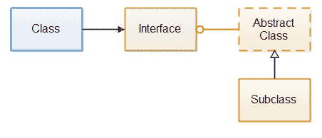

# Java 接口与抽象类

> 原文：<https://jenkov.com/tutorials/java/interfaces-vs-abstract-classes.html>

我经常遇到的一个问题是 Java 接口和抽象类之间有什么区别，以及何时使用它们。通过电子邮件多次回答这个问题后，我决定写这篇关于 Java 接口和抽象类的教程。

Java 接口用于将某些组件的接口从实现中分离出来。换句话说，使使用接口的类独立于实现接口的类。因此，您可以交换接口的实现，而不必使用接口更改类。

抽象类通常用作子类扩展的基类。一些编程语言使用抽象类来实现多态性，并将接口与实现分开，但是在 Java 中，你使用接口来实现这一点。记住，一个 Java 类只能有 1 个超类，但是它可以实现多个接口。因此，如果一个类已经有一个不同的超类，它可以实现一个接口，但不能扩展另一个抽象类。因此，接口是一种更灵活的公开公共接口的机制。

如果您需要将接口与其实现分开，请使用接口。如果您还需要提供接口的基类或默认实现，请添加实现该接口的抽象类(或普通类)。

下面的例子展示了一个引用接口的类，一个实现该接口的抽象类，以及一个扩展该抽象类的子类。

|  |
| 蓝色类只知道接口。抽象类实现接口，子类从抽象类继承。 |

下面是来自 [Java 抽象类](abstract-classes.html)的代码示例，但是添加了一个由抽象基类实现的接口。这样，它类似于上面的图表。

首先是界面:

```
public interface URLProcessor {

    public void process(URL url) throws IOException;
}

```

二、抽象基类:

```
public abstract class URLProcessorBase implements URLProcessor {

    public void process(URL url) throws IOException {
        URLConnection urlConnection = url.openConnection();
        InputStream input = urlConnection.getInputStream();

        try{
            processURLData(input);
        } finally {
            input.close();
        }
    }

    protected abstract void processURLData(InputStream input)
        throws IOException;

}

```

第三，抽象基类的子类:

```
public class URLProcessorImpl extends URLProcessorBase {

    @Override
    protected void processURLData(InputStream input) throws IOException {
        int data = input.read();
        while(data != -1){
            System.out.println((char) data);
            data = input.read();
        }
    }
}

```

第四，如何使用接口`URLProcessor`作为变量类型，尽管实例化的是子类`UrlProcessorImpl`。

```
URLProcessor urlProcessor = new URLProcessorImpl();

urlProcessor.process(new URL("http://jenkov.com"));

```

使用一个接口和一个抽象基类使你的代码更加灵活。简单地通过子类化抽象基类来实现简单的 URL 处理器是可能的。如果你需要更高级的东西，你的 URL 处理器可以直接实现`URLProcessor`接口，而不是从`URLProcessorBase`继承。