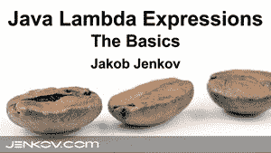
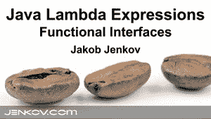
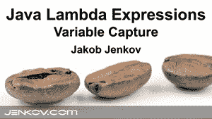

# Java Lambda 表达式

> 原文：<https://jenkov.com/tutorials/java/lambda-expressions.html>

Java lambda 表达式是 Java 8 中的新特性。Java lambda 表达式是 Java 迈向函数式编程的第一步。因此，Java lambda 表达式是一个不属于任何类也可以创建的函数。Java lambda 表达式可以像对象一样传递，并按需执行。

Java lambda 表达式通常用于实现简单的事件监听器/回调，或者在函数式编程中使用 [Java Streams API](/java-collections/streams.html) 。Java Lambda 表达式也常用于 Java 中的[函数式编程。](/java-functional-programming/index.html)

如果你更喜欢视频，我在这个 [Java Lambda Expression YouTube 播放列表](https://www.youtube.com/watch?v=lIXs4Y8sJCk&list=PLL8woMHwr36HQhhPPdV_T8rigbuywMpD7&index=1)里有这个教程的视频版本。这是该播放列表中的第一个视频:

[](https://www.youtube.com/watch?v=lIXs4Y8sJCk&list=PLL8woMHwr36HQhhPPdV_T8rigbuywMpD7&index=1 "Java Lambda Expressions Tutorial")

## Java Lambdas 和单一方法接口

函数式编程经常用于实现事件侦听器。Java 中的事件侦听器通常被定义为具有单一方法的 Java 接口。下面是一个虚构的单一方法接口示例:

```
public interface StateChangeListener {

    public void onStateChange(State oldState, State newState);

}

```

这个 Java 接口定义了一个方法，只要状态发生变化(无论观察到什么)，就会调用这个方法。

在 Java 7 中，为了监听状态变化，您必须实现这个接口。假设您有一个名为`StateOwner`的类，它可以注册状态事件监听器。这里有一个例子:

```
public class StateOwner {

    public void addStateListener(StateChangeListener listener) { ... }

}

```

在 Java 7 中，您可以使用匿名接口实现来添加事件监听器，如下所示:

```
StateOwner stateOwner = new StateOwner();

stateOwner.addStateListener(new StateChangeListener() {

    public void onStateChange(State oldState, State newState) {
        // do something with the old and new state.
    }
});

```

首先创建一个`StateOwner`实例。然后，`StateChangeListener`接口的匿名实现被添加为`StateOwner`实例上的监听器。

在 Java 8 中，您可以使用 Java lambda 表达式添加事件监听器，如下所示:

```
StateOwner stateOwner = new StateOwner();

stateOwner.addStateListener(
    (oldState, newState) -> System.out.println("State changed")
);

```

lambda 表达式是这一部分:

```
(oldState, newState) -> System.out.println("State changed")

```

lambda 表达式与`addStateListener()`方法参数的参数类型相匹配。如果 lambda 表达式匹配参数类型(在本例中是`StateChangeListener`接口)，那么 lambda 表达式将被转换为一个函数，该函数实现与该参数相同的接口。

Java lambda 表达式只能在匹配的类型是单一方法接口的情况下使用。在上面的例子中，lambda 表达式被用作参数，其中参数类型是`StateChangeListener`接口。这个接口只有一个方法。因此，lambda 表达式与该接口成功匹配。

### 将 Lambdas 与接口匹配

单个方法接口有时也被称为*功能接口*。将 Java lambda 表达式与函数接口进行匹配分为以下几个步骤:

*   接口是否只有一个抽象(未实现)方法？
*   lambda 表达式的参数与单个方法的参数匹配吗？
*   lambda 表达式的返回类型与单个方法的返回类型匹配吗？

如果这三个问题的答案都是肯定的，那么给定的 lambda 表达式就与接口成功匹配。

### 具有默认和静态方法的接口

从 Java 8 开始， [Java 接口](/java/interfaces.html)可以包含默认方法和静态方法。默认方法和静态方法都有直接在接口声明中定义的实现。这意味着，一个 Java lambda 表达式可以用不止一个方法实现接口——只要接口只有一个未实现的(也就是抽象的)方法。

换句话说，一个接口仍然是一个*函数接口*，即使它包含默认和静态方法，只要该接口只包含一个未实现的(抽象)方法。这是这一小段的视频版本:

[](https://www.youtube.com/watch?v=GxZWMgpMuLs&list=PLL8woMHwr36HQhhPPdV_T8rigbuywMpD7&index=2 "Java Lambda Expressions Functional Interfaces Tutorial")

以下接口可以用 lambda 表达式实现:

```
import java.io.IOException;
import java.io.OutputStream;

public interface MyInterface {

    void printIt(String text);

    default public void printUtf8To(String text, OutputStream outputStream){
        try {
            outputStream.write(text.getBytes("UTF-8"));
        } catch (IOException e) {
            throw new RuntimeException("Error writing String as UTF-8 to OutputStream", e);
        }
    }

    static void printItToSystemOut(String text){
        System.out.println(text);
    }
}

```

即使这个接口包含 3 个方法，它也可以通过 lambda 表达式实现，因为只有一个方法没有实现。下面是实现的样子:

```
MyInterface myInterface = (String text) -> {
    System.out.print(text);
};

```

## Lambda 表达式与匿名接口实现

尽管 lambda 表达式接近匿名接口实现，但还是有一些差异值得注意。

主要区别在于，匿名接口实现可以有状态(成员变量)，而 lambda 表达式不能。看这个界面:

```
public interface MyEventConsumer {

    public void consume(Object event);

}

```

此接口可以使用匿名接口实现来实现，如下所示:

```
MyEventConsumer consumer = new MyEventConsumer() {
    public void consume(Object event){
        System.out.println(event.toString() + " consumed");
    }
};

```

这个匿名的`MyEventConsumer`实现可以有自己的内部状态。看看这个重新设计:

```
MyEventConsumer myEventConsumer = new MyEventConsumer() {
    private int eventCount = 0;
    public void consume(Object event) {
        System.out.println(event.toString() + " consumed " + this.eventCount++ + " times.");
    }
};

```

注意匿名的`MyEventConsumer`实现现在有了一个名为`eventCount`的字段。

lambda 表达式不能有这样的字段。因此，lambda 表达式被称为是无状态的。

## λ型推理

在 Java 8 之前，当实现匿名接口时，你必须指定要实现什么接口。下面是本文开头的匿名接口实现示例:

```
stateOwner.addStateListener(new StateChangeListener() {

    public void onStateChange(State oldState, State newState) {
        // do something with the old and new state.
    }
});

```

使用 lambda 表达式，通常可以从周围的代码中推断出类型*。例如，参数的接口类型可以从`addStateListener()`方法的方法声明中推断出来(在`StateChangeListener`接口上的单个方法)。这就是所谓的*式推理*。编译器通过在别处寻找类型来推断参数的类型——在本例中是方法定义。下面是本文开头的例子，显示了在 lambda 表达式中没有提到`StateChangeListener`接口:*

 *```
stateOwner.addStateListener(
    (oldState, newState) -> System.out.println("State changed")
);

```

在 lambda 表达式中，通常也可以推断出参数类型。在上面的例子中，编译器可以从`onStateChange()`方法声明中推断出它们的类型。因此，参数`oldState`和`newState`的类型是从`onStateChange()`方法的方法声明中推断出来的。

## λ参数

因为 Java lambda 表达式实际上只是方法，所以 lambda 表达式可以像方法一样接受参数。前面展示的 lambda 表达式的`(oldState, newState)`部分指定了 lambda 表达式采用的参数。这些参数必须与单一方法接口上的方法参数相匹配。在这种情况下，这些参数必须匹配`StateChangeListener`接口的`onStateChange()`方法的参数:

```
public void onStateChange(State oldState, State newState);

```

lambda 表达式和方法中的参数数量至少必须匹配。

其次，如果在 lambda 表达式中指定了任何参数类型，这些类型也必须匹配。我还没有向您展示如何在 lambda 表达式参数上放置类型(这将在本文后面展示)，但是在许多情况下您并不需要它们。

### 零参数

如果你匹配 lambda 表达式的方法不带参数，那么你可以这样写你的 lambda 表达式:

```
() -> System.out.println("Zero parameter lambda");

```

注意括号之间没有内容。这表示 lambda 没有参数。

### 一个参数

如果匹配 Java lambda 表达式的方法有一个参数，那么可以这样编写 lambda 表达式:

```
(param) -> System.out.println("One parameter: " + param);

```

请注意，参数列在括号内。

当 lambda 表达式采用单个参数时，您也可以省略括号，如下所示:

```
 param -> System.out.println("One parameter: " + param);

```

### 多参数

如果匹配 Java lambda 表达式的方法有多个参数，那么这些参数需要用括号括起来。这在 Java 代码中是这样的:

```
(p1, p2) -> System.out.println("Multiple parameters: " + p1 + ", " + p2);

```

只有当方法采用单个参数时，才能省略括号。

### 参数类型

如果编译器无法从 lambda 匹配的函数接口方法中推断出参数类型，有时可能有必要为 lambda 表达式指定参数类型。不要担心，编译器会告诉你什么时候是这种情况。下面是一个 Java lambda 参数类型示例:

```
(Car car) -> System.out.println("The car is: " + car.getName());

```

如您所见，`car`参数的类型(`Car`)写在参数名称本身的前面，就像您在其他地方的方法中声明参数时，或者在匿名实现接口时一样。

### Java 11 中的变量参数类型

在 Java 11 中，你可以使用关键字`var`作为参数类型。关键字`var`在 Java 10 中作为[局部变量类型推断](variables.html#java-local-variable-type-inference)引入。来自 Java 11 的`var`也可以用于 lambda 参数类型。下面是一个在 lambda 表达式中使用 Java `var`关键字作为参数类型的示例:

```
Function<String, String> toLowerCase = (var input) -> input.toLowerCase();

```

上面用`var`关键字声明的参数类型将被推断为类型`String`，因为变量的类型声明将其泛型类型设置为`Function<String, String>`，这意味着`Function`的参数类型和返回类型为`String`。

## λ函数体

lambda 表达式的主体，以及它所代表的函数/方法的主体，被指定在 lambda 声明中的`->`的右边:下面是一个例子:

```
 (oldState, newState) -> System.out.println("State changed")

```

如果您的 lambda 表达式需要由多行组成，您可以将 lambda 函数体放在`{ }`括号内，这也是 Java 在其他地方声明方法时需要的。这里有一个例子:

```
 (oldState, newState) -> {
    System.out.println("Old state: " + oldState);
    System.out.println("New state: " + newState);
  }

```

## 从 Lambda 表达式返回值

您可以从 Java lambda 表达式中返回值，就像从方法中返回值一样。您只需在 lambda 函数体中添加一个 return 语句，如下所示:

```
 (param) -> {
    System.out.println("param: " + param);
    return "return value";
  }

```

如果你的 lambda 表达式只是计算一个返回值并返回它，你可以用一种更简单的方式来指定返回值。而不是这个:

```
 (a1, a2) -> { return a1 > a2; }

```

你可以写:

```
 (a1, a2) -> a1 > a2;

```

编译器然后计算出表达式`a1 > a2`是 lambda 表达式的返回值(因此命名为 lambda *表达式*——因为表达式返回某种类型的值)。

## 作为对象的 Lambdas

Java lambda 表达式本质上是一个对象。你可以将一个 lambda 表达式赋给一个变量，然后像对待任何其他对象一样传递它。这里有一个例子:

```
public interface MyComparator {

    public boolean compare(int a1, int a2);

}

```

```
MyComparator myComparator = (a1, a2) -> a1 > a2;

boolean result = myComparator.compare(2, 5);

```

第一个代码块显示了 lambda 表达式实现的接口。第二个代码块显示了 lambda 表达式的定义、lambda 表达式如何被赋给变量，以及最后如何通过调用它实现的接口方法来调用 lambda 表达式。

## 可变捕获

在某些情况下，Java lambda 表达式能够访问 lambda 函数体外部声明的变量。我这里有这部分的视频版本:

[](https://www.youtube.com/watch?v=kBc8S40HdoM&list=PLL8woMHwr36HQhhPPdV_T8rigbuywMpD7&index=3 "Java Lambda Expressions Variable Capture Tutorial")

Java lambdas 可以捕获以下类型的变量:

*   局部变量
*   实例变量
*   静态变量

这些变量捕获中的每一个都将在下面的章节中描述。

### 局部变量捕获

Java lambda 可以捕获在 lambda 主体外部声明的局部变量的值。为了说明这一点，首先看一下这个单一的方法接口:

```
public interface MyFactory {
    public String create(char[] chars);
}

```

现在，看看这个实现了`MyFactory`接口的 lambda 表达式:

```
MyFactory myFactory = (chars) -> {
    return new String(chars);
};

```

现在这个 lambda 表达式只引用传递给它的参数值(`chars`)。但是我们可以改变。下面是一个更新版本，它引用了一个在 lambda 函数体外部声明的`String`变量:

```
String myString = "Test";

MyFactory myFactory = (chars) -> {
    return myString + ":" + new String(chars);
};

```

如你所见，lambda 主体现在引用了在 lambda 主体外部声明的局部变量`myString`。当且仅当被引用的变量是“有效的最终变量”时，这才是可能的，这意味着它在赋值后不会改变它的值。如果`myString`变量的值后来改变了，编译器会抱怨从 lambda 主体内部对它的引用。

### 实例变量捕获

lambda 表达式还可以捕获创建 lambda 的对象中的实例变量。这里有一个例子说明:

```
public class EventConsumerImpl {

    private String name = "MyConsumer";

    public void attach(MyEventProducer eventProducer){
        eventProducer.listen(e -> {
            System.out.println(this.name);
        });
    }
}

```

注意 lambda 主体中对`this.name`的引用。这捕获了封闭的`EventConsumerImpl`对象的`name`实例变量。甚至有可能在捕获实例变量后改变它的值——这个值将反映在 lambda 中。

`this`的语义实际上是 Java lambdas 与接口的匿名实现不同的地方之一。匿名接口实现可以有自己的实例变量，这些变量通过`this`引用来引用。然而，lambda 不能有自己的实例变量，所以`this`总是指向封闭对象。

注意:上面一个事件消费者的设计不是特别优雅。我这样做是为了能够说明实例变量捕获。

### 静态变量捕获

Java lambda 表达式也可以捕获静态变量。这并不奇怪，因为只要静态变量是可访问的(打包的作用域或公共的)，静态变量在 Java 应用程序中的任何地方都是可访问的。

下面是一个创建 lambda 的示例类，该类从 lambda 主体内部引用静态变量:

```
public class EventConsumerImpl {
    private static String someStaticVar = "Some text";

    public void attach(MyEventProducer eventProducer){
        eventProducer.listen(e -> {
            System.out.println(someStaticVar);
        });
    }
}

```

在 lambda 捕获静态变量之后，静态变量的值也允许改变。

同样，上面的类设计有点荒谬。别想太多了。这个类主要是向你展示 lambda 可以访问静态变量。

## 作为 Lambdas 的方法引用

如果您的 lambda 表达式只是用传递给 lambda 的参数调用另一个方法，那么 Java lambda 实现提供了一种更短的方法来表达方法调用。首先，这是一个单一功能界面的例子:

```
public interface MyPrinter{
    public void print(String s);
}

```

下面是一个创建实现`MyPrinter`接口的 Java lambda 实例的例子:

```
MyPrinter myPrinter = (s) -> { System.out.println(s); };

```

因为 lambda 主体只包含一条语句，所以我们实际上可以省略括起来的`{ }`括号。此外，由于 lambda 方法只有一个参数，我们可以省略参数周围的括号`( )`。下面是 lambda 声明的结果:

```
MyPrinter myPrinter = s -> System.out.println(s);

```

因为 lambda 主体所做的只是将字符串参数转发给`System.out.println()`方法，所以我们可以用方法引用替换上面的 lambda 声明。下面是 lambda 方法引用的样子:

```
MyPrinter myPrinter = System.out::println;

```

注意这两个冒号`::`。这些通知 Java 编译器这是一个方法引用。引用的方法是双冒号后面的内容。拥有被引用方法的类或对象出现在双冒号之前。

您可以引用以下类型的方法:

*   静态法
*   参数对象上的实例方法
*   实例方法
*   构造器

这些类型的方法引用都包含在下面的章节中。

### 静态方法引用

最容易引用的方法是静态方法。这里首先是一个单函数接口的例子:

```
public interface Finder {
    public int find(String s1, String s2);
}

```

这里有一个静态方法，我们想创建一个方法引用:

```
public class MyClass{
    public static int doFind(String s1, String s2){
        return s1.lastIndexOf(s2);
    }
}

```

最后，这里有一个引用静态方法的 Java lambda 表达式:

```
Finder finder = MyClass::doFind;

```

因为`Finder.find()`和`MyClass.doFind()`方法的参数匹配，所以可以创建一个实现`Finder.find()`并引用`MyClass.doFind()`方法的 lambda 表达式。

### 参数方法参考

你也可以引用 lambda 的一个参数的方法。想象一个如下所示的单一功能界面:

```
public interface Finder {
    public int find(String s1, String s2);
}

```

该接口旨在表示一个能够在`s1`中搜索`s2`事件的组件。下面是一个调用`String.indexOf()`进行搜索的 Java lambda 表达式的例子:

```
Finder finder = String::indexOf;

```

这相当于 lambda 的定义:

```
Finder finder = (s1, s2) -> s1.indexOf(s2);

```

注意快捷方式是如何引用单个方法的。Java 编译器将尝试使用第二个参数类型作为被引用方法的参数，将被引用方法与第一个参数类型进行匹配。

### 实例方法引用

第三，也可以从 lambda 定义中引用实例方法。首先，让我们来看一个单一的方法接口定义:

```
public interface Deserializer {
    public int deserialize(String v1);
}

```

这个接口代表了一个能够将一个`String`反序列化为一个`int`的组件。

现在看看这个`StringConverter`类:

```
public class StringConverter {
    public int convertToInt(String v1){
        return Integer.valueOf(v1);
    }
}

```

`convertToInt()`方法与`Deserializer` `deserialize()`方法的`deserialize()`方法具有相同的签名。因此，我们可以创建一个`StringConverter`的实例，并从 Java lambda 表达式中引用它的`convertToInt()`方法，如下所示:

```
StringConverter stringConverter = new StringConverter();

Deserializer des = stringConverter::convertToInt;

```

两行中的第二行创建的 lambda 表达式引用了第一行中创建的`StringConverter`实例的`convertToInt`方法。

### 构造函数引用

最后，引用一个类的构造函数是可能的。您可以通过编写类名后跟`::new`来实现，就像这样:

```
MyClass::new

```

看看如何使用构造函数作为 lambda 表达式，看看这个接口定义:

```
public interface Factory {
    public String create(char[] val);
}

```

这个接口的`create()`方法匹配`String`类中一个构造函数的签名。因此，此构造函数可以用作 lambda。下面是一个例子:

```
Factory factory = String::new;

```

这相当于这个 Java lambda 表达式:

```
Factory factory = chars -> new String(chars);

```*