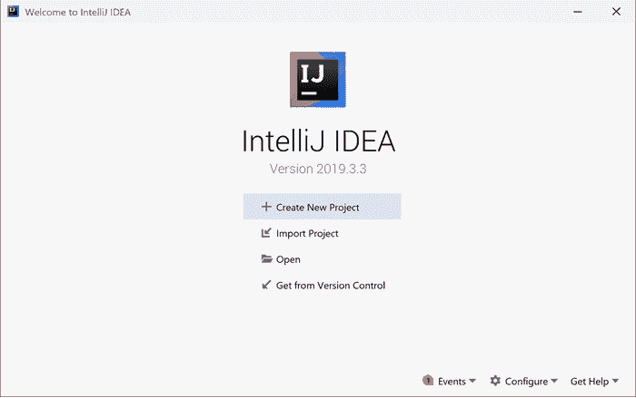
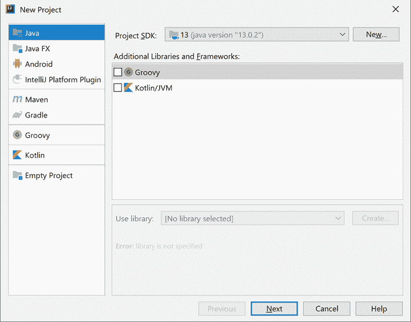
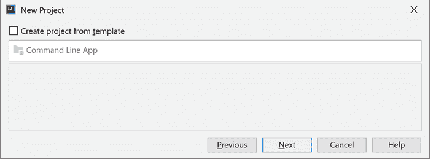
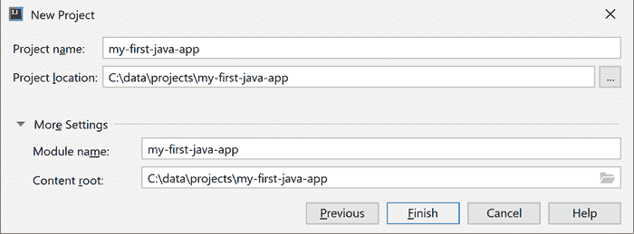
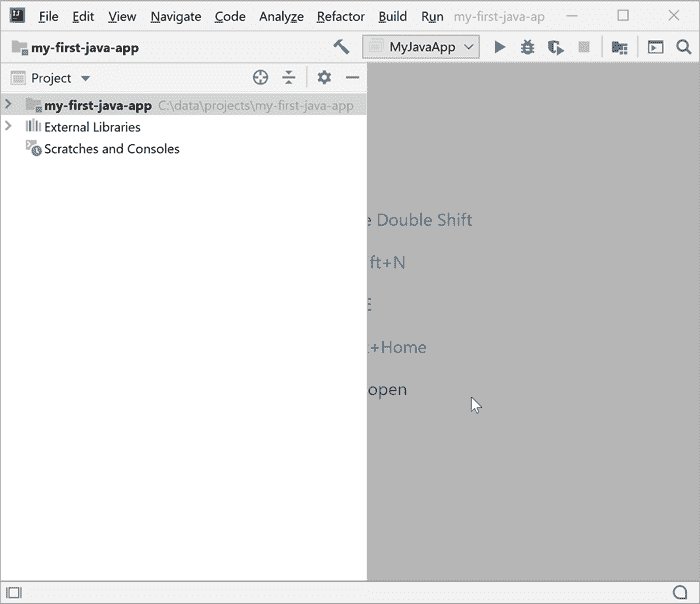
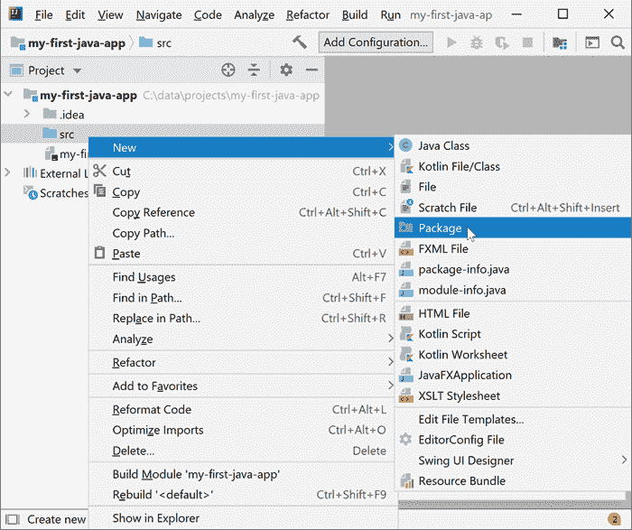
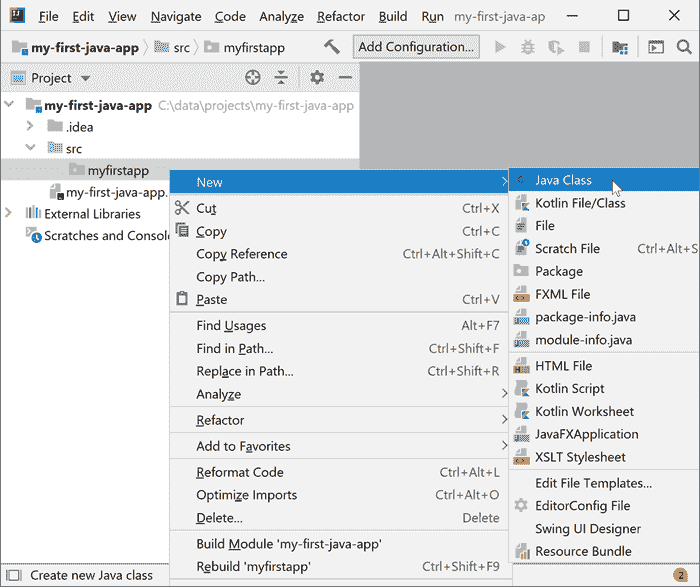
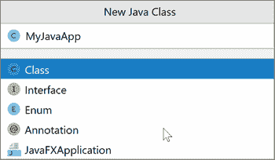
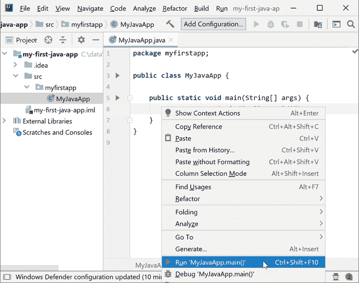
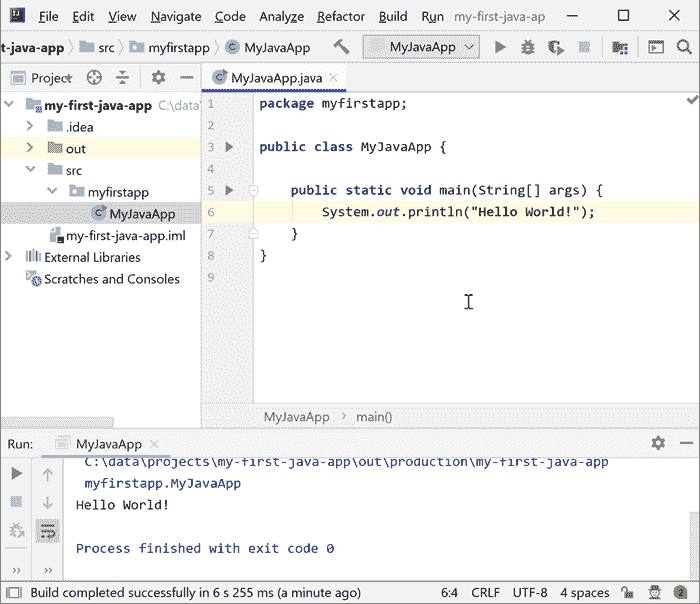

# 你的第一个 Java 应用

> 原文：<https://jenkov.com/tutorials/java/your-first-java-app.html>

在本教程中，您将制作您的第一个 Java 应用程序。我假设您已经安装了 JDK，如下所述:

[安装 Java SDK](installing-java-sdk.html)

在本教程中，我将向您展示如何使用 IntelliJ IDEA 社区版(免费)2019.3.3 版制作您的第一个 Java 应用程序。如果您使用的是 IDEA 的不同版本，或者您使用的是 Eclipse、Netbeans 或其他一些编辑器或 IDE，那么看起来可能与我在这里展示的有所不同。关于安装 Java SDK 的文章也包含了这些 Java IDEs 的链接。

如果您对 Java 完全陌生，那么本文中会有许多您不理解的概念。别担心。后面的文章会解释这些概念。本文的目的只是让一个工作的 Java 程序运行起来，这样您就可以在阅读本教程后面的文章时自己对它进行修改。

## 启动 IntelliJ 创意

首先你要启动 IntelliJ IDEA。如何操作取决于你运行的操作系统(Windows、Mac、Linux 等。)

当 IntelliJ IDEA 运行时，您将看到如下所示的 IntelliJ IDEA 应用程序窗口:



## 创建新项目

Java 项目是属于一个项目的 Java 文件(也可能是其他文件)的集合。例如，一个较大的 Java 程序可能由多个(数百或数千个)Java 文件组成。

在启动 IntelliJ IDEA 时打开的窗口中，单击“创建新项目”链接/按钮。将打开以下对话框:



在左侧菜单中选择“Java”。确保在对话框的右侧选择一个有效的 Java SDK 作为“项目 SDK”。然后单击对话框底部的“下一步”按钮。

单击“下一步”按钮时，会出现下面的对话框。只需点击对话框底部的“下一步”按钮，无需做任何更改。



在下一个对话框中，要求您为项目键入一个名称，并在硬盘上选择一个存储项目文件的目录。您可以键入您认为适合您的项目名称和位置的内容。



当您键入项目名称并选择位置后，单击对话框底部的“下一步”按钮。

您的项目现已创建。您将看到一个类似如下的窗口:



## 创建新的包

一旦创建了新的 Java 项目，就需要创建一个包，将所有 Java 代码放入其中。Java 包只是一个目录，你可以在里面放一个或多个 Java 文件(类、接口、注释、枚举等)。定义)。

要创建一个 Java 包，在 IntelliJ IDEA 中右键单击项目窗口左侧显示的“src”目录。“src”这个名字是“source”的缩写，意思是您的 Java 源代码(Java 程序文件的另一个术语)。在右键菜单中选择“新建”,然后选择“打包”,如下图所示:



在打开的对话框中，键入包名。包名必须全部是小写字符。键入包名后，单击“确定”按钮。


## 创建一个新类

当您创建了一个新的 Java 包时，该包将出现在 IntelliJ IDEA 左侧的“src”目录下。现在，您必须在新创建的包中创建一个新类。右键单击 Java 包，选择“New ”,然后选择“Class ”,如下图所示:



在打开的对话框中，键入新 Java 类的名称。习惯上，类名以一个大写字符开头，后跟小写字符，类名中的每个新单词都有一个新的大写字符。这种款式也叫“骆驼案”，因为名字里有骆驼一样的突起。例如:



为新的 Java 类键入名称后，单击“OK”按钮。

## 插入 main()方法

一旦创建了新类，它将是空的。它将只包含文本:

```
package myfirstapp;

public class MyJavaApp {

}

```

或许还会有一些评论，比如:

```
package myfirstapp;

/*
    Created by...
*/
public class MyJavaApp {

}

```

`/* ... */`中的部分是注释，不是执行的 Java 代码的一部分。Java 编译器会忽略它。

在运行 Java 应用程序之前，您需要在类中插入一个`main()`方法。只要确保您的类看起来像这样:


## 运行 main()方法

现在，您已经准备好运行新创建的 Java 类了。您可以通过在编辑器中右键单击类源代码，然后选择“Run ...”，像这样:



当你点击“运行…”选项，IntelliJ IDEA 将首先编译您的 Java 类，然后运行它。执行 Java 类 main 方法后，您将在 IntelliJ IDEA 窗口的底部看到类似如下的输出:



如果你还不明白什么是`main()`方法，或者类，或者包，不要担心。这将在本教程后面的文本中解释。