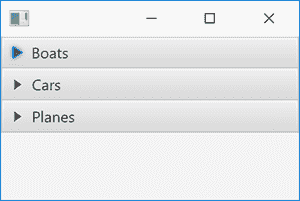
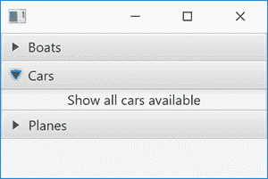

# JavaFX 手风琴

> 原文：<https://jenkov.com/tutorials/javafx/accordion.html>

*JavaFX* *Accordion* 控件是一个容器控件，它可以在内部包含几个部分 ，每个部分的内容都可以展开或折叠。Accordion 控件是由 JavaFX 类`javafx.scene.control.Accordion`实现的 。里面显示的 部分由 [JavaFX TitledPane](titledpane.html) 控件组成。 这里是一个 JavaFX `Accordion`控件的截图:



请注意，没有展开任何部分。您可以通过单击每个部分标题旁边的小三角形来展开该部分。展开一个部分将显示其内容。下面是一个 JavaFX `Accordion`的截图，其中有一个部分被展开:



## JavaFX 手风琴示例

这里有一个完整的 JavaFX `Accordion`示例，这样你可以快速了解它的用法 像什么:

```

import javafx.application.Application;
import javafx.scene.Scene;
import javafx.scene.control.Accordion;
import javafx.scene.control.Label;
import javafx.scene.control.TitledPane;
import javafx.scene.layout.VBox;
import javafx.stage.Stage;

public class AccordionExample extends Application {

    public static void main(String[] args) {
        launch(args);
    }

    public void start(Stage primaryStage) {

        Accordion accordion = new Accordion();

        TitledPane pane1 = new TitledPane("Boats" , new Label("Show all boats available"));
        TitledPane pane2 = new TitledPane("Cars"  , new Label("Show all cars available"));
        TitledPane pane3 = new TitledPane("Planes", new Label("Show all planes available"));

        accordion.getPanes().add(pane1);
        accordion.getPanes().add(pane2);
        accordion.getPanes().add(pane3);

        VBox vBox = new VBox(accordion);
        Scene scene = new Scene(vBox);

        primaryStage.setScene(scene);

        primaryStage.show();
    }
}

```

## 制作一架手风琴

在使用 JavaFX `Accordion`控件之前，您必须首先实例化它。 您只需使用 Java `new`命令实例化它，就像这样:

```

Accordion accordion = new Accordion();

```

## 将标题窗格对象添加到折叠面板

JavaFX `Accordion`中显示的每个部分都由一个 [JavaFX 标题窗格](titledpane.html)表示。要将部分添加到`Accordion` 控件中，您需要为每个部分创建一个`TitledPane`，并将其添加到`Accordion`。 下面是一个向 JavaFX `Accordion` : 添加`TitledPane`部分的例子

```

Accordion accordion = new Accordion();

TitledPane pane1 = new TitledPane("Boats" , new Label("Show all boats available"));
TitledPane pane2 = new TitledPane("Cars"  , new Label("Show all cars available"));
TitledPane pane3 = new TitledPane("Planes", new Label("Show all planes available"));

accordion.getPanes().add(pane1);
accordion.getPanes().add(pane2);
accordion.getPanes().add(pane3);

```

## 将手风琴添加到场景图形

要使 JavaFX `Accordion`可见，必须将其添加到 [场景图](scene.html#the-scene-graph)中。下面是一个将 JavaFX `Accordion`添加到 JavaFX 场景图的例子:

```

Accordion accordion = new Accordion();

VBox vBox = new VBox(accordion);
Scene scene = new Scene(vBox);

primaryStage.setScene(scene);

primaryStage.show();

```