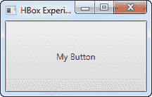
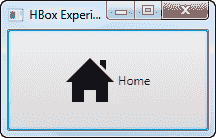
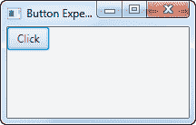
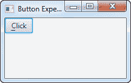
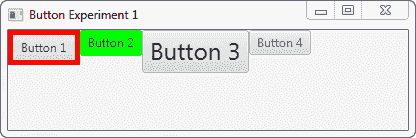

# JavaFX 按钮

> 原文：<https://jenkov.com/tutorials/javafx/button.html>

JavaFX 按钮控件使 JavaFX 应用程序能够在应用程序用户单击按钮时执行某些操作。JavaFX 按钮控件由类`javafx.scene.control.Button`表示。JavaFX 按钮上可以有一个文本和一个图标，指示用户单击按钮将会做什么。

## 创建按钮

通过创建一个`Button`类的实例来创建一个按钮控件。下面是一个 JavaFX `Button`实例化的例子:

```
Button button = new Button("My Label");

```

按钮上显示的文本作为参数传递给`Button`构造函数。

## 向场景图添加按钮

要使 JavaFX `Button`可见，必须将按钮对象添加到场景图形中。这意味着将其添加到一个`Scene`对象，或作为一个附加到`Scene`对象的布局的子对象。

下面是一个将 JavaFX `Button`附加到场景图的示例:

```
package com.jenkov.javafx.controls;

import javafx.application.Application;
import javafx.scene.Scene;
import javafx.scene.control.Button;
import javafx.scene.control.Label;
import javafx.stage.Stage;

public class ButtonExperiments extends Application  {

    @Override
    public void start(Stage primaryStage) throws Exception {
        primaryStage.setTitle("HBox Experiment 1");

        Button button = new Button("My Button");

        Scene scene = new Scene(button, 200, 100);
        primaryStage.setScene(scene);
        primaryStage.show();

    }

    public static void main(String[] args) {
        Application.launch(args);
    }
}

```

请注意，`Button`被直接添加到了`Scene`对象中。通常你会将`Button`嵌套在某种布局组件中。为了使这个例子简单，我把它留在这里。请参见关于布局组件的教程，了解它们的工作方式。

运行上述 JavaFX `Button`示例的结果是一个如下所示的应用程序:



请注意，该按钮占据了窗口中所有可用的空间。这就是为什么很难看到按钮的边缘。当 JavaFX 按钮被添加到布局组件时，您可以更容易地看到按钮的边缘。

## 按钮文本

有两种方法可以设置 JavaFX 按钮的文本。第一种方法是将文本传递给`Button`构造函数。在前面的例子中，您已经看到了这一点。

设置按钮文本的第二种方法是调用`Button`实例上的`setText()`方法。这可以在创建了`Button`实例之后完成。因此，它可以用来改变已经可见的`Button`的文本。下面是一个在 JavaFX `Button`上调用`setText()`的例子:

```
button.setText("Click me if you dare!");

```

### 按钮文本大小

您可以设置 JavaFX `Button`的文本大小。您可以使用 CSS 属性`-fx-text-size`来实现。这个 CSS 属性在关于[按钮 CSS 样式](#button-css-styles)的章节中有解释

### 按钮文本换行

JavaFX `Button`控件支持按钮文本的文本换行。文本换行意味着如果文本太长而无法在按钮内的一行中显示，则文本会被分成多行。

使用方法`setWrapText()`在 JavaFX `Button`实例上启用文本换行。`setWrapText()`方法采用单个`boolean`参数。如果您将值`true`传递给`setWrapText()`，那么您将启用文本换行。如果将值`false`传递给`setWrapText()`，则禁用文本换行。下面是一个在 JavaFX 按钮上启用文本换行的示例:

```
button.setWrapText(true);

```

下面是两个 JavaFX 按钮的屏幕截图，其中一个按钮启用了文本换行:


## Button Font

您可以通过它的`setFont()`方法指定 JavaFX 按钮上的文本应该使用什么字体。你可以在我的 [JavaFX 字体](fonts.html)教程中读到更多关于创建字体的内容。以下是在 JavaFX 按钮上设置字体的示例:

```
Button button = new Button("Click me!");

Font font = Font.font("Courier New", FontWeight.BOLD, 36);

button.setFont(font);

```

## 默认按钮模式

JavaFX 按钮可以设置为默认模式。当按钮处于默认模式时，它以不同的方式呈现，因此用户可以看到这是默认按钮。在 Windows 上，按钮的背景颜色会改变，虽然我猜这也取决于应用程序中使用的颜色主题等。在 JavaFX 的未来版本中可能会有所变化。

默认按钮旨在用于对话框或表单中的“默认选择”。因此，对于用户来说，选择用户最可能经常做出的选择变得更容易。

对话框或窗体的默认按钮有一些附加的键盘快捷键来帮助用户单击它:

*   Windows + Linux
    *   如果没有其他按钮获得焦点，按键盘上的 ENTER 键将激活默认按钮。
    *   如果默认按钮有焦点，按下键盘回车键将激活默认按钮。
*   苹果个人计算机
    *   只有默认按钮可以通过按下回车键来激活。所有其他按钮都是通过按下空格键来激活的。

将 JavaFX 按钮设置为默认按钮是通过它的`setDefaultButton()`方法完成的。下面是一个将 JavaFX 按钮设置为默认按钮的示例:

```
button.setDefaultButton(true);

```

## 取消按钮模式

JavaFX 按钮可以设置为*取消模式*。当按钮处于取消模式时，通过按 ESC 键盘键可以更容易地激活它——如果场景图中没有其他节点消耗该键按压。

将 JavaFX 按钮设置为取消模式(作为取消按钮)是通过它的`setCancelButton()`方法完成的。以下是在取消模式下设置 JavaFX 按钮的示例:

```
buttonDefault.setCancelButton(true);

```

## 按钮图像

可以在按钮文本旁边的按钮内显示图像。JavaFX `Button`类包含一个构造函数，它可以接受一个`Node`作为额外的参数。下面是一个 JavaFX 标签示例，它使用一个 [JavaFX ImageView](imageview.html) 组件向按钮添加一个图像:

```
package com.jenkov.javafx.controls;

import javafx.application.Application;
import javafx.scene.Scene;
import javafx.scene.control.Button;
import javafx.scene.image.Image;
import javafx.scene.image.ImageView;
import javafx.stage.Stage;

import java.io.FileInputStream;

public class ButtonExperiments extends Application  {

    @Override
    public void start(Stage primaryStage) throws Exception {
        primaryStage.setTitle("HBox Experiment 1");

        FileInputStream input = new FileInputStream("resources/images/iconmonstr-home-6-48.png");
        Image image = new Image(input);
        ImageView imageView = new ImageView(image);

        Button button = new Button("Home", imageView);

        Scene scene = new Scene(button, 200, 100);
        primaryStage.setScene(scene);
        primaryStage.show();

    }

    public static void main(String[] args) {
        Application.launch(args);
    }
}

```

运行上述 JavaFX `Button`示例的结果是一个如下所示的应用程序:



## 按钮大小

JavaFX Button 类包含一组可以用来设置按钮大小的方法。控制按钮大小的方法有:

```
button.setMinWidth()
button.setMaxWidth()
button.setPrefWidth()

button.setMinHeight()
button.setMaxHeight()
button.setPrefHeight()

button.setMinSize()
button.setMaxSize()
button.setPrefSize()

```

方法`setMinWidth()`和`setMaxWidth()`设置按钮允许的最小和最大宽度。方法`setPrefWidth()`设置按钮的首选宽度。当有足够的空间以其首选宽度显示按钮时，JavaFX 会这样做。如果没有，JavaFX 将缩小按钮直到它达到最小宽度。

方法`setMinHeight()`和`setMaxHeight()`设置按钮允许的最小和最大高度。方法`setPrefHeight()`设置按钮的首选高度。当有足够的空间以首选高度显示按钮时，JavaFX 会这样做。如果没有，JavaFX 将缩小按钮，直到它达到最小高度。

方法`setMinSize()`、`setMaxSize()`和`setPrefSize()`在一次调用中设置按钮的宽度和高度。因此，这些方法同时接受宽度和高度参数。例如，打电话

```
button.setMaxSize(100, 200);

```

相当于调用

```
button.setMaxWidth(100);
button.setMaxHeight(200);

```

下面是两个 JavaFX 按钮的截图。第一个按钮的默认大小是根据它的按钮文本和它所嵌套的布局组件计算出来的。第二个按钮的首选宽度为 200，高度为 48:


## 按钮事件

为了响应按钮的点击，您需要将一个事件监听器附加到`Button`对象上。这是它的样子:

```
button.setOnAction(new EventHandler() {
    @Override
    public void handle(ActionEvent actionEvent) {
        //... do something in here.
    }
}); 
```

下面是使用 [Java Lambda 表达式](/java/lambda-expressions.html)附加一个点击事件监听器的样子:

```
button.setOnAction(actionEvent ->  {
    //... do something in here.    
});

```

最后，让我们看一个完整的例子，当按钮被点击时，它改变了一个 [JavaFX 标签](label.html)的文本:

```
package com.jenkov.javafx.controls;

import javafx.application.Application;
import javafx.event.ActionEvent;
import javafx.event.EventHandler;
import javafx.scene.Scene;
import javafx.scene.control.Button;
import javafx.scene.control.Label;
import javafx.scene.layout.HBox;
import javafx.stage.Stage;

public class ButtonExperiments extends Application  {

    @Override
    public void start(Stage primaryStage) throws Exception {
        primaryStage.setTitle("HBox Experiment 1");

        Label label = new Label("Not clicked");
        Button button = new Button("Click");

        button.setOnAction(value ->  {
           label.setText("Clicked!");
        });

        HBox hbox = new HBox(button, label);

        Scene scene = new Scene(hbox, 200, 100);
        primaryStage.setScene(scene);
        primaryStage.show();

    }

    public static void main(String[] args) {
        Application.launch(args);
    }
}

```

## 按钮记忆法

您可以在 JavaFX `Button`实例上设置助记符。一个*助记键*是一个键盘键，当与 ALT 键一起按下时激活按钮。因此，助记键是激活按钮的快捷键。稍后我会解释如何通过助记符激活按钮。

按钮的助记符在按钮文本中指定。通过在按钮文本中您想要设置为该按钮助记符的字符前放置一个下划线字符(`_`)，您可以标记哪个键将被用作助记符。下划线字符不会显示在按钮文本中。以下是为按钮设置助记符的示例:

```
button.setMnemonicParsing(true);

button.setText("_Click");

```

注意，首先需要调用按钮上的值为`true`的`setMnemonicParsing()`。这指示按钮解析按钮文本中的助记符。如果您使用值`false`调用这个方法，按钮文本中的下划线字符将只显示为文本，而不会被解释为助记符。

第二行设置按钮上的文本`_Click`。这告诉按钮使用键`c`作为助记符。助记符不区分大小写，所以激活按钮的`C`不必是大写字母。

要激活该按钮，您现在可以按 ALT-C(同时按下这两个键)。这将激活按钮，就像你用鼠标点击它。

也可以先按一次 ALT 键。它将在按钮文本中显示按钮的助记键。然后您可以按下`c`键。如果您按 ALT，然后再按 ALT，助记键会先显示，然后再隐藏。当助记键可见时，您可以单独使用助记键激活按钮，而无需同时按下 ALT。当助记键不可见时，您必须同时按 ALT 和助记键来激活按钮。

下面是两张截图，展示了助记符不可见和可见时的样子:

 

## 按钮 CSS 样式

您可以使用 CSS 样式来设置 JavaFX 按钮的样式。JavaFX `Button`控件支持以下 CSS 样式:

```
-fx-border-width
-fx-border-color
-fx-background-color
-fx-font-size
-fx-text-fill

```

下面是一个将 JavaFX 按钮的背景色设置为红色的示例:

```
Button button = new Button("My Button");

button.setStyle("-fx-background-color: #ff0000; ");

```

这个示例通过`setStyle()`方法直接在按钮上设置样式，但是您也可以通过样式表来设置 JavaFX 按钮的样式。参见我的 [JavaFX CSS 样式](css-styling.html)教程，了解更多关于 JavaFX 使用 CSS 样式表的信息。

这是一个 JavaFX 按钮示例，它创建了 4 个不同的按钮。每个按钮上都设置了 CSS 样式。在代码示例之后，我包含了给定样式的按钮的截图。

```
package com.jenkov.javafx.controls;

import javafx.application.Application;
import javafx.scene.Scene;
import javafx.scene.control.Button;
import javafx.scene.layout.HBox;
import javafx.stage.Stage;

import java.io.FileInputStream;
import java.io.FileNotFoundException;

public class ButtonExperiments extends Application  {

    @Override
    public void start(Stage primaryStage) throws Exception {
        primaryStage.setTitle("Button Experiment 1");

        Button button1 = new Button("Button 1");
        Button button2 = new Button("Button 2");
        Button button3 = new Button("Button 3");
        Button button4 = new Button("Button 4");

        button1.setStyle("-fx-border-color: #ff0000; -fx-border-width: 5px;");
        button2.setStyle("-fx-background-color: #00ff00");
        button3.setStyle("-fx-font-size: 2em; ");
        button4.setStyle("-fx-text-fill: #0000ff");

        HBox hbox = new HBox(button1, button2, button3, button4);

        Scene scene = new Scene(hbox, 400, 100);
        primaryStage.setScene(scene);
        primaryStage.show();
    }

    public static void main(String[] args) {
        Application.launch(args);
    }
}

```

以下是 4 个 JavaFX 按钮及其 CSS 样式的屏幕截图:



第一个按钮同时设置了`-fx-border-width`和`-fx-border-color` CSS 属性。这导致按钮有一个 5 像素宽的红色边框。

第二个按钮设置了`-fx-background-color` CSS 属性。这导致按钮的背景颜色为绿色。

第三个按钮设置了`-fx-font-size` CSS 属性。这导致按钮的文本是正常大小的两倍。

第四个按钮设置了`-fx-text-fill` CSS 属性。这会产生一个蓝色文本的按钮。

您可以简单地通过设置多个 CSS 属性来组合 JavaFX 按钮的 CSS 样式，就像上面示例中的第一个按钮一样。

## 禁用按钮

您可以通过 JavaFX 按钮的`setDisable()`方法禁用它。`setDisable()`方法接受一个`boolean`参数，该参数指定按钮是否应该被禁用。值`true`意味着按钮将被禁用，值`false`意味着它不会被禁用——这意味着启用。下面是一个通过`setDisable()`方法禁用 JavaFX 按钮的例子:

```
Button button = new Button();
button.setText("Click me!");

// here the app is running, and something happens so
// the button should now be disabled.

button.setDisable(true);

// again the app runs, and something happens so
// the button should now be enabled again.

button.setDisable(false);

```

## Button FXML

可以在一个 [JavaFX FXML](fxml.html) 文件中声明一个 JavaFX 按钮。我不会在这里详细解释 FXML。点击第一句中的链接，阅读更多关于 FXML 如何工作的内容。我将只向您展示与 JavaFX 按钮控件相关的 FXML 部分。下面是一个非常简单的 FXML 文件示例，展示了如何声明一个按钮:

```
<?xml version="1.0" encoding="UTF-8"?>
    <?import javafx.scene.layout.VBox?>
    <?import javafx.scene.control.Button?>
    <VBox xmlns:fx="http://javafx.com/fxml" spacing="20">
    <children>
        <Button fx:id="button1" text="Click me!" onAction="#buttonClicked"/>
    </children>
</VBox>

```

是<button>元素声明了按钮控件。属性可以用来将声明的按钮连接到 FXML 控制器对象中的按钮成员变量。</button>

`text`属性用于在为该按钮声明创建的按钮实例中设置相应的`text`属性值。这是按钮上显示的文本。

`onAction`属性用于将按钮的`onAction`事件链接到 FXML 控制器对象中的一个方法。在这个例子中，它是 FXML 控制器中名为`buttonClicked()`的方法。

下面是相应的 FXML 控制器对象的类的样子。请注意，`button1`按钮成员变量的名称与 FXML 文件中的`fx:id`属性值相匹配。顺便说一下，这个成员变量必须是公共的。还要注意从 FXML 文件中的 Button `onAction`属性引用的方法`buttonClicked()`。

```
import javafx.event.Event;
import javafx.fxml.FXML;
import javafx.scene.control.Button;

public class ButtonFXMLController {

    public Button button1 = null;
    private int   button1ClickCount = 0;

    @FXML
    public void buttonClicked(Event e){
        this.button1ClickCount++;

        String text = "Button1 clicked " + this.button1ClickCount + " times";

        System.out.println(text);

        button1.setText(text);
    }

}

```

这是完整的 JavaFX 应用程序，它加载 FXML 文件并创建 FXML 控制器等。:

```
import javafx.application.Application;
import javafx.fxml.FXMLLoader;
import javafx.scene.Scene;
import javafx.scene.layout.VBox;
import javafx.stage.Stage;

import java.io.File;
import java.net.URL;

public class ButtonFXMLExample extends Application {

    public static void main(String[] args) {
        launch(args);
    }

    @Override
    public void start(Stage primaryStage) throws Exception {

        FXMLLoader loader = new FXMLLoader();

        ButtonFXMLController controller = new ButtonFXMLController();
        loader.setController(controller);

        File fxmlFile = new File("assets/fxml/button-example.fxml");
        URL fxmlUrl = fxmlFile.toURI().toURL();
        loader.setLocation(fxmlUrl);

        VBox vbox = loader.<VBox>load();
        Scene scene = new Scene(vbox);

        primaryStage.setScene(scene);

        primaryStage.setTitle("Button FXML Example");
        primaryStage.setWidth(300);
        primaryStage.setHeight(300);
        primaryStage.show();
    }
}

```

## 按钮转换

您可以将 [JavaFX 转换](transformations.html)添加到 JavaFX 按钮，如缩放、旋转、平移等。向 JavaFX 按钮添加转换对象，如下所示:

```
button.getTransforms().add(scaleTransformation);

```

以下是向 JavaFX 按钮添加缩放转换的完整示例:

```
import javafx.application.Application;
import javafx.scene.Scene;
import javafx.scene.control.Button;
import javafx.scene.layout.VBox;
import javafx.scene.transform.Scale;
import javafx.stage.Stage;

public class ButtonTransformationExample extends Application {

    public static void main(String[] args) {
        launch(args);
    }

    @Override
    public void start(Stage primaryStage) {

        Button button = new Button();

        button.setText("Click me!");

        button.setOnAction((event) -> {
            System.out.println("Button clicked!");
        });

        Scale scaleTransformation = new Scale();
        scaleTransformation.setX(3.0);
        scaleTransformation.setY(2.0);
        scaleTransformation.setPivotX(0);
        scaleTransformation.setPivotY(0);

        button.getTransforms().add(scaleTransformation);

        VBox  vbox  = new VBox(button);
        Scene scene = new Scene(vbox);
        primaryStage.setScene(scene);
        primaryStage.setWidth(512);
        primaryStage.setHeight(256);
        primaryStage.show();
    }

}

```