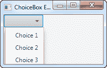

# JavaFX 选择框

> 原文：<https://jenkov.com/tutorials/javafx/choicebox.html>

JavaFX ChoiceBox 控件使用户能够从预定义的选项列表中选择一个选项。JavaFX ChoiceBox 控件由类`javafx.scene.control.ChoiceBox`表示。这篇 JavaFX ChoiceBox 教程将解释如何使用`ChoiceBox`类。

## 创建选择框

您只需通过创建一个新的`ChoiceBox`类实例来创建一个`ChoiceBox`。下面是一个 JavaFX `ChoiceBox`实例化的例子:

```
ChoiceBox choiceBox = new ChoiceBox();

```

## 向选择框添加选项

您可以通过获取项目集合向`ChoiceBox`添加选项，并向其中添加项目。下面是一个向 JavaFX `ChoiceBox`添加选择的例子:

```
choiceBox.getItems().add("Choice 1");
choiceBox.getItems().add("Choice 2");
choiceBox.getItems().add("Choice 3");

```

## 向场景图添加选择框

要使`ChoiceBox`可见，你必须将它添加到场景图中。这意味着您必须将`ChoiceBox`添加到一个`Scene`对象或某个布局组件，然后该布局组件被附加到`Scene`对象。

下面的例子展示了如何将 JavaFX `ChoiceBox`添加到场景图中:

```
package com.jenkov.javafx.controls;

import javafx.application.Application;
import javafx.scene.Scene;
import javafx.scene.control.ChoiceBox;
import javafx.scene.layout.HBox;
import javafx.stage.Stage;

public class ChoiceBoxExperiments extends Application  {

    @Override
    public void start(Stage primaryStage) throws Exception {
        primaryStage.setTitle("ChoiceBox Experiment 1");

        ChoiceBox choiceBox = new ChoiceBox();

        choiceBox.getItems().add("Choice 1");
        choiceBox.getItems().add("Choice 2");
        choiceBox.getItems().add("Choice 3");

        HBox hbox = new HBox(choiceBox);

        Scene scene = new Scene(hbox, 200, 100);
        primaryStage.setScene(scene);
        primaryStage.show();

    }

    public static void main(String[] args) {
        Application.launch(args);
    }
}

```

运行此示例生成的应用程序将类似于以下内容:



## 读取选定的值

您可以通过`getValue()`方法读取`ChoiceBox`的选定值。如果没有选择，则`getValue()`方法返回`null`。下面是一个打电话给`getValue()`的例子:

```
String value = (String) choiceBox.getValue();

```

## 倾听选择

通过其`setOnAction()`方法在 ChoiceBox 上设置一个动作监听器，可以监听 JavaFX ChoiceBox 中的选择变化。下面是一个在 ChoiceBox 上设置动作监听器的示例，它读取 ChoiceBox 中选择的值:

```
ChoiceBox choiceBox = new ChoiceBox();

choiceBox.getItems().add("Choice 1");
choiceBox.getItems().add("Choice 2");
choiceBox.getItems().add("Choice 3");

choiceBox.setOnAction((event) -> {
    int selectedIndex = choiceBox.getSelectionModel().getSelectedIndex();
    Object selectedItem = choiceBox.getSelectionModel().getSelectedItem();

    System.out.println("Selection made: [" + selectedIndex + "] " + selectedItem);
    System.out.println("   ChoiceBox.getValue(): " + choiceBox.getValue());
});

```