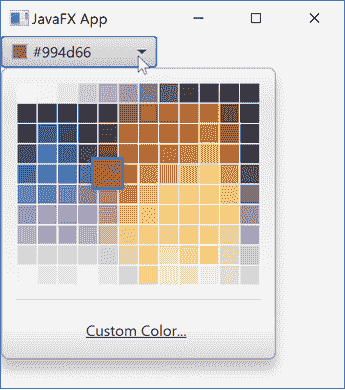

# JavaFX 颜色选择器

> 原文：<https://jenkov.com/tutorials/javafx/colorpicker.html>

*Java FX**color picker*控件使用户能够在弹出对话框中选择颜色。 您的 JavaFX 应用程序稍后可以从 ColorPicker 中读取所选的颜色。 Java FX color picker 控件由类`javafx.scene.control.ColorPicker`表示。 下面是一个打开的 JavaFX `ColorPicker` : 的截图



## 完整的颜色选择器示例

这里是一个完整的 JavaFX `ColorPicker`示例，这样您就可以看到代码是什么样子的:

```

import javafx.application.Application;
import javafx.scene.Scene;
import javafx.scene.control.ColorPicker;
import javafx.scene.layout.VBox;
import javafx.scene.paint.Color;
import javafx.stage.Stage;

public class ColorPickerExample extends Application {
    public static void main(String[] args) {
        launch(args);
    }

    @Override
    public void start(Stage primaryStage) {
        primaryStage.setTitle("JavaFX App");

        ColorPicker colorPicker = new ColorPicker();

        Color value = colorPicker.getValue();

        VBox vBox = new VBox(colorPicker);
        //HBox hBox = new HBox(button1, button2);
        Scene scene = new Scene(vBox, 960, 600);

        primaryStage.setScene(scene);
        primaryStage.show();
    }

}

```

## 创建颜色选择器

为了使用 JavaFX `ColorPicker`，您必须首先创建一个 `ColorPicker`类的实例。下面是一个创建 JavaFX `ColorPicker` : 的例子

```

ColorPicker colorPicker = new ColorPicker();

```

## 选择颜色

要读取 JavaFX `ColorPicker`中选择的颜色，您需要调用它的`getValue()` 方法。下面是一个在 JavaFX `ColorPicker` : 中获取所选颜色的例子

```

Color value = colorPicker.getValue();

```