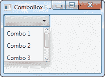
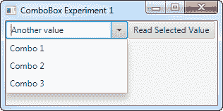

# JavaFX 组合框

> 原文：<https://jenkov.com/tutorials/javafx/combobox.html>

JavaFX ComboBox 控件使用户能够从预定义的选项列表中选择一个选项，或者如果没有预定义的选项与用户想要选择的匹配，则键入另一个值。JavaFX ComboBox 控件由类`javafx.scene.control.ComboBox`表示。这个 JavaFX ComboBox 教程将解释如何使用`ComboBox`类。

## 创建组合框

您只需通过创建一个新的`ComboBox`类实例来创建一个`ComboBox`。下面是一个 JavaFX `ComboBox`实例化的例子:

```
ComboBox comboBox = new ComboBox();

```

## 向组合框添加选项

您可以通过获取项目集合向`ComboBox`添加选项，并向其中添加项目。下面是一个向 JavaFX `ComboBox`添加选择的例子:

```
comboBox.getItems().add("Choice 1");
comboBox.getItems().add("Choice 2");
comboBox.getItems().add("Choice 3");

```

## 向场景图添加组合框

要使`ComboBox`可见，你必须将它添加到场景图中。这意味着您必须将`ComboBox`添加到一个`Scene`对象或某个布局组件，然后该布局组件被附加到`Scene`对象。

下面的例子展示了如何将 JavaFX `ComboBox`添加到场景图中:

```
package com.jenkov.javafx.controls;

import javafx.application.Application;
import javafx.scene.Scene;
import javafx.scene.control.ComboBox;
import javafx.scene.layout.HBox;
import javafx.stage.Stage;

public class ComboBoxExperiments extends Application  {

    @Override
    public void start(Stage primaryStage) throws Exception {
        primaryStage.setTitle("ComboBox Experiment 1");

        ComboBox comboBox = new ComboBox();

        comboBox.getItems().add("Choice 1");
        comboBox.getItems().add("Choice 2");
        comboBox.getItems().add("Choice 3");

        HBox hbox = new HBox(comboBox);

        Scene scene = new Scene(hbox, 200, 120);
        primaryStage.setScene(scene);
        primaryStage.show();

    }

    public static void main(String[] args) {
        Application.launch(args);
    }
}

```

运行此示例生成的应用程序将类似于以下内容:



## 使组合框可编辑

默认情况下，`ComboBox`不可编辑。这意味着，默认情况下，用户不能自己输入任何内容，只能从预定义的选项列表中进行选择。要使`ComboBox`可编辑，你必须调用`ComboBox`的`setEditable()`方法。下面是一个让 JavaFX `ComboBox`可编辑的例子:

```
comboBox.setEditable(true);

```

一旦`ComboBox`可编辑，用户可以在`ComboBox`中输入值。如前所述，输入的值也通过`getValue()`方法读取。下面的屏幕截图显示了一个可编辑的 JavaFX `ComboBox`，并输入了一个自定义值:



## 读取选定的值

您可以通过`getValue()`方法读取`ComboBox`的选定值。如果没有选择，则`getValue()`方法返回`null`。下面是一个打电话给`getValue()`的例子:

```
String value = (String) comboBox.getValue();

```

## 倾听选择

通过其`setOnAction()`方法在组合框上设置一个动作监听器，可以监听 JavaFX 组合框中的选择变化。下面是一个在组合框上设置动作侦听器的示例，该侦听器读取组合框中选择的值:

```
ComboBox comboBox = new ComboBox();

comboBox.getItems().add("Choice 1");
comboBox.getItems().add("Choice 2");
comboBox.getItems().add("Choice 3");

comboBox.setOnAction((event) -> {
    int selectedIndex = comboBox.getSelectionModel().getSelectedIndex();
    Object selectedItem = comboBox.getSelectionModel().getSelectedItem();

    System.out.println("Selection made: [" + selectedIndex + "] " + selectedItem);
    System.out.println("   ComboBox.getValue(): " + comboBox.getValue());
});

```