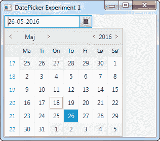

# JavaFX DatePicker

> 原文：<https://jenkov.com/tutorials/javafx/datepicker.html>

JavaFX DatePicker 控件使用户能够输入日期或从类似向导的弹出对话框中选择日期。弹出对话框只显示有效日期，因此这是用户选择日期并确保在日期选择器文本字段中输入的日期和日期格式有效的一种更简单的方法。JavaFX DatePicker 由类`javafx.scene.control.DatePicker`表示。

`DatePicker`是`ComboBox`类的子类，因此与这个类有一些相似之处。

## 创建日期选择器

通过`DatePicker`类的构造函数创建一个 DatePicker 控件。下面是一个 JavaFX `DatePicker`实例化的例子:

```
DatePicker datePicker = new DatePicker();

```

## 向场景图添加日期选择器

要使`DatePicker`可见，必须将其添加到 JavaFX 场景图中。这意味着将其添加到一个`Scene`对象，或添加到一个添加到`Scene`对象的布局组件。

下面的例子展示了如何将 JavaFX `DatePicker`添加到场景图中:

```
package com.jenkov.javafx.controls;

import javafx.application.Application;
import javafx.scene.Scene;
import javafx.scene.control.DatePicker;
import javafx.scene.layout.HBox;
import javafx.stage.Stage;

public class DatePickerExperiments extends Application  {

    @Override
    public void start(Stage primaryStage) throws Exception {
        primaryStage.setTitle("Button Experiment 1");

        DatePicker datePicker = new DatePicker();

        HBox hbox = new HBox(datePicker);

        Scene scene = new Scene(hbox, 200, 100);
        primaryStage.setScene(scene);
        primaryStage.show();

    }

    public static void main(String[] args) {
        Application.launch(args);
    }
}

```

运行此示例生成的应用程序将类似于以下内容:



## 读取选定的日期

使用`getValue()`方法可以读取在`DatePicker`中选择的日期。下面是一个从`DatePicker`中读取选定日期的例子:

```
LocalDate value = datePicker.getValue();

```

`getValue()`返回一个代表在`DatePicker`中选择的日期的 [LocalDate](/java-date-time/localdate.html) 对象。

下面是一个完整的示例，添加了一个按钮，当单击该按钮时，提取`DatePicker`中所选的日期:

```
package com.jenkov.javafx.controls;

import javafx.application.Application;
import javafx.scene.Scene;
import javafx.scene.control.Button;
import javafx.scene.control.DatePicker;
import javafx.scene.layout.HBox;
import javafx.stage.Stage;

import java.time.LocalDate;

public class DatePickerExperiments extends Application  {

    @Override
    public void start(Stage primaryStage) throws Exception {
        primaryStage.setTitle("DatePicker Experiment 1");

        DatePicker datePicker = new DatePicker();

        Button button = new Button("Read Date");

        button.setOnAction(action -> {
            LocalDate value = datePicker.getValue();
        });

        HBox hbox = new HBox(datePicker);

        Scene scene = new Scene(hbox, 300, 240);
        primaryStage.setScene(scene);
        primaryStage.show();

    }

    public static void main(String[] args) {
        Application.launch(args);
    }
}

```