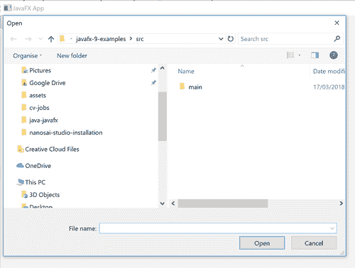

# JavaFX FileChooser

> 原文：<https://jenkov.com/tutorials/javafx/filechooser.html>

一个 *JavaFX FileChooser* 类(`javafx.stage.FileChooser`)是一个对话框，它使用户能够从用户的本地计算机上通过文件浏览器 选择一个或多个文件。JavaFX FileChooser 在类`javafx.stage.FileChooser`中实现。在这个 Java FX`FileChooser`教程中，我将向你展示如何使用 JavaFX `FileChooser`对话框。

下面是一个 JavaFX `FileChooser`的截图示例:



## 创建 jfilechooser

为了使用 JavaFX `FileChooser`对话框，您必须首先创建一个`FileChooser` 实例。下面是一个创建 JavaFX `FileChooser`对话框的例子:

```

FileChooser fileChooser = new FileChooser();

```

如您所见，创建一个`FileChooser`实例非常容易。

## 显示 jfilechooser 对话框

显示 JavaFX `FileChooser`对话框是通过调用它的`showOpenDialog()`方法来完成的。 下面是一个显示`FileChooser`对话框的例子:

```

File selectedFile = fileChooser.showOpenDialog(stage);

```

`showOpenDialog()`方法返回的`File`是用户在 的`FileChooser`中选择的文件。

`stage`参数是 JavaFX `Stage`，它应该“拥有”这个`FileChooser`对话框。 “拥有”是指显示`FileChooser`对话框的`Stage`。这个 通常是按钮所在的`Stage`，启动`FileChooser`的显示。

显示`FileChooser`通常是点击按钮或菜单项的结果。下面是一个完整的 Java FX 示例，展示了一个按钮，当它被点击时会打开一个`FileChooser`:

```

import javafx.application.Application;
import javafx.scene.Scene;
import javafx.scene.control.Button;
import javafx.scene.layout.VBox;
import javafx.stage.FileChooser;
import javafx.stage.Stage;

public class FileChooserExample extends Application {
    public static void main(String[] args) {
        launch(args);
    }

    @Override
    public void start(Stage primaryStage) {
        primaryStage.setTitle("JavaFX App");

        FileChooser fileChooser = new FileChooser();

        Button button = new Button("Select File");
        button.setOnAction(e -> {
            File selectedFile = fileChooser.showOpenDialog(primaryStage);
        });

        VBox vBox = new VBox(button);
        Scene scene = new Scene(vBox, 960, 600);

        primaryStage.setScene(scene);
        primaryStage.show();
    }
}

```

这个例子创建了一个完整的 JavaFX 应用程序，它带有一个`Button`，单击它会打开一个 `FileChooser`。注意 JavaFX 应用程序的主`Stage`是如何作为 参数传递给`FileChooser` `showOpenDialog()`方法的。

## 设置初始目录

您可以通过 JavaFX `FileChooser`的`setInitialDirectory()` 方法设置 Java FX`FileChooser`中显示的初始目录。下面是一个设置`FileChooser`对话框初始目录的例子:

```

fileChooser.setInitialDirectory(new File("data"));

```

本例将`FileChooser`显示的初始目录设置为`data`。

## 设置初始文件名

您可以设置在`FileChooser`中显示的初始文件名。然而，一些平台(例如 Windows)可能 忽略这个设置。下面是设置一个`FileChooser` : 的初始文件名的例子

```

fileChooser.setInitialFileName("myfile.txt");

```

本示例将初始文件名设置为`myfile.txt`。

## 添加文件名过滤器

可以给 JavaFX `FileChooser`添加文件名过滤器。当用户浏览文件系统时，文件名过滤器用于过滤掉 中显示的文件。下面是一个 添加文件名过滤器的例子:

```

FileChooser fileChooser = new FileChooser();

fileChooser.getExtensionFilters().addAll(
     new FileChooser.ExtensionFilter("Text Files", "*.txt")
    ,new FileChooser.ExtensionFilter("HTML Files", "*.htm")
);

```

这个例子向`FileChooser`添加了两个文件名过滤器。用户可以在`FileChooser`对话框中选择这些 文件名过滤器。