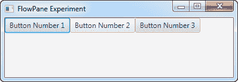
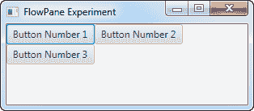
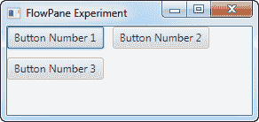

# JavaFX 流程窗格

> 原文：<https://jenkov.com/tutorials/javafx/flowpane.html>

JavaFX FlowPane 是一个布局组件，它垂直或水平地布置其子组件，如果一行中没有足够的空间，它可以将组件换行到下一行或下一列。JavaFX FlowPane 布局组件由类`javafx.scene.layout.FlowPane`表示

## 创建流程窗格

您通过它的构造函数创建一个 JavaFX `FlowPane`。下面是一个 JavaFX `FlowPane`实例化的例子:

```
FlowPane flowpane = new FlowPane();

```

## 向流程窗格添加子级

你可以通过获取它的子集合来给一个`FlowPane`添加子元素，并添加你想让`FlowPane`布局的组件。下面是一个给`FlowPane`添加 3 个按钮的例子:

```
Button button1 = new Button("Button Number 1");
Button button2 = new Button("Button Number 2");
Button button3 = new Button("Button Number 3");

FlowPane flowpane = new FlowPane();

flowpane.getChildren().add(button1);
flowpane.getChildren().add(button2);
        flowpane.getChildren().add(button3);

```

## 向场景图添加流窗格

要使`FlowPane`可见，必须将其添加到 JavaFX 场景图中。为此，您必须将`FlowPane`实例添加到一个`Scene`对象中，或者将`FlowPane`添加到一个布局组件中，该布局组件被添加到一个`Scene`对象中。

下面是一个将 JavaFX `FlowPane`添加到场景图的例子:

```
package com.jenkov.javafx.layouts;

import javafx.application.Application;
import javafx.geometry.Orientation;
import javafx.scene.Scene;
import javafx.scene.control.Button;
import javafx.scene.layout.FlowPane;
import javafx.stage.Stage;

public class FlowPaneExperiments extends Application  {

    @Override
    public void start(Stage primaryStage) throws Exception {
        primaryStage.setTitle("HBox Experiment 1");

        Button button1 = new Button("Button Number 1");
        Button button2 = new Button("Button Number 2");
        Button button3 = new Button("Button Number 3");

        FlowPane flowpane = new FlowPane();

        flowpane.getChildren().add(button1);
        flowpane.getChildren().add(button2);
        flowpane.getChildren().add(button3);

        Scene scene = new Scene(flowpane, 200, 100);
        primaryStage.setScene(scene);
        primaryStage.show();
    }

    public static void main(String[] args) {
        Application.launch(args);
    }
}

```

该应用程序生成的应用程序类似于以下屏幕截图。请注意，当窗口变得太小而无法在一个水平行中显示所有按钮时，这些按钮是如何向下流动到下一个水平行的。

 

## 水平和垂直间距

您可以使用 JavaFX `FlowPane`的`setHGap()`和`setVGap()`方法来设置 Java FX`FlowPane`中显示的组件之间的水平和垂直间距。下面的例子展示了如何设置`FlowPane`中组件之间的水平和垂直间隙:

```
flowpane.setHgap(10);
flowpane.setVgap(10);

```

当添加到前面的示例中时，生成的应用程序如下所示:



现在请注意按钮之间的水平和垂直间隙。

## 方向

默认情况下，`FlowPane`中的组件是水平布局的，当`FlowPane`中没有足够的空间来水平显示更多组件时，组件会换行。

您可以使用`setOrientation()`方法改变`FlowPane`的流向。您可以强制将组件从上到下排列成列，然后在高度空间不足以显示更多组件时更改列。以下是您的操作方法:

```
flowpane.setOrientation(Orientation.VERTICAL);

```