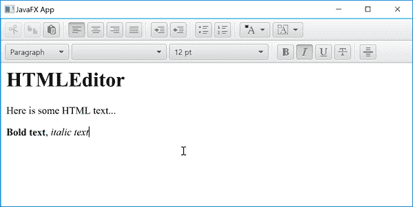

# JavaFX HTMLEditor

> 原文：<https://jenkov.com/tutorials/javafx/htmleditor.html>

*JavaFX* *HTMLEditor* 是一个高级 HTML 编辑器，使用户能够编辑 HTML 比用文本编写完整的 HTML 标记更容易。HTMLEditor 包含一组按钮，可以使用 来设置编辑后的文本所见即所得的样式。JavaFX HTMLEditor 由类 `javafx.scene.web.HTMLEditor`表示。下面是一个 JavaFX HTMLEditor 的截图:



## 完整的 Full 编辑器示例

这里首先是一个完整的 JavaFX `HTMLEditor`示例，因此您可以看到使用`HTMLEditor` 在代码中是什么样子的:

```

import javafx.application.Application;
import javafx.scene.Scene;
import javafx.scene.layout.VBox;
import javafx.scene.web.HTMLEditor;
import javafx.stage.Stage;

public class HtmlEditorExample extends Application {

    public static void main(String[] args) {
        launch(args);
    }

    public void start(Stage primaryStage) {

        HTMLEditor htmlEditor = new HTMLEditor();

        VBox vBox = new VBox(htmlEditor);
        Scene scene = new Scene(vBox);

        primaryStage.setScene(scene);
        primaryStage.setTitle("JavaFX App");

        primaryStage.show();
    }
}

```

## 创建 html 编辑器

在代码中使用 JavaFX `HTMLEditor`之前，必须先创建它的一个实例。 下面是一个创建 JavaFX `HTMLEditor` : 实例的例子

```

 HTMLEditor htmlEditor = new HTMLEditor();

```

## 从 HTMLEditor 获取 HTML

迟早你可能会想要获得由用户 在`HTMLEditor`中编辑的 HTML 文本。您通过`HTMLEditor`的`getHtmlText()`方法从它那里获得 HTML。 下面是一个从 JavaFX `HTMLEditor`实例中获取 HTML 的例子:

```

String htmlText = htmlEditor.getHtmlText();

```

如您所见，HTML 作为标准的 [Java 字符串](/java/strings.html)返回。

## 在 HTMLEditor 中设置 HTML

您还可以通过 JavaFX `HTMLEditor`的`setHtmlText()` 方法设置要在 Java FX`HTMLEditor`中编辑的 HTML。下面是一个在 JavaFX `HTMLEditor`实例中设置要编辑的 HTML 的例子:

```

String htmlText = "<b>Bold text</b>";

htmlEditor.setHtmlText(htmlText);

```