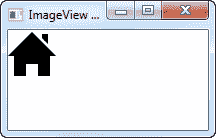

# JavaFX 图像视图

> 原文：<https://jenkov.com/tutorials/javafx/imageview.html>

JavaFX ImageView 控件可以在 JavaFX GUI 中显示图像。ImageView 控件必须添加到场景图中才可见。JavaFX ImageView 控件由类`javafx.scene.image.ImageView`表示。

## 创建图像视图

通过创建一个`ImageView`类的实例来创建一个 ImageView 控件实例。`ImageView`类的构造函数需要一个`javafx.scene.image.Image`的实例作为参数。`Image`对象代表由`ImageView`控件显示的图像。

以下是 JavaFX ImageView 实例化示例:

```
FileInputStream input = new FileInputStream("resources/images/iconmonstr-home-6-48.png");
Image image = new Image(input);
ImageView imageView = new ImageView(image);

```

首先创建一个`FileInputStream`，它指向要显示的图像的图像文件。

其次，创建一个`Image`实例，将`FileInputStream`作为参数传递给`Image`构造函数。这样，`Image`类知道从哪里加载图像文件。

第三，创建一个`ImageView`实例，将`Image`实例作为参数传递给`ImageView`构造函数。

## 将 ImageView 添加到场景图

要使`ImageViewl`可见，你必须将它添加到场景图中。这意味着将它添加到一个`Scene`对象中。由于`ImageView`不是`javafx.scene.Parent`的子类，它不能被直接添加到场景 grahp 中。它必须嵌套在另一个组件中，例如布局组件。

下面是一个示例，通过将 JavaFX `ImageView`嵌套在`HBox`布局组件中，将它附加到场景图:

```
package com.jenkov.javafx.controls;

import javafx.application.Application;
import javafx.scene.Scene;
import javafx.scene.control.Button;
import javafx.scene.image.Image;
import javafx.scene.image.ImageView;
import javafx.scene.layout.HBox;
import javafx.stage.Stage;

import java.io.FileInputStream;

public class ImageViewExperiments extends Application  {

    @Override
    public void start(Stage primaryStage) throws Exception {
        primaryStage.setTitle("ImageView Experiment 1");

        FileInputStream input = new FileInputStream("resources/images/iconmonstr-home-6-48.png");
        Image image = new Image(input);
        ImageView imageView = new ImageView(image);

        HBox hbox = new HBox(imageView);

        Scene scene = new Scene(hbox, 200, 100);
        primaryStage.setScene(scene);
        primaryStage.show();

    }

    public static void main(String[] args) {
        Application.launch(args);
    }

}

```

运行上述 JavaFX `ImageView`示例的结果是一个如下所示的应用程序:



## 标签和按钮中的 ImageView

JavaFX `Label`和 Button 中都可以使用`ImageView`。这将导致`Label`和`Button`在`Label`或`Button`中文本的左侧显示`ImageView`。有关如何操作的信息，请参见关于 [JavaFX 标签](label.html)和 [JavaFX 按钮](button.html)的文本。