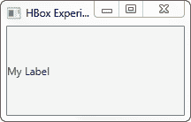
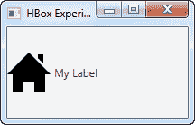

# JavaFX 标签

> 原文：<https://jenkov.com/tutorials/javafx/label.html>

JavaFX Label 控件可以在 JavaFX GUI 中显示文本或图像标签。label 控件必须添加到场景图中才可见。JavaFX 标签控件由类`javafx.scene.control.Label`表示。

## 创建标签

通过创建一个`Label`类的实例来创建一个标签控件实例。下面是一个 JavaFX 标签实例化示例:

```
Label label = new Label("My Label");

```

如您所见，标签中显示的文本作为参数传递给了`Label`构造函数。

## 向场景图添加标签

要使`Label`可见，你必须将它添加到场景图中。这意味着将其添加到一个`Scene`对象，或作为一个附加到`Scene`对象的布局的子对象。

下面是一个将 JavaFX `Label`附加到场景图的示例:

```
package com.jenkov.javafx.controls;

import javafx.application.Application;
import javafx.scene.Scene;
import javafx.scene.control.Label;
import javafx.stage.Stage;

public class LabelExperiments extends Application  {

    @Override
    public void start(Stage primaryStage) throws Exception {
        primaryStage.setTitle("HBox Experiment 1");

        Label label = new Label("My Label");

        Scene scene = new Scene(label, 200, 100);
        primaryStage.setScene(scene);
        primaryStage.show();
    }

    public static void main(String[] args) {
        Application.launch(args);
    }
}

```

请注意，`Label`被直接添加到了`Scene`对象中。通常你会将`Label`嵌套在某种布局组件中。为了使这个例子简单，我把它留在这里。请参见关于布局组件的教程，了解它们的工作方式。

运行上述 JavaFX `Label`示例的结果是一个如下所示的应用程序:



## 在标签中显示图像

可以在标签文本旁边的标签内显示图像。JavaFX `Label`类包含一个构造函数，它可以接受一个`Node`作为额外的参数。下面是一个 JavaFX 标签示例，它使用一个 [JavaFX ImageView](imageview.html) 组件向标签添加图像:

```
package com.jenkov.javafx.controls;

import javafx.application.Application;
import javafx.scene.Scene;
import javafx.scene.control.Label;
import javafx.scene.image.Image;
import javafx.scene.image.ImageView;
import javafx.stage.Stage;

import java.io.FileInputStream;

public class LabelExperiments extends Application  {

    @Override
    public void start(Stage primaryStage) throws Exception {
        primaryStage.setTitle("HBox Experiment 1");

        FileInputStream input = new FileInputStream("resources/images/iconmonstr-home-6-48.png");
        Image image = new Image(input);
        ImageView imageView = new ImageView(image);

        Label label = new Label("My Label", imageView);

        Scene scene = new Scene(label, 200, 100);
        primaryStage.setScene(scene);
        primaryStage.show();
    }

    public static void main(String[] args) {
        Application.launch(args);
    }
}

```

运行上述 JavaFX `Label`示例的结果是一个如下所示的应用程序:



## 更改标签的文本

您可以使用标签的`setText()`方法来更改标签的文本。这可以在应用程序运行时完成。以下是设置 JavaFX 标签文本的示例:

```
label.setText("New label text");

```

参见 [JavaFX 按钮教程](button.html)中的一个例子，当点击一个按钮时改变标签的文本。

## 设置标签字体

您可以通过调用 JavaFX `Label`的`setFont()`方法来更改它所使用的字体。如果您需要更改文本的大小，或者想要使用不同的文本样式，这将非常有用。你可以在我的 [JavaFX 字体](fonts.html)教程中了解更多关于如何创建 JavaFX 字体的信息。下面是一个设置 JavaFX `Label`字体的例子:

```
Label label = new Label("A label with custom font set.");

label.setFont(new Font("Arial", 24));

```

这个例子告诉`Label`使用大小为 24 的`Arial`字体。