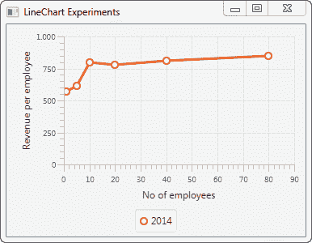

# JavaFX 折线图

> 原文：<https://jenkov.com/tutorials/javafx/linechart.html>

JavaFX 折线图可以在 JavaFX 应用程序中绘制折线图。JavaFX 折线图组件由类`javafx.scene.chart.LineChart`表示。

## 折线图 X 轴和 Y 轴

JavaFX 折线图绘制折线图。折线图是一个二维图形，意味着该图形有一个 X 轴和一个 Y 轴。折线图通常有两个数值轴。数值轴由 JavaFX 类`javafx.scene.chart.NumberAxis`表示。

你需要定义一个`LineChart`使用的 X 轴和 Y 轴。下面是创建两个 JavaFX `NumberAxis`实例的示例:

```
NumberAxis xAxis = new NumberAxis();
xAxis.setLabel("No of employees");

NumberAxis yAxis = new NumberAxis();
yAxis.setLabel("Revenue per employee");

```

## 创建折线图

通过创建一个`LineChart`类的实例来创建一个 JavaFX 折线图组件。您需要将 X 轴和 Y 轴传递给`LineChart`构造函数。下面是一个 JavaFX `LineChart`实例化的例子:

```
NumberAxis xAxis = new NumberAxis();
xAxis.setLabel("No of employees");

NumberAxis yAxis = new NumberAxis();
yAxis.setLabel("Revenue per employee");

LineChart lineChart = new LineChart(xAxis, yAxis);

```

## 折线图数据系列

要让 JavaFX `LineChart`组件显示任何行，您必须为它提供一个*数据序列*。数据系列是数据点的列表。每个数据点包含一个 X 值和一个 Y 值。下面是一个创建数据序列并将其添加到`LineChart`组件的示例:

```
XYChart.Series dataSeries1 = new XYChart.Series();
dataSeries1.setName("2014");

dataSeries1.getData().add(new XYChart.Data( 1, 567));
dataSeries1.getData().add(new XYChart.Data( 5, 612));
dataSeries1.getData().add(new XYChart.Data(10, 800));
dataSeries1.getData().add(new XYChart.Data(20, 780));
dataSeries1.getData().add(new XYChart.Data(40, 810));
dataSeries1.getData().add(new XYChart.Data(80, 850));

lineChart.getData().add(dataSeries1);

```

首先创建一个`XYChart.Series`实例并给它命名。其次，6 个`XYChart.Data`实例被添加到`XYChart.Series`对象中。第三，将`XYChart.Series`对象添加到`LineChart`对象中。

可以向`LineChart`添加多个数据系列。只需对额外的数据系列重复上述代码。

## 向场景图添加折线图

要使`LineChart`可见，必须将其添加到 JavaFX 场景图中。这意味着将`LineChart`添加到一个`Scene`对象，或者将`LineChart`添加到一个布局组件，该布局组件被添加到一个`Scene`对象。

下面是一个将`LineChart`添加到 JavaFX 场景图的示例:

```
package com.jenkov.javafx.charts;

import javafx.application.Application;
import javafx.scene.Scene;
import javafx.scene.chart.LineChart;
import javafx.scene.chart.NumberAxis;
import javafx.scene.chart.XYChart;
import javafx.scene.layout.VBox;
import javafx.stage.Stage;

public class LineChartExperiments extends Application {

    @Override
    public void start(Stage primaryStage) throws Exception {
        primaryStage.setTitle("LineChart Experiments");

        NumberAxis xAxis = new NumberAxis();
        xAxis.setLabel("No of employees");

        NumberAxis yAxis = new NumberAxis();
        yAxis.setLabel("Revenue per employee");

        LineChart lineChart = new LineChart(xAxis, yAxis);

        XYChart.Series dataSeries1 = new XYChart.Series();
        dataSeries1.setName("2014");

        dataSeries1.getData().add(new XYChart.Data( 1, 567));
        dataSeries1.getData().add(new XYChart.Data( 5, 612));
        dataSeries1.getData().add(new XYChart.Data(10, 800));
        dataSeries1.getData().add(new XYChart.Data(20, 780));
        dataSeries1.getData().add(new XYChart.Data(40, 810));
        dataSeries1.getData().add(new XYChart.Data(80, 850));

        lineChart.getData().add(dataSeries1);

        VBox vbox = new VBox(lineChart);

        Scene scene = new Scene(vbox, 400, 200);

        primaryStage.setScene(scene);
        primaryStage.setHeight(300);
        primaryStage.setWidth(1200);

        primaryStage.show();
    }

    public static void main(String[] args) {
        Application.launch(args);
    }
}

```

运行此应用程序生成的应用程序看起来如下所示:

