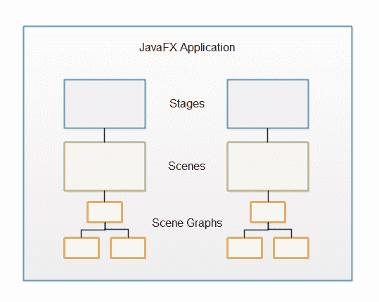

# JavaFX 概述

> 原文：<https://jenkov.com/tutorials/javafx/overview.html>

要充分利用 JavaFX，了解 JavaFX 的设计方式并全面了解 JavaFX 包含的功能是非常有用的。本文目的是为您提供 JavaFX 概述。本文将首先介绍 JavaFX 的一般设计，然后介绍 JavaFX 的各种特性。

如果你熟悉 Flash / Flex，你会发现 JavaFX 多少受到了 Flash / Flex 的启发。JavaFX 中也有一些相同的想法。

通常，JavaFX 应用程序包含一个或多个与 windows 相对应的阶段。每个阶段都有一个场景。每个场景可以有一个控制、布局等的对象图。附在上面的，叫场景图。这些概念将在后面详细解释。下面是 JavaFX 应用程序的一般结构:

## 阶段

阶段是 JavaFX 应用程序的外部框架。该阶段通常对应于一个窗口。在 JavaFX 可以在浏览器中运行的早期，stage 也可以指 JavaFX 可以用来绘制自己的网页内的区域。

由于 Java 浏览器插件 JavaFX 主要用于桌面应用程序。这里，JavaFX 取代 Swing 成为推荐的桌面 GUI 框架。我必须说，JavaFX 看起来比 Swing 更加一致，功能更加丰富。

在桌面环境中使用时，JavaFX 应用程序可以打开多个窗口。每个窗口都有自己的舞台。

每个阶段由 JavaFX 应用程序中的一个`Stage`对象表示。JavaFX 应用程序有一个由 JavaFX 运行时为您创建的主`Stage`对象。如果需要打开额外的窗口，JavaFX 应用程序可以创建额外的`Stage`对象。例如，对于对话框、向导等。

## 事件

要在 JavaFX 应用程序的舞台上显示任何东西，您需要一个*场景*。一个舞台一次只能显示一个场景，但在运行时可以交换场景。就像剧院中的舞台可以重新排列以在一出戏中显示多个场景一样，JavaFX 中的 stage 对象可以在 JavaFX 应用程序的生命周期中显示多个场景(一次一个)。

您可能想知道为什么 JavaFX 应用程序的每个阶段会有多个场景。想象一个电脑游戏。一个游戏可能有多个“屏幕”显示给用户。例如，初始菜单屏幕、主游戏屏幕(玩游戏的地方)、游戏结束屏幕和高分屏幕。这些屏幕中的每一个都可以用不同的场景来表示。当游戏需要从一个屏幕切换到下一个屏幕时，它只需将相应的场景附加到 JavaFX 应用程序的`Stage`对象上。

一个场景由 JavaFX 应用程序中的一个`Scene`对象表示。JavaFX 应用程序必须创建它需要的所有`Scene`对象。

### 场景图

所有可视组件(控件、布局等。)必须附加到要显示的场景，并且该场景必须附加到舞台，整个场景才可见。所有控件、布局等的总对象图。附在一个场景上的叫做*场景图*。

### 节点

所有附属于场景图的组件被称为*节点*。所有节点都是名为`javafx.scene.Node`的 JavaFX 类的子类。

有两种类型的节点:分支节点和叶节点。分支节点是可以包含其他节点(子节点)的节点。分支节点也称为父节点，因为它们可以包含子节点。叶节点是不能包含其他节点的节点。

## 控制

JavaFX 控件是 JavaFX 组件，在 JavaFX 应用程序中提供某种控制功能。例如，按钮、单选按钮、表格、树等。

对于一个可见的控件，它必须被附加到某个`Scene`对象的场景图中。

控件通常嵌套在某个 JavaFX 布局组件中，该组件管理控件之间的相对布局。

JavaFX 包含以下控件:

*   手风琴
*   [按钮](button.html)
*   [复选框](checkbox.html)
*   选择框
*   颜色选择器
*   组合框
*   日期选择器
*   [标签](label.html)
*   列表视图
*   菜单
*   菜单条
*   jpasswordfield
*   进度条
*   [单选按钮](radiobutton.html)
*   滑块
*   纺纱机
*   SplitMenuButton 按钮
*   SplitPane
*   TableView
*   标签窗格
*   文本区域
*   [文本字段](textfield.html)
*   标题窗格
*   [切换按钮](togglebutton.html)
*   工具栏
*   TreeTableView
*   树形视图

这些控件将在单独的文本中进行解释。

## 布局

*JavaFX 布局*是内部包含其他组件的组件。布局组件管理嵌套在其中的组件的布局。JavaFX 布局组件有时也被称为*父组件*，因为它们包含子组件，并且因为布局组件是 JavaFX 类`javafx.scene.Parent`的子类。

布局组件必须附加到某个`Scene`对象的场景图形上才可见。

JavaFX 包含以下布局组件:

*   组
*   地区
*   窗格
*   [HBox](hbox.html)
*   [VBox](vbox.html)
*   流动窗格
*   BorderPane
*   BorderPane
*   堆栈面板
*   蒂勒潘尼
*   网格面板
*   锚板
*   TextFlow

这些布局组件中的每一个都将包含在单独的文本中。

### 嵌套布局

可以将布局组件嵌套在其他布局组件中。这有助于实现特定的布局。例如，要获得未在网格中布局的组件的水平行，但每行不同，您可以在 VBox 组件中嵌套多个 HBox 布局组件。

## 图表

JavaFX 附带了一组内置的即用型图表组件，因此每次需要基本图表时，您不必从头开始编写图表。JavaFX 包含以下图表组件:

*   面积图
*   BarChart
*   泡泡图
*   线性图表
*   PieChart
*   散点图
*   stackledareachart
*   堆叠条形图

## 2D 图形

JavaFX 包含的特性使得在屏幕上绘制 2D 图形变得很容易。

## 3D 图形

JavaFX 包含一些功能，可以轻松地在屏幕上绘制 3D 图形。

## 声音的

JavaFX 包含的特性使得在 JavaFX 应用程序中播放音频变得很容易。这在游戏或教育应用中非常有用。

## 录像

JavaFX 包含的特性使得在 JavaFX 应用程序中播放视频变得很容易。这通常在流应用、游戏或教育应用中很有用。

## 网络视图

JavaFX 包含一个能够显示网页(HTML5，CSS 等)的组件。).JavaFX `WebView`组件基于 WebKit——Chrome 和 Safari 中也使用的网页渲染引擎。

组件使得混合桌面应用程序和网络应用程序成为可能。有时候这是有用的。例如，如果你已经有了一个不错的 web 应用程序，但是需要一些只有桌面应用程序才能提供的功能，比如磁盘访问、与 HTTP 之外的其他网络协议通信(例如 UDP、IAP 等)。) .