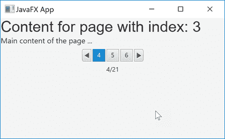

# JavaFX 分页

> 原文：<https://jenkov.com/tutorials/javafx/pagination.html>

*JavaFX* Java FX 分页控件由类`javafx.scene.control.Pagination`表示。 这里是一个 JavaFX `Pagination`控件的截图:



## 完整分页示例

这里首先是一个完整的 Java 代码示例，演示如何使用 JavaFX `Pagination`控件:

```

import javafx.application.Application;
import javafx.scene.Scene;
import javafx.scene.control.Label;
import javafx.scene.control.Pagination;
import javafx.scene.layout.VBox;
import javafx.scene.text.Font;
import javafx.stage.Stage;

public class PaginationExample extends Application {
    public static void main(String[] args) {
        launch(args);
    }

    @Override
    public void start(Stage primaryStage) {
        primaryStage.setTitle("JavaFX App");

        Pagination pagination = new Pagination();
        pagination.setPageCount(21);
        pagination.setCurrentPageIndex(3);
        pagination.setMaxPageIndicatorCount(3);

        pagination.setPageFactory((pageIndex) -> {

            Label label1 = new Label("Content for page with index: " + pageIndex);
            label1.setFont(new Font("Arial", 24));

            Label label2 = new Label("Main content of the page ...");

            return new VBox(label1, label2);
        });

        VBox vBox = new VBox(pagination);
        Scene scene = new Scene(vBox, 960, 600);

        primaryStage.setScene(scene);
        primaryStage.show();
    }
}

```

## 分页属性

JavaFX `Pagination`控件包含一组指定如何呈现 `Pagination`控件的属性。这些属性是:

*   页数
*   当前页面索引
*   页面指示器的最大数量

页数是用户可以浏览的总页数。当前页面索引是用户当前正在查看的页面。页面指示器的最大数量是带有页码的快捷按钮的数量，用户可以单击这些按钮直接导航到该页面。

所有这三个属性的效果在本教程前面的屏幕截图中都可以看到。以下是设置所有三个属性的示例:

```

Pagination pagination = new Pagination();

pagination.setPageCount(21);
pagination.setCurrentPageIndex(3);
pagination.setMaxPageIndicatorCount(3);

```

## 分页页面工厂

JavaFX `Pagination`控件需要在其上设置一个页面工厂，以便能够在分页内容中正确地 导航。当用户导航到新页面时，页面工厂被调用。页面工厂 组件通过其`setPageFactory()`方法 附加到`Pagination`控件，并且必须实现接口`javafx.util.Callback`接口。

下面首先介绍如何定义`CallBack`接口:

```

public interface Callback<P,R> {

    public R call(P param);

}

```

在`setPageFactory()`方法中，两个类型参数 P 和 R 被设置为`Integer` (P) 和`Node` (R)。这意味着，页面工厂必须实现`Callback<Integer, Node>` 接口。下面是一个`Callback<Integer, Node>`的实现示例:

```

public static class MyPageFactory implements Callback<Integer, Node> {
    @Override
    public Node call(Integer pageIndex) {
        return new Label("Content for page " + pageIndex);
    }
}

```

传递给`Callback`实现的`Integer`参数是页面工厂应该为其创建`Node`的 页面的索引。返回的`Node`应该显示 具有给定页面索引的页面内容。

下面是一个在 JavaFX `Pagination`控件上设置页面工厂的例子:

```

pagination.setPageFactory(new MyPageFactory());

```

还可以使用匿名的`Callback` 接口实现，或者使用 [Java lambda](/java/lambda-expressions.html) 表达式，在`Pagination`控件上设置页面工厂。 这里首先是一个使用匿名`Callback`实现的例子:

```

pagination.setPageFactory(new Callback<Integer, Node>() {
    @Override
    public Node call(Integer pageIndex) {
        return new Label("Content for page " + pageIndex);
    }
});

```

下面是一个使用 Java lambda 表达式设置`Pagination`页面工厂的例子:

```

pagination.setPageFactory((pageIndex) -> {
   return new Label("Content for page " + pageIndex);
});

```

甚至更短，使用更短的 lambda 表达式语法:

```

pagination.setPageFactory((pageIndex) -> new Label("Content for page " + pageIndex) );

```