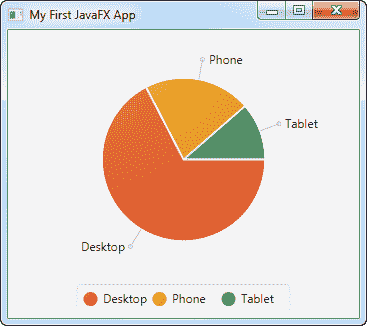

# JavaFX 饼图

> 原文：<https://jenkov.com/tutorials/javafx/piechart.html>

JavaFX 饼图组件能够根据您提供的数据在 JavaFX 应用程序中绘制饼图。PieChart 组件非常容易使用。JavaFX PieChart 组件由类`javafx.scene.chart.PieChart`表示。

## 创建饼图

您可以通过创建一个`PieChart`类的实例来创建一个 JavaFX PieChart 组件。下面是一个 JavaFX `PieChart`实例化的例子:

```
PieChart pieChart = new PieChart();

```

## 向饼图添加数据

要显示任何内容，您必须向`PieChart`添加数据。饼图数据由`PieChart.Data`类表示。饼图中的每个部分由一个`PieChart.Data`实例表示。下面是一个向 JavaFX `PieChart`组件添加数据的示例:

```
PieChart pieChart = new PieChart();

PieChart.Data slice1 = new PieChart.Data("Desktop", 213);
PieChart.Data slice2 = new PieChart.Data("Phone"  , 67);
PieChart.Data slice3 = new PieChart.Data("Tablet" , 36);

pieChart.getData().add(slice1);
pieChart.getData().add(slice2);
pieChart.getData().add(slice3);

```

## 向场景图添加饼图

为了使 JavaFX `PieChart`组件可见，必须将其添加到 JavaFX 场景图中。这意味着将`PieChart`实例添加到一个`Scene`对象，或者将其添加到一个布局组件，该布局组件被添加到一个`Scene`对象。

下面是向 JavaFX 场景图添加`PieChart`的完整示例:

```
package com.jenkov.javafx.charts;

import javafx.application.Application;
import javafx.scene.Scene;
import javafx.scene.chart.PieChart;
import javafx.scene.layout.VBox;
import javafx.stage.Stage;

public class PieChartExperiments extends Application {

    @Override
    public void start(Stage primaryStage) throws Exception {
        primaryStage.setTitle("My First JavaFX App");

        PieChart pieChart = new PieChart();

        PieChart.Data slice1 = new PieChart.Data("Desktop", 213);
        PieChart.Data slice2 = new PieChart.Data("Phone"  , 67);
        PieChart.Data slice3 = new PieChart.Data("Tablet" , 36);

        pieChart.getData().add(slice1);
        pieChart.getData().add(slice2);
        pieChart.getData().add(slice3);

        VBox vbox = new VBox(pieChart);

        Scene scene = new Scene(vbox, 400, 200);

        primaryStage.setScene(scene);
        primaryStage.setHeight(300);
        primaryStage.setWidth(1200);

        primaryStage.show();
    }

    public static void main(String[] args) {
        Application.launch(args);
    }
}

```

运行上述代码生成的应用程序将类似于以下内容:

