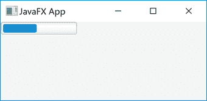

# JavaFX 进度条

> 原文：<https://jenkov.com/tutorials/javafx/progressbar.html>

*JavaFX 进度条*是一个能够显示某个任务进度的控件。进度 设置为 0 到 1 之间的`double`值，其中 0 表示无进度，1 表示全部进度(任务完成)。 Java FX*progress bar*控件由`javafx.scene.control.ProgressBar` 类表示。下面是一张*Java FX*T10】进度条的截图:



上面截图中的`ProgressBar`进度设置为 0.5。

## JavaFX ProgressBar 示例

下面是一个完整的 JavaFX `ProgressBar`代码示例:

```

import javafx.application.Application;
import javafx.scene.Scene;
import javafx.scene.control.Hyperlink;
import javafx.scene.control.ProgressBar;
import javafx.scene.layout.VBox;
import javafx.stage.Stage;

public class ProgressBarExample extends Application {
    public static void main(String[] args) {
        launch(args);
    }

    @Override
    public void start(Stage primaryStage) {
        primaryStage.setTitle("JavaFX App");

        ProgressBar progressBar = new ProgressBar(0);

        progressBar.setProgress(0.5);

        VBox vBox = new VBox(progressBar);
        Scene scene = new Scene(vBox, 960, 600);

        primaryStage.setScene(scene);
        primaryStage.show();
    }

}

```

## 创建进度条

为了使用 JavaFX `ProgressBar`，您必须首先创建一个`ProgressBar` 类的实例。下面是如何创建一个 JavaFX `ProgressBar` : 的实例

```

ProgressBar progressBar = new ProgressBar();

```

这个例子在不确定模式下创建了一个`ProgressBar`，这意味着它的进度是未知的。 在不确定模式下，JavaFX `ProgressBar`显示动画。

您可以通过将进度值 作为参数传递给其构造函数来创建具有确定进度级别的`ProgressBar`实例，如下:

```

ProgressBar progressBar = new ProgressBar(0);

```

## 设置进度级别

您可以通过`setProgress()`方法设置`ProgressBar`的进度级别。 下面是一个如何设置 JavaFX `ProgressBar` : 进度水平的例子

```

ProgressBar progressBar = new ProgressBar(0);

progressBar.setProgress(0.5);

```