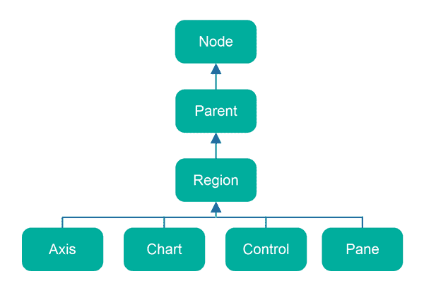
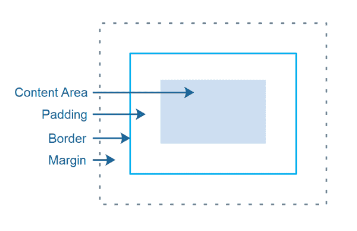

# JavaFX 区域

> 原文：<https://jenkov.com/tutorials/javafx/region.html>

*JavaFX* *区域*类是所有 JavaFX 布局窗格的基类，如[窗格](pane.html)等。 JavaFX Region 类有一组属性和特征，由所有扩展 Region 的 Java FX 布局类 共享。

## JavaFX 区域类层次结构

JavaFX Region 类的类层次结构如下所示:



记住，JavaFX 有许多类，它们是 Axis、Chart、Control 和 Pane 的子类。所有这些也都是 Region 的间接子类，也将具有与 Region 相同的属性。

## JavaFX 区域属性

JavaFX 区域类由其子类共享的属性有:

*   背景
*   内容区域
*   填料
*   边界
*   边缘
*   区域插图

这些概念如下所示:



内容区域是布局容器将在其中绘制其子级的地方。

填充是内容区域和边框之间的空间。

边框是一条线(或类似的线)，可以显示在内容区域+区域填充的周围。

边距是区域和它自己的父布局容器中的其他组件之间的空间。

## 设置填充

您可以使用其`setPadding()` 方法设置 JavaFX 区域或区域的子类的填充。在这个例子中，我使用了一个 [JavaFX HBox](hbox.html) ，它也是 Region， 的子类，因为不是所有的 Region 子类都支持它们的填充设置(据我所知，Pane 不支持)。 下面是如何设置一个 HBox 的填充:

```

HBox hBox = new HBox(new Label("Hello Pane"));

hBox.setPadding(new Insets(10));

```

## 设置边框

可以在 JavaFX 区域上设置边框。您可以使用标准描边作为边框(线条)或边框图像。边界图像可以用来在一个区域周围画一个图片框——就像画周围的框一样。不过，边框笔画更常见。

### 设置描边边框

下面是一个在区域上设置描边的例子。在本例中，使用的是 Region 子类窗格。了解什么术语，如“描边线接合线”、“描边线帽”等。意思是，看看我的 [SVG 笔画教程](/svg/stroke.html)。SVG 和 JavaFX 中的概念(很可能)是相同的，尽管实现的细节可能不同。有一天，我可能会在 JavaFX 中更深入地研究这一切。

```

Pane  pane  = new Pane();

StrokeType     strokeType     = StrokeType.INSIDE;
StrokeLineJoin strokeLineJoin = StrokeLineJoin.MITER;
StrokeLineCap  strokeLineCap  = StrokeLineCap.BUTT;
double         miterLimit     = 10;
double         dashOffset     = 0;
List<Double>   dashArray      = null;

BorderStrokeStyle borderStrokeStyle =
        new BorderStrokeStyle(
                strokeType,
                strokeLineJoin,
                strokeLineCap,
                miterLimit,
                dashOffset,
                dashArray
        );

BorderStroke borderStroke =
        new BorderStroke(
                Color.valueOf("08ff80"),
                borderStrokeStyle,
                new CornerRadii(0),
                new BorderWidths(8)
        );

Border border = new Border(borderStroke);

pane.setBorder(border);

```

## 设置背景

可以使用 JavaFX Background 类设置 JavaFX 区域的背景。在你正确初始化它之前，你可能需要多管闲事。您可以设置一个颜色填充的背景，或使用图像作为背景。

### 设置背景颜色

您可以为 JavaFX 区域设置背景色，如下所示:

```

Pane  pane  = new Pane();

BackgroundFill backgroundFill =
        new BackgroundFill(
                Color.valueOf("#ff00ff"),
                new CornerRadii(10),
                new Insets(10)
                );

Background background =
        new Background(backgroundFill);

pane.setBackground(background);

```

传递给 BackgroundFill 构造函数的 CornerRadii 实例设置背景填充的角的半径-如果需要圆角的话。如果不是，请将圆角半径设置为 0。

传递给 BackgroundFill 构造函数的 Insets 实例设置区域边缘和背景填充之间的内部填充。

可以将多个 BackgroundFill 实例应用于彼此之上。以下是如何做到这一点的示例:

```

Pane  pane  = new Pane();

BackgroundFill backgroundFill1 =
        new BackgroundFill(
                Color.valueOf("#ff00ff"),
                new CornerRadii(0),
                new Insets(0)
                );

BackgroundFill backgroundFill2 =
        new BackgroundFill(
                Color.valueOf("#00ff00"),
                new CornerRadii(10),
                new Insets(10)
                );

Background background =
        new Background(backgroundFill1, backgroundFill2);

pane.setBackground(background);

```

在此示例中，backgroundFill2 将绘制在 backgroundFill1 的顶部。由于 backgroundFill2 具有圆角半径和填充集，因此 backgroundFill1 将在 backgroundFill2 的边缘周围可见。

### 设置背景图像

也可以使用图像作为 JavaFX 区域的背景。下面是一个使用图像作为区域(窗格)背景的示例:

```

Pane pane = new Pane();

String filePath = "data/background.jpg";
Image image = null;
try {
    image = new Image(new FileInputStream(filePath));
} catch (FileNotFoundException e) {
    e.printStackTrace();
}

BackgroundImage backgroundImage =
    new BackgroundImage(
        image,
        BackgroundRepeat.NO_REPEAT,  // repeat X
        BackgroundRepeat.NO_REPEAT,  // repeat Y
        BackgroundPosition.CENTER,   // position
        new BackgroundSize(
            100,   // width  = 100%
            100,   // height = 100%
            true,  // width is percentage
            true,  // height is percentage
            true,  // contain image within bounds
            true   // cover all of Region content area
        )
    );

pane.setBackground(new Background(backgroundImage));

```