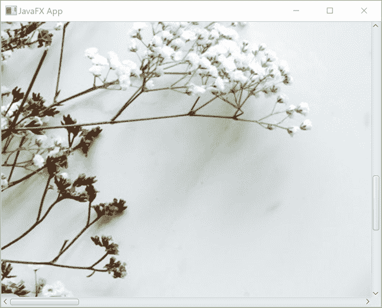

# JavaFX ScrollPane

> 原文：<https://jenkov.com/tutorials/javafx/scrollpane.html>

*JavaFX* 滚动条允许用户 滚动滚动条窗格中显示的组件，因此可以看到组件的不同部分。 JavaFX scroll pane 控件由 Java FX 类`javafx.scene.control.ScrollPane`表示。 这里是一个 JavaFX `ScrollPane`的截图，里面有一个[Java FX ImageView](imageview.html) :



## 创建一个滚动窗格

要使用 JavaFX `ScrollPane`，您必须首先创建一个`ScrollPane`实例。 下面是一个创建 JavaFX `ScrollPane`实例的例子:

```

ScrollPane scrollPane = new ScrollPane();

```

## 设置滚动窗格内容

一旦你创建了一个 JavaFX `ScrollPane`实例，你就可以通过它的`setContent()`方法设置你想要它在 上显示的内容。下面是一个将 JavaFX `ImageView` 设置为 JavaFX `ScrollPane` : 的内容的例子

```

ScrollPane scrollPane = new ScrollPane();

String imagePath = "images/aerial-beverage-caffeine-972533.jpg";
ImageView imageView = new ImageView(new Image(new FileInputStream(imagePath)));

scrollPane.setContent(imageView);

```

## ScrollPane Viewport

JavaFX `ScrollPane`的可见部分被称为*滚动条*视口。 当您使用滚动条滚动显示在`ScrollPane`中的内容时， 视窗也会在内容周围移动，使内容的不同部分可见。

## 具有效果或变换的内容

如果您想要在 JavaFX `ScrollPane`中显示的内容(JavaFX 控件)使用效果 或变换，您必须首先将这些控件包装在一个 [JavaFX 组](group.html)中。否则 内容无法正确显示。

## Pannable ScrollPane

默认情况下，用户只能使用 滚动条浏览 JavaFX `ScrollPane`中显示的内容。然而，使 JavaFX `ScrollPane` *可平移*是可能的。 可平移的`ScrollPane`使用户能够通过按住鼠标左键 并四处移动鼠标来导航其内容。这和使用滚动条有同样的效果。但是，使用平移，您 可以同时沿 X 轴和 Y 轴移动内容。使用滚动条是不可能的，用户一次只能操作一个滚动条。

要将 JavaFX `ScrollPane`切换到可平移模式，必须将其`pannableProperty` 设置为值`true`。下面是一个将 JavaFX `ScrollPane`切换到 可平移模式的例子:

```

scrollPane.pannableProperty().set(true);

```

## 适合宽度

JavaFX `ScrollPane` `fitToWidth`属性可以使`ScrollPane`将其内容调整到`ScrollPane`视窗的宽度。为此，必须将`fitToWidth` 属性设置为值`true`。如果内容节点不是 可调整大小的，则忽略该属性。下面是一个将 JavaFX `ScrollPane` `fitToWidth`属性 设置为`true` : 的例子

```

scrollPane.fitToWidthProperty().set(true);

```

## 适合高度

JavaFX `ScrollPane` `fitToHeight`属性可以使`ScrollPane`将其内容调整到`ScrollPane`视口的高度。为此，必须将`fitToHeight` 属性设置为值`true`。如果内容节点不是 可调整大小的，则忽略该属性。下面是一个将 JavaFX `ScrollPane` `fitToHeight`属性 设置为`true` : 的例子

```

scrollPane.fitToHeightProperty().set(true);

```

## 通过滚动条策略显示和隐藏滚动条

可以指定 JavaFX `ScrollPane`何时显示垂直和水平滚动条。 您可以通过`ScrollPane` `hbarPolicyProperty`和`vbarPolicyProperty` 属性来实现。这些属性可以设置为`ScrollPane.ScrollBarPolicy`枚举值之一。 您可以从`ALWAYS`、`AS_NEEDED`和`NEVER`的值中选择。下面是将`hbarPolicyProperty`和`vbarPolicyProperty`设置为 `ScrollBarPolicy.NEVER`的 示例:

```

scrollPane.hbarPolicyProperty().setValue(ScrollPane.ScrollBarPolicy.NEVER);
scrollPane.vbarPolicyProperty().setValue(ScrollPane.ScrollBarPolicy.NEVER);

```

上面的例子从`ScrollPane`中移除了垂直和水平滚动条。没有 滚动条，用户不能使用它们来滚动`ScrollPane`的内容。然而， 如果`ScrollPane`处于可平移模式(参见 JavaFX ScrollPane 教程的前面部分) 用户仍然可以抓取内容并用鼠标滚动。