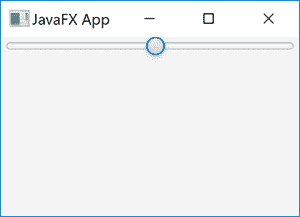
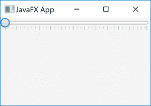
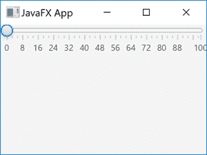

# JavaFX 滑块

> 原文：<https://jenkov.com/tutorials/javafx/slider.html>

*JavaFX Slider* 控件为用户提供了一种在给定区间 内选择一个值的方法，方法是将手柄滑动到代表所需值的所需点。 *JavaFX* *滑块* 由 JavaFX 类`javafx.scene.control.Slider`表示。下面是一个 JavaFX `Slider`的截图:



## JavaFX 滑块示例

下面是一个完整的 JavaFX `Slider`代码示例:

```

import javafx.application.Application;
import javafx.scene.Scene;
import javafx.scene.control.Slider;
import javafx.scene.layout.VBox;
import javafx.stage.Stage;

public class SliderExample extends Application {
    public static void main(String[] args) {
        launch(args);
    }

    @Override
    public void start(Stage primaryStage) {
        primaryStage.setTitle("JavaFX App");

        Slider slider = new Slider(0, 100, 0);

        VBox vBox = new VBox(slider);
        Scene scene = new Scene(vBox, 960, 600);

        primaryStage.setScene(scene);
        primaryStage.show();
    }

}

```

## 创建滑块

要使用 JavaFX `Slider`，您必须首先创建一个`Slider`类的实例。 下面是一个创建 JavaFX `Slider`实例的例子:

```

Slider slider = new Slider(0, 100, 0);

```

上面使用的`Slider`构造函数有三个参数:最小值、最大值和初始值。 最小值是将手柄滑动到最左侧所代表的值。这是用户可以选择一个值的区间 的开始。最大值是将手柄滑动到最右侧所代表的值。 这是用户可以选择数值的时间间隔的终点。初始值是第一次呈现给用户时，句柄 应该位于的值。

## 读取滑块值

您可以通过`getValue()`方法读取用户选择的`Slider`的值。 下面是一个读取 JavaFX `Slider` : 的选定值的例子

```

double value = slider.getValue();

```

## 主要刻度单位

您可以设置 JavaFX `Slider`控件的主要刻度单位。主要刻度单位是 用户每次移动`Slider`手柄一个刻度，数值改变多少个单位。 下面是一个将 JavaFX `Slider`的主要刻度单位设置为 8: 的例子

```

Slider slider = new Slider(0, 100, 0);

slider.setMajorTickUnit(8.0);

```

每当移动`Slider` 中的手柄时，该`Slider`的值将随着 8.0 上下变化。

## 次要刻度计数

您可以通过`setMinorTickCount()` 方法设置 JavaFX `Slider`的次要时钟周期数。次要刻度计数指定两个主要刻度之间有多少个次要刻度。 下面是一个将次要刻度计数设置为 2 的示例:

```

Slider slider = new Slider(0, 100, 0);

slider.setMajorTickUnit(8.0);

slider.setMinorTickCount(3);

```

这里配置的`Slider`在每个主要分笔成交点之间有 8.0 个值单位，在这些主要分笔成交点的每个 之间有 3 个次要分笔成交点。

## 将手柄对齐刻度

您可以使用`Slider` `setSnapToTicks()`方法，通过传递一个参数值`true`来使 JavaFX `Slider`的句柄捕捉到刻度。下面是一个让 JavaFX `Slider`将其句柄对齐刻度的例子:

```

slider.setSnapToTicks(true);

```

## 显示刻度线

您可以让 *JavaFX* *滑块*在呈现滑块时显示刻度标记。使用它的`setShowTickMarks()`方法可以做到这一点。下面是一个让 JavaFX `Slider` 显示刻度线的例子:

```

slider.setShowTickMarks(true);

```

下面是一个 JavaFX `Slider`的截图，显示了勾选标记:



## 显示刻度标签

您可以让 JavaFX `Slider`在呈现滑块时显示刻度标签。 你可以使用它的`setShowTickLabels()`方法。下面是一个让 JavaFX `Slider` 显示刻度标签的例子:

```

slider.setShowTickLabels(true);

```

下面是一个 JavaFX `Slider`的截图，显示了标记和标签:

