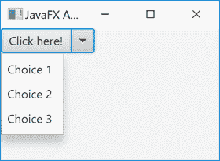

# JavaFX SplitMenuButton 按钮

> 原文：<https://jenkov.com/tutorials/javafx/splitmenubutton.html>

*JavaFX* JavaFX *SplitMenuButton* 可以显示或隐藏菜单项。菜单项通常在点击 *SplitMenuButton* 中的小箭头按钮时显示。JavaFX SplitMenuButton 控件由类`javafx.scene.control.SplitMenuButton`表示。下面是一个 JavaFX `SplitMenuButton`的截图:



## 创建拆分菜单按钮

在使用 JavaFX `SplitMenuButton`之前，您必须创建它的一个实例。下面是一个创建 JavaFX `SplitMenuButton`的例子:

```
SplitMenuButton splitMenuButton = new SplitMenuButton();

```

## SplitMenuButton Text

您可以通过`setText()`方法设置`SplitMenuButton`的按钮文本。下面是一个设置 JavaFX `SplitMenuButton`按钮文本的例子:

```
splitMenuButton.setText("Click here!");

```

## SplitMenuButton Font

JavaFX SplitMenuButton 使您能够设置用于呈现 SplitMenuButton 文本的字体。你可以在我的 [JavaFX 字体](fonts.html)教程中阅读更多关于在 JavaFX 中创建字体的内容。以下是在 JavaFX SplitMenuButton 上设置字体的示例:

```
SplitMenuButton splitMenuButton = new SplitMenuButton();

Font font = Font.font("Courier New", FontWeight.BOLD, 36);
splitMenuButton.setFont(font);

```

## 设置 Menu 按钮菜单项

您可以通过`getItems()`返回的`MenuItem`集合来设置在 JavaFX `SplitMenuButton`的菜单部分显示的菜单项。每个菜单项由一个`MenuItem`对象表示。下面是一个在 JavaFX `SplitMenuButton`上设置三个菜单项的例子:

```
MenuItem choice1 = new MenuItem("Choice 1");
MenuItem choice2 = new MenuItem("Choice 2");
MenuItem choice3 = new MenuItem("Choice 3");

button.getItems().addAll(choice1, choice2, choice3);

```

## 响应菜单项选择

JavaFX `SplitMenuButton`的工作方式类似于 [JavaFX 菜单按钮](menubutton.html)对所选菜单项的响应。为了响应 JavaFX *SplitMenuButton* 中菜单项的选择，您必须在添加到`SplitMenuButton`的每个`MenuItem`上设置一个动作监听器。下面是一个通过在 JavaFX `SplitMenuButton`的`MenuItem`实例上设置动作监听器来响应菜单项选择的例子:

```
MenuItem choice1 = new MenuItem("Choice 1");
MenuItem choice2 = new MenuItem("Choice 2");
MenuItem choice3 = new MenuItem("Choice 3");

choice1.setOnAction((e)-> {
    System.out.println("Choice 1 selected");
});
choice2.setOnAction((e)-> {
    System.out.println("Choice 2 selected");
});
choice3.setOnAction((e)-> {
    System.out.println("Choice 3 selected");
});

```

在这个例子中，动作监听器简单地将文本打印到控制台。在实际的应用程序中，您可能希望存储关于选择了什么操作的信息，或者采取一些其他的操作，而不仅仅是将文本输出到控制台。

## 响应按钮点击

您可以通过在 JavaFX `SplitMenuButton`按钮上设置一个动作监听器来响应按钮点击。下面是一个在 JavaFX `SplitMenuButton`上设置动作监听器的例子:

```
splitMenuButton.setOnAction((e) -> {
    System.out.println("SplitMenuButton clicked!");
});

```

这个例子使用了一个 Java Lambda 表达式作为动作监听器。点击按钮时，文本`SplitMenuButton clicked!`将被打印到控制台。

## SplitMenuButton 与 MenuButton、ChoiceBox 和 ComboBox

你可能想知道 JavaFX `SplitMenuButton`和 [JavaFX 菜单按钮](menubutton.html)、 [JavaFX 选择框](choicebox.html)和 [JavaFX 组合框](combobox.html)之间的区别。下面我会试着解释一下。

`SplitMenuButton`和`MenuButton`控件是*按钮*。也就是说，它们是为你的应用程序设计的，以响应点击其中一个菜单项，或者在`SplitMenuButton`的情况下——主按钮或者其中一个菜单项。当您希望在用户单击/选择菜单项时立即执行操作时，请使用这两个控件之一。当其中一个选项比其他选项做得更多时，使用`SplitMenuButton`。将按钮部分用于最常选择的选项，将菜单项用于不经常选择的选项。

`ChoiceBox`和`ComboBox`仅仅在内部存储用户在他们的菜单项中做了什么选择。它们不是为菜单项选择后的立即操作而设计的。在用户最终单击“确定”或“取消”按钮之前必须做出几个选择的表单中使用这些控件。当点击这些按钮中的一个时，您可以阅读从`ChoiceBox`或`ComboBox`中选择的菜单项。