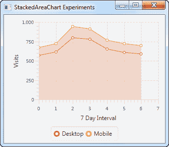

# JavaFX 堆栈区域图表

> 原文：<https://jenkov.com/tutorials/javafx/stackedareachart.html>

JavaFX StackedAreaChart 组件能够在 JavaFX 应用程序中绘制堆叠面积图。堆叠面积图类似于具有多个数据系列的面积图，不同之处在于堆叠面积图显示相互堆叠的数据系列(以及面积),而普通面积图会将它们重叠。

JavaFX StackedAreaChart 组件由类`java.scene.chart.StackedAreaChart`表示。

## 堆叠面积图表 X 轴和 Y 轴

JavaFX StackedAreaChart 绘制堆积面积图。堆积面积图是一个二维图形，这意味着该图形有一个 X 轴和一个 Y 轴。面积图通常有两个数轴。数值轴由 JavaFX 类`javafx.scene.chart.NumberAxis`表示。

你需要定义一个`StackedAreaChart`使用的 X 轴和 Y 轴。下面是创建两个 JavaFX `NumberAxis`实例的示例:

```
NumberAxis xAxis = new NumberAxis();
xAxis.setLabel("Last 7 Days");

NumberAxis yAxis = new NumberAxis();
yAxis.setLabel("Visits");

```

## 创建堆叠区域图表

通过创建一个`StackedAreaChart`类的实例来创建 JavaFX StackedAreaChart 组件。您需要将 X 轴和 Y 轴传递给`StackedAreaChart`构造函数。下面是一个 JavaFX `StackedAreaChart`实例化的例子:

```
NumberAxis xAxis = new NumberAxis();
xAxis.setLabel("No of employees");

NumberAxis yAxis = new NumberAxis();
yAxis.setLabel("Revenue per employee");

StackedAreaChart stackedAreaChart = new StackedAreaChart(xAxis, yAxis);

```

## StackedAreaChart 数据系列

要让 JavaFX `StackedAreaChart`组件显示任何点，您必须为它提供一个*数据序列*。数据系列是数据点的列表。每个数据点包含一个 X 值和一个 Y 值。

要查看任何堆叠区域，您必须向`StackedAreaChart`组件添加两个或更多数据系列。`StackedAreaChart`显示相互堆叠的数据系列的值。

以下是创建两个数据系列并将它们添加到`StackedAreaChart`组件的示例:

```
XYChart.Series dataSeries1 = new XYChart.Series();
dataSeries1.setName("Desktop");

dataSeries1.getData().add(new XYChart.Data( 0, 567));
dataSeries1.getData().add(new XYChart.Data( 1, 612));
dataSeries1.getData().add(new XYChart.Data( 2, 800));
dataSeries1.getData().add(new XYChart.Data( 3, 780));
dataSeries1.getData().add(new XYChart.Data( 4, 650));
dataSeries1.getData().add(new XYChart.Data( 5, 610));
dataSeries1.getData().add(new XYChart.Data( 6, 590));

stackedAreaChart.getData().add(dataSeries1);

XYChart.Series dataSeries2 = new XYChart.Series();
dataSeries2.setName("Mobile");

dataSeries2.getData().add(new XYChart.Data( 0, 101));
dataSeries2.getData().add(new XYChart.Data( 1, 110));
dataSeries2.getData().add(new XYChart.Data( 2, 140));
dataSeries2.getData().add(new XYChart.Data( 3, 132));
dataSeries2.getData().add(new XYChart.Data( 4, 115));
dataSeries2.getData().add(new XYChart.Data( 5, 109));
dataSeries2.getData().add(new XYChart.Data( 6, 105));

stackedAreaChart.getData().add(dataSeries2);

```

这些数据系列中的数据代表 7 天前用户在桌面和移动设备上的访问数据。

## 向场景图添加 StackedAreaChart

要使 JavaFX `StackedAreaChart`可见，必须将其添加到 JavaFX 场景图中。这意味着将`StackedAreaChart`添加到一个`Scene`对象，或者将`AreaChart`添加到一个布局组件，该布局组件被添加到一个`Scene`对象。

下面是一个将`StackedAreaChart`添加到 JavaFX 场景图的示例:

```
package com.jenkov.javafx.charts;

import javafx.application.Application;
import javafx.scene.Scene;
import javafx.scene.chart.NumberAxis;
import javafx.scene.chart.StackedAreaChart;
import javafx.scene.chart.XYChart;
import javafx.scene.layout.VBox;
import javafx.stage.Stage;

public class StackedAreaChartExperiments extends Application {

    @Override
    public void start(Stage primaryStage) throws Exception {
        primaryStage.setTitle("StackedAreaChart Experiments");

        NumberAxis xAxis = new NumberAxis();
        xAxis.setLabel("7 Day Interval");

        NumberAxis yAxis = new NumberAxis();
        yAxis.setLabel("Visits");

        StackedAreaChart stackedAreaChart = new StackedAreaChart(xAxis, yAxis);

        XYChart.Series dataSeries1 = new XYChart.Series();
        dataSeries1.setName("Desktop");

        dataSeries1.getData().add(new XYChart.Data( 0, 567));
        dataSeries1.getData().add(new XYChart.Data( 1, 612));
        dataSeries1.getData().add(new XYChart.Data( 2, 800));
        dataSeries1.getData().add(new XYChart.Data( 3, 780));
        dataSeries1.getData().add(new XYChart.Data( 4, 650));
        dataSeries1.getData().add(new XYChart.Data( 5, 610));
        dataSeries1.getData().add(new XYChart.Data( 6, 590));

        stackedAreaChart.getData().add(dataSeries1);

        XYChart.Series dataSeries2 = new XYChart.Series();
        dataSeries2.setName("Mobile");

        dataSeries2.getData().add(new XYChart.Data( 0, 101));
        dataSeries2.getData().add(new XYChart.Data( 1, 110));
        dataSeries2.getData().add(new XYChart.Data( 2, 140));
        dataSeries2.getData().add(new XYChart.Data( 3, 132));
        dataSeries2.getData().add(new XYChart.Data( 4, 115));
        dataSeries2.getData().add(new XYChart.Data( 5, 109));
        dataSeries2.getData().add(new XYChart.Data( 6, 105));

        stackedAreaChart.getData().add(dataSeries2);

        VBox vbox = new VBox(stackedAreaChart);

        Scene scene = new Scene(vbox, 400, 200);

        primaryStage.setScene(scene);
        primaryStage.setHeight(300);
        primaryStage.setWidth(1200);

        primaryStage.show();
    }

    public static void main(String[] args) {
        Application.launch(args);
    }
}

```

运行此示例生成的应用程序将类似于以下内容:

