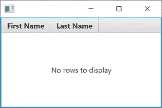
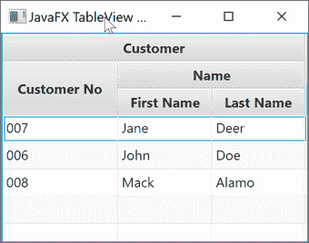

# JavaFX 表格视图

> 原文：<https://jenkov.com/tutorials/javafx/tableview.html>

JavaFX *TableView* 使您能够在 JavaFX 应用程序中显示表格视图。 Java FX table view 由类`javafx.scene.control.TableView`表示。 这里是一个 JavaFX `TableView` : 的截图


## 与 TableView 相关的类

JavaFX TableView 类使用一组相关的类来完成它的工作。这些类别是:

*   表格列
*   表格行
*   TableCell(表格单元)
*   桌子位置
*   TableViewFocusModel
*   表视图选择模型

这些类具体做什么将在本教程后面的相应章节中介绍。

## JavaFX 表格视图示例

下面是一个完整但简单的 JavaFX `TableView`代码示例:

```

import javafx.application.Application;
import javafx.scene.Scene;
import javafx.scene.control.TableColumn;
import javafx.scene.control.TableView;
import javafx.scene.control.cell.PropertyValueFactory;
import javafx.scene.layout.VBox;
import javafx.stage.Stage;

public class TableViewExample extends Application {

  public static void main(String[] args) {
    launch(args);
  }

  @Override
  public void start(Stage primaryStage) {

    TableView tableView = new TableView();

    TableColumn<Person, String> column1 =  new TableColumn<>("First Name");
     column1.setCellValueFactory(  new PropertyValueFactory<>("firstName"));

    TableColumn<Person, String> column2 =  new TableColumn<>("Last Name");
     column2.setCellValueFactory(  new PropertyValueFactory<>("lastName"));

    tableView.getColumns().add(column1);
    tableView.getColumns().add(column2);

    tableView.getItems().add(  new Person("John", "Doe"));
    tableView.getItems().add(  new Person("Jane", "Deer"));

    VBox vbox = new VBox(tableView);

    Scene scene = new Scene(vbox);

    primaryStage.setScene(scene);

    primaryStage.show();
  }

}

```

下面是本例中使用的`Person`类:

```

public class Person {

    private String firstName = null;
    private String lastName = null;

    public Person() {
    }

    public Person(String firstName, String lastName) {
        this.firstName = firstName;
        this.lastName = lastName;
    }

    public String getFirstName() {
        return firstName;
    }

    public void setFirstName(String firstName) {
        this.firstName = firstName;
    }

    public String getLastName() {
        return lastName;
    }

    public void setLastName(String lastName) {
        this.lastName = lastName;
    }
}

```

## 创建表格视图

为了使用 JavaFX `TableView`组件，您必须首先创建一个`TableView`实例。 下面是一个创建 JavaFX `TableView`实例的例子:

```

TableView tableView = new TableView();

```

## 向 TableView 添加 TableColumn

创建了一个`TableView`之后，您需要向 `TableView`实例添加一个或多个`TableColumn`实例。一个`TableColumn`代表一列垂直的值。每个值 都显示在自己的行上，并且通常是从 `TableView`中显示的对象列表中提取的。下面是向一个 JavaFX `TableView`实例添加两个`TableColumn`实例的例子:

```

TableView tableView = new TableView();

TableColumn<Person, String> firstNameColumn =  TableColumn<>("First Name");
firstNameColumn.setCellValueFactory(  new PropertyValueFactory<>("firstName"));

TableColumn<Person, String> lastNameColumn =  new TableColumn<>("Last Name");
lastNameColumn.setCellValueFactory(  new PropertyValueFactory<>("lastName"));

```

注意传递给 `TableColumn`类的构造函数的 [Java 字符串](/java/strings.html)参数。该字符串将显示为列上方的列标题。 你可以在本页顶部的截图中看到这样一个列标题的例子。

### 表列单元格值工厂

一个`TableColumn`必须有一个*单元格值工厂*设置在上面。单元格值工厂 提取要在列的每个单元格(每行)中显示的值。在上面的例子中使用了 和`PropertyValueFactory`。`PropertyValueFactory`工厂可以从 Java 对象中提取属性值 (字段值)。属性的名称作为参数传递给 `PropertyValueFactory`构造函数，就像这样:

```

PropertyValueFactory factory =  new PropertyValueFactory<>("firstName");

```

属性名`firstName`将匹配包含每行显示的值的`Person`对象的 getter 方法`getFirstName()` 。

在前面显示的例子中，第二个`PropertyValueFactory`被设置在第二个 `TableColumn`实例上。传递给第二个`PropertyValueFactory` 的属性名是`lastName`，它将匹配`Person` 类的 getter 方法`getLastName()`。

## 向表视图添加数据

一旦向 JavaFX `TableView`添加了`TableColumn`实例，就可以向`TableView`添加 要显示的数据。数据通常包含在一个常规 Java 对象(POJOs)列表中。下面是一个向`TableView` : 添加两个`Person`对象(在 JavaFX TableView 教程中前面的 类)的例子

```

tableView.getItems().add(new Person("John", "Doe"));
tableView.getItems().add(new Person("Jane", "Deer"));

```

## 使用地图作为数据项

可以为您的数据项 使用标准的 [Java Map](/java-collections/map.html) 实例，而不是为它们创建一个特定的类(如前面例子中的 Person 类)。

要将地图用作数据项，附加到 TableView 的 TableColumn 实例需要使用一个称为 MapValueFactory 的特殊像元值工厂。以下是配置两个 TableColumn 实例以显示从映射中提取的名字和姓氏的示例:

```

TableColumn<Map, String> firstNameColumn = new TableColumn<>("firstName");
firstNameColumn.setCellValueFactory(new MapValueFactory<>("firstName"));

TableColumn<Map, String> lastNameColumn = new TableColumn<>("lastName");
lastNameColumn.setCellValueFactory(new MapValueFactory<>("lastName"));

```

通过这些表列配置，您可以将地图实例用作数据项。以下是展示如何将地图实例用作数据项的完整示例:

```

TableView tableView = new TableView();

TableColumn<Map, String> firstNameColumn = new TableColumn<>("firstName");
firstNameColumn.setCellValueFactory(new MapValueFactory<>("firstName"));

TableColumn<Map, String> lastNameColumn = new TableColumn<>("lastName");
lastNameColumn.setCellValueFactory(new MapValueFactory<>("lastName"));

tableView.getColumns().add(firstNameColumn);
tableView.getColumns().add(lastNameColumn);

ObservableList<Map<String, Object>> items =
    FXCollections.<Map<String, Object>>observableArrayList();

Map<String, Object> item1 = new HashMap<>();
item1.put("firstName", "Randall");
item1.put("lastName" , "Kovic");

items.add(item1);

Map<String, Object> item2 = new HashMap<>();
item2.put("firstName", "Irmelin");
item2.put("lastName" , "Satoshi");

items.add(item2);

tableView.getItems().addAll(items);

```

## 没有要显示的行时设置占位符

您可以设置一个占位符，以便在 JavaFX `TableView`没有要显示的行时显示。 占位符必须是 JavaFX `Node`类的实例，大多数(如果不是全部)JavaFX 控件 都是这样。因此，您可以使用一个 [JavaFX ImageView](/javafx/imageview.html) 或 T6】Java FX 标签作为占位符。下面是一个在 JavaFX `TableView` : 中使用`Label`作为占位符的例子

```

tableView.setPlaceholder(  new Label("No rows to display"));

```

下面是相应的`TableView`在显示占位符 时的样子



## 表视图选择模型

JavaFX TableView 组件有一个内部的 *SelectionModel* ，用于读取用户选择了哪些行 和/或单元格，或者以编程方式选择行和单元格。在接下来的章节 中，我将仔细研究 JavaFX TableView SelectionModel。

### 获取 TableView SelectionModel 实例

要获得 JavaFX TableView `SelectionModel`，必须调用它的`getSelectionModel()` 方法。下面是一个从 JavaFX 表格视图中获取`SelectionModel`的例子:

```

TableViewSelectionModel selectionModel =  tableView.getSelectionModel();

```

TableViewSelectionModel 类可以设置泛型类型。通常，该类型将与 TableView 中显示的数据所用的类型相同。下面是一个在获取 TableViewSelectionModel 时声明泛型类型的示例:

```

TableViewSelectionModel<Person> selectionModel =  tableView.getSelectionModel();

```

### 设置选择模式

您可以使用 table view TableViewSelectionModel 的 `setSelectionMode()`方法设置其*选择模式*。您可以选择是只选择一行， 还是多行，甚至是单个单元格。下面是一个设置 TableViewSelectionModel 的选择模式的例子:

```

// set selection mode to only 1 row
selectionModel.setSelectionMode(  SelectionMode.SINGLE);

// set selection mode to multiple rows
selectionModel.setSelectionMode(  SelectionMode.MULTIPLE);

```

第一行将选择模式设置为一次只允许选择一行。顺便说一下，这是 TableViewSelectionModel 的默认设置。

第二行设置选择模式，允许选择多行。用户需要在选择行时按住 SHIFT 或 CTRL 键来选择多行。

### 获取选定的行

要获得 JavaFX TableView 的选定行项目的列表，可以调用 SelectionModel `getSelectedItems()` 方法。返回的列表是只读的。下面是一个从 JavaFX TableView SelectionModel 获得选中行列表的例子:

```

ObservableList selectedItems =  selectionModel.getSelectedItems();

```

如果 TableViewSelectionModel 上设置了泛型类型，那么从 返回的`ObservableList`将具有相同的泛型类型。下面是一个例子:

```

ObservableList<Person> selectedItems =  selectionModel.getSelectedItems();

```

### 获取选定的索引

您也可以只获取所选行的索引列表，而不是所选项目本身。以下是从 TableViewSelectionModel 获取选定行的索引列表的示例:

```

ObservableList<Integer> selectedIndices =  selectionModel.getSelectedIndices();

```

### 清除选择

您可以使用 TableViewSelectionModel `clearSelection()`方法清除所有选定的行和单元格。 下面是一个通过 TableViewSelectionModel `clearSelection()`方法清除表格视图中所有选中的行或单元格的例子:

```

selectionModel.clearSelection();

```

### 监听选择更改

可以侦听 TableViewSelectionModel 中的选择更改。为此，您必须将一个侦听器附加到由`getSelectedItems()`或`getSelectedIndices()`返回的一个 ObservableList。 您应该使用两个列表中的哪一个取决于当选择改变时您是否需要获得选择的项目或选择的索引 。下面是一个将更改监听器附加到由 `getSelectedItems()` : 返回的 ObservableList 的示例

```

ObservableList<Person> selectedItems =  selectionModel.getSelectedItems();

selectedItems.addListener(  new ListChangeListener<Person>() {
   @Override
   public void onChanged(  Change<? extends Person> change) {
     System.out.println(  "Selection changed: " + change.getList());
   }
})

```

### 以编程方式选择行

可以在 JavaFX TableView 中以编程方式选择行。您可以通过 TableViewSelectionModel 对象的许多选择方法来实现这一点。要选择具有特定索引的行，可以使用`select(int)` 方法。下面是一个在 JavaFX 表视图中选择具有给定索引的单行的例子:

```

selectionModel.select(1);

```

本示例选择索引为 1 的行。请记住，行索引从 0 开始。

## 嵌套列

JavaFX TableView 支持添加到其中的 TableColumn 实例的嵌套。嵌套列仅仅意味着名为“Customer”的表列可以细分为两个嵌套列，例如“Customer No”和“Name”。“姓名”列可以再细分为“名”和“姓”。下面是一个 JavaFX TableView 嵌套列示例，显示了:



嵌套级别中最低的 TableColumn 实例称为*叶列*。只有叶列可以 显示数据。因此，您只需向叶 TableColumn 实例添加单元格值工厂。嵌套层次中更高的 TableColumn 实例主要是作为一种视觉效果出现的。

以下是上述 JavaFX TableView 嵌套列示例的代码:

```

TableView tableView = new TableView();

TableColumn<Customer, String> customer   =  new TableColumn<>("Customer");
TableColumn<Customer, String> customerId =  new TableColumn<>("Customer No");
TableColumn<Customer, String> name       =  new TableColumn<>("Name");
TableColumn<Customer, String> firstName  =  new TableColumn<>("First Name");
TableColumn<Customer, String> lastName   =  new TableColumn<>("Last Name");

name     .getColumns().addAll(firstName, lastName);
customer .getColumns().addAll(customerId, name);
tableView.getColumns().addAll(customer);

customerId.setCellValueFactory(  new PropertyValueFactory<>("customerNo"));
firstName .setCellValueFactory(  new PropertyValueFactory<>("firstName"));
lastName  .setCellValueFactory(  new PropertyValueFactory<>("lastName"));

tableView.getItems().add(  new Customer("007", "Jane", "Deer"));
tableView.getItems().add(  new Customer("006", "John", "Doe"));
tableView.getItems().add(  new Customer("008", "Mack", "Alamo"));

```

### 可见叶列

JavaFX TableView 类有一个名为 c 的方法，它可以返回 TableView 的可见叶列(TableColumn)。将可见叶列的索引作为参数传递给`getVisibleLeafColumn()`方法。下面是一个从 JavaFX 表视图中获取第二个(索引 1)可见叶列 的示例:

```

TableColumn<String, Customer> leafColumn =
    tableView.getVisibleLeafColumn(1);

```

如果对上一节示例中配置的 TableView 执行上述代码，则返回的 TableColumn 将是“First Name”table column。

您还可以通过 TableView `getVisibleLeafColumns()`获得所有可见的叶列。

## 隐藏列

JavaFX TableView 使您能够通过调用 TableColumn `setVisible()`并传递 `false`作为参数来隐藏表列。下面是一个隐藏表格列的例子:

```

tableColumn.setVisible(false);

```

要再次显示隐藏的列，只需用`true`作为参数值调用`setVisible()`。 下面是一个显示表格列的例子:

```

tableColumn.setVisible(true);

```

## 重新排列列

JavaFX TableView 使您能够对其列进行重新排序。有两种方法可以记录它的列。

第一种方法是将列拖动到 TableView 中的不同水平位置。这是由最终用户完成的，而不是开发人员。

第二种方法是改变 TableView `getColumns()`方法返回的 ObservableList 中 TableColumn 实例的顺序。这是以编程方式完成的。下面是一个 删除第一列并再次将其添加为 TableView 的最后一列的例子:

```

tableView.getColumns().add(
    tableView.getColumns().remove(0));

```

## 排序行

JavaFX TableView 使您能够对 TableView 中的行进行排序。有两种方法可以对行进行排序。

第一种方法是让用户单击 TableColumn 标题单元格(显示列标题的位置)。这将在该列的值之后对 TableView 中的行进行排序。如果用户再次单击同一个 TableColumn 单元格，排序顺序就会颠倒。如果用户第三次单击，该列的排序将再次被禁用。

对 TableView 的行进行排序的第二种方式是编程方式。您可以设置排序顺序(升序或降序)，设置自定义比较器来比较 TableColumn 的值，设置要显示的自定义排序图标，甚至完全禁用给定 TableColumn 的排序。这些选项将在下面更详细地解释。

### 排序类型

您可以使用 TableColumn `setSortType()`方法指定希望该列使用的排序类型。 您可以将排序类型设置为升序或降序。下面两个例子展示了如何设置两种 排序类型:

```

tableColumn.setSortType(TableColumn.SortType.ASCENDING);

tableColumn.setSortType(TableColumn.SortType.DESCENDING);

```

### 禁用列排序

可以对给定的表列完全禁用排序。您可以通过 TableColumn `setSortable()`方法来实现。下面是一个禁用给定表格列排序的示例:

```

tableColumn.setSortable(false);

```

要重新启用 TableColumn 的排序，只需调用值为`true` 的`setSortable()`作为参数——就像这样:

```

tableColumn.setSortable(false);

```

### 列自定义比较器

您可以在 TableColumn 上设置自定义比较器接口实现。这个比较器实现将决定该列中显示的值如何排序。通过 TableColumn 的`setComparator()`方法在 table column 上设置一个比较器。下面是一个在表列上设置自定义比较器的例子:

```

Comparator<String> columnComparator =
    (String v1, String v2) -> {

  return v1.toLowerCase().compareTo(
        v2.toLowerCase());

};

tableColumn.setComparator(columnComparator);

```

这个示例首先创建一个比较器实现，它比较小写形式的字符串对象。然后它在 TableColumn 上设置这个比较器。然后，该比较器将确定该列中显示的值的排序顺序。

### 列默认比较器

TableColumn 上有一个默认的比较器，它可以为您执行某种智能形式的默认排序。有时候默认的比较器就足够了。下面是默认比较器如何比较同一列中显示的两个值:

1.  检查`null`值。`null`值被认为小于非空值。 如果两个值都是`null`，则认为它们相等。
2.  如果第一个值是实现 Comparable 接口的对象，那么默认的比较器将返回`value1.compareTo(value2)`。
3.  如果规则 1 和 2 不适用于这些值——默认的比较器使用它们的`.toString()`方法将这两个值转换成字符串，并对它们进行比较。

### 列排序节点

TableColumn 类使用“排序节点”来显示当前应用于该列的排序类型。排序节点显示在列标题内。默认的排序节点是一个类似箭头的三角形。

您可以通过 TableColumn 的`setSortNode()`方法更改它的排序节点，传递一个 JavaFX 节点 作为排序节点。下面是一个将 ImageView 设置为 TableColumn 排序节点的例子:

```

FileInputStream input = new FileInputStream("images/sort-image.png");
Image image = new Image(input);
ImageView sortImage = new ImageView(image);

tableColumn.setSortNode(sortImage);

```

注意:当排序类型从升序变为降序时，TableColumn 使用的默认排序节点旋转 180 度。但是，对于自定义排序节点，这种旋转似乎不会发生。当排序类型改变时，您可能必须自己管理排序节点的改变。

### 列排序顺序

JavaFX TableView 使您能够指定 TableView 的默认排序顺序。TableView 中的项目将按照这个顺序排序——直到用户单击一些 TableColumn 标题并更改排序顺序。

默认排序顺序由 TableColumn 实例的可见列表组成。TableView 中的项目将在此列表中第一个 TableColumn 的排序集之后排序。如果第一个 TableColumn 的值相等，项目将根据第二个 TableColumn 上的排序设置进行排序，如果它们相等，则根据第三个 TableColumn 进行排序，依此类推。

以下是设置默认排序顺序的示例:

```

 tableView.getSortOrder().addAll(lastNameColumn, firstNameColumn);

```

本示例首先将排序顺序设置为`lastNameColumn`，然后再设置为`firstNameColumn`。

注意:当我运行我的例子时，我在查看 TableView 中显示的项目的排序顺序时遇到了一些困难——但是还是发生了一些事情。您可能需要尝试一下这个特性，才能让它按照您想要的那样工作！

### 手动触发排序

JavaFX TableView 控件包含一个名为`sort()`的方法，调用该方法将触发 TableView 中项目的排序 。下面是一个缩放 TableView `sort()`方法的例子:

```

tableView.sort();

```

### 排序事件

JavaFX TableView 在对项目进行排序之前触发一个 sort 事件。您可以使用 TableView `setOnSort()`方法监听排序事件，将 EventHandler 接口实现 作为参数传递。下面是一个监听 JavaFX TableView 排序事件的例子:

```

tableView.setOnSort((event) -> {
    System.out.println("Sorting items");
});

```

顺便说一下，如果事件监听器调用`event.consume()` -那么排序将被取消。 这是可能的情况:

```

tableView.setOnSort((event) -> {
    event.consume();
});

```

### 禁用表视图的排序

您可以通过侦听排序事件并使用它们(调用 event.consume())或禁用所有 TableColumn 实例的排序来禁用整个 TableView 的排序。还有其他方法可以禁用整个 TableView 的排序，但是这两种方法应该足够了。

## 虚拟化单元渲染

JavaFX TableView 中单元格的呈现是虚拟化的。这意味着 TableView 将只为可见的行/列创建单元格呈现对象，而不是为支持数据集中的所有行创建。因此，如果 TableView 包含 1，000 行，但一次只有 10 行可见，那么 TableView 将只为可见的 10 行创建单元格呈现对象——而不是所有的 1，000 行。当用户滚动显示在 TableView 中的数据集中的数据时，已经创建的单元呈现对象被重用来显示变得可见的行。通过这种方式，TableView 可以处理非常大的数据集，而单元呈现对象的内存开销更少。

## 自定义单元格呈现

JavaFX TableView 使您能够自定义 TableView 中显示的单元格的呈现。添加到 TableView 的每个 TableColumn 在 TableView 中的每个可见行都有一个*单元格*。这意味着， 如果 TableView 有 10 个可见行和 3 列，那么每列(TableColumn)有 10 个单元格——总共有 30 个单元格。

如前所述，单元格计数由可见行和列(可见单元格)的数量决定。TableView 的项目列表中是否有 1000 个数据项(行)并不重要。重要的只是在给定的时间内有多少行是可见的。可见单元格对象将被重用来显示在任何给定时间可见的任何行的值。与为每行(数据项)的每列创建一个单元格对象相比，这种设计节省了大量的单元格对象创建工作。

若要自定义单元格呈现，必须在要为其自定义单元格呈现的 TableColumn 上设置单元格工厂。您通过 TableColumn `setCellFactory()`方法设置了一个单元格工厂。 `setCellFactory()`方法将回调接口实现作为参数。回调 实现创建 TableCell 实例。每个 TableCell 实例对应于 table view 中的一个可见单元格。对于要创建的每个 TableCell，回调实现将被调用一次，因此回调实现 不需要知道 TableView 中有多少个可见单元格。

为了更好地理解细胞工厂是如何工作的，让我们看一个在表格列上设置细胞工厂的例子:

```

customerColumn.setCellFactory((tableColumn) -> {
    TableCell<Customer, String> tableCell = new TableCell<>() {
        @Override
        protected void updateItem(String item, boolean empty) {
            super.updateItem(item, empty);

            this.setText(null);
            this.setGraphic(null);

            if(!empty){
                this.setText(item.toUpperCase());
            }
        }
    };

    return tableCell;
});

```

这个例子使用回调实现作为 Java Lambda 表达式调用`setCellFactory()`方法。

回调实现创建一个 TableCell 并返回它。创建的 TableCell 是 TableCell 类的匿名子类，其中的`updateItem()`方法被覆盖。每次 TableCell 显示新项目(行)的列值时，TableCell 子类的`updateItem()` 方法被调用。 这就是为什么`updateItem()`方法首先调用`setText(null)`和`setGraphic(null)` 来清除 TableCell 之前显示的任何文本和图形。

清除前一项(行)中的值后，将设置新值——如果单元格不为空，即。传递给`updateItem()`的第二个参数是一个`boolean`，如果单元格为空，则该参数的值为 `true`。如果单元格为空，则 TableCell 不应显示任何值。

TableCell 的呈现方式类似于 [JavaFX 标签](label.html)——这意味着它可以显示图形 和文本。为了显示图形，TableCell `updateItem()`调用`setGraphic()`方法 ，使用 JavaFX 节点对象作为参数。显示一个文本调用`setText()`，用一个字符串作为参数。 表格单元格可以同时显示图形和文本。

## 可编辑表格视图

使 JavaFX 表格视图可编辑是可能的。使 JavaFX TableView 可编辑需要几个步骤。首先，您必须调用 TableView 的`setEditable()`方法，传递一个值`true` 作为参数。下面是它的样子:

```

tableView.setEditable(true);

```

其次，您必须在希望可编辑的 TableColumn 上设置不同的单元格渲染器。JavaFX 附带了 4 个内置的单元渲染器，您可以使用:

*   TextFieldTableCell
*   复选框表格级别
*   choiceboxtablevell
*   ComboBoxTableCell

TextFieldTableCell 单元格渲染器用于启用使用文本字段编辑单元格值。CheckBoxTableCell 单元格渲染器用于启用使用复选框编辑单元格值。ChoiceBoxTableCell 单元格渲染器用于启用使用 ChoiceBox 编辑单元格值。ComboBoxTableCell 单元格渲染器用于启用使用 ComboBox 编辑单元格值。

以下是如何使用这些单元渲染器的示例:

```

TableView tableView = new TableView();
tableView.setEditable(true);

TableColumn<Person, String> column1 = new TableColumn<>("First Name");
column1.setCellValueFactory(new PropertyValueFactory<>("firstName"));

TableColumn<Person, String> column2 = new TableColumn<>("Last Name");
column2.setCellValueFactory(new PropertyValueFactory<>("lastName"));
column2.setCellFactory(TextFieldTableCell.<Person>forTableColumn());

TableColumn<Person, String> column3 = new TableColumn<>("Category");
column3.setCellValueFactory(new PropertyValueFactory<>("category"));
column3.setCellFactory(ComboBoxTableCell.<Person, String>forTableColumn("Category 1", "Category 2"));

TableColumn<Person, Boolean> column4 = new TableColumn<>("Is XYZ");
column4.setCellValueFactory( cellData -> new ReadOnlyBooleanWrapper(cellData.getValue().getIsXyz()));
column4.setCellFactory(CheckBoxTableCell.<Person>forTableColumn(column4));

tableView.getColumns().add(column1);
tableView.getColumns().add(column2);
tableView.getColumns().add(column3);
tableView.getColumns().add(column4);

tableView.getItems().add(new Person("John"  , "Doe"  , null, false));
tableView.getItems().add(new Person("Jane"  , "Deer" , "Category 1", true));
tableView.getItems().add(new Person("Dinesh", "Gupta", "Category 2", true));

```

本例中使用的 Person 类如下所示:

```

public class Person {

    private String firstName = null;
    private String lastName = null;

    private String category = null;

    private boolean isXyz = true;

    public Person() {
    }

    public Person(String firstName, String lastName) {
        this.firstName = firstName;
        this.lastName = lastName;
    }

    public Person(String firstName, String lastName, String category, boolean isXyz) {
        this.firstName = firstName;
        this.lastName  = lastName;
        this.category  = category;
        this.isXyz     = isXyz;
    }

    public String getFirstName() {
        return firstName;
    }

    public void setFirstName(String firstName) {
        this.firstName = firstName;
    }

    public String getLastName() {
        return lastName;
    }

    public void setLastName(String lastName) {
        this.lastName = lastName;
    }

    public String toString() {
        return "{ firstName: '" + this.firstName + ", lastName: " + this.lastName + " }";
    }

    public String getCategory() {
        return this.category;
    }

    public void setCategory(String category) {
        this.category = category;
    }

    public Boolean getIsXyz() {
        return this.isXyz;
    }

    public void setIsXyz(Boolean isXyz) {
        this.isXyz = isXyz;
    }
}

```