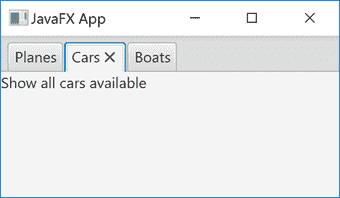

# JavaFX 选项卡窗格

> 原文：<https://jenkov.com/tutorials/javafx/tabpane.html>

*JavaFX* 在 一次只显示一个标签。它就像纸质文件夹，其中一个文件夹是打开的。JavaFX *TabPane* 控件是由`javafx.scene.control.TabPane`类实现的 。这里是一个 JavaFX *TabPane* : 的截图



在这个截图中，中间的标签有焦点，这意味着中间标签的标题被点击了。

## 完整的 JavaFX 选项卡示例

下面是一个完整的 JavaFX `TabPane`代码示例:

```

import javafx.application.Application;
import javafx.scene.Scene;
import javafx.scene.control.TabPane;
import javafx.scene.control.Tab;
import javafx.scene.control.Label;
import javafx.scene.layout.VBox;
import javafx.stage.Stage;

public class TabPaneExample extends Application {

    public static void main(String[] args) {
        launch(args);
    }

    public void start(Stage primaryStage) {

        TabPane tabPane = new TabPane();

        Tab tab1 = new Tab("Planes", new Label("Show all planes available"));
        Tab tab2 = new Tab("Cars"  , new Label("Show all cars available"));
        Tab tab3 = new Tab("Boats" , new Label("Show all boats available"));

        tabPane.getTabs().add(tab1);
        tabPane.getTabs().add(tab2);
        tabPane.getTabs().add(tab3);

        VBox vBox = new VBox(tabPane);
        Scene scene = new Scene(vBox);

        primaryStage.setScene(scene);
        primaryStage.setTitle("JavaFX App");

        primaryStage.show();
    }
}

```

## 创建选项卡窗格

为了使用 JavaFX `TabPane`，您必须首先创建一个`TabPane`类的实例。 下面是一个创建 JavaFX `TabPane`类实例的例子:

```

TabPane tabPane = new TabPane();

```

## 向选项卡窗格添加选项卡

要显示任何内容，您必须向 JavaFX `TabPane`添加一个或多个*选项卡*。 选项卡由`javafx.scene.control.Tab`类表示。下面是一个向 JavaFX `TabPane` : 添加 3 个标签的例子

```

TabPane tabPane = new TabPane();

Tab tab1 = new Tab("Planes", new Label("Show all planes available"));
Tab tab2 = new Tab("Cars"  , new Label("Show all cars available"));
Tab tab3 = new Tab("Boats" , new Label("Show all boats available"));

tabPane.getTabs().add(tab1);
tabPane.getTabs().add(tab2);
tabPane.getTabs().add(tab3);

```

上例中使用的`Tab`构造函数有两个参数。 第一个参数是显示在选项卡顶部的标题，在“句柄”中，单击该处显示 选项卡。第二个参数是根 JavaFX 控件，它包含要在选项卡的 body 部分 中显示的内容。在上面的例子中，使用了一个简单的 [JavaFX 标签](label.html)，但是在一个真实的应用程序中 使用一个容器控件会更正常，它可以包含其他嵌套控件。例如， a [JavaFX VBox](vbox.html) ， [JavaFX HBox](hbox.html) ， [JavaFX Flowpane](flowpane.html) ， [JavaFX TilePane](tilepane.html) 或者 [JavaFX GridPane](gridpane.html) 。

## 获取选定的选项卡

您可以通过`TabPane` `getSelectionModel().getSelectedItem()`方法调用获得 JavaFX `TabPane` 中当前选中的`Tab`(可见)。下面是一个从 JavaFX `TabPane` : 中获取当前选中的`Tab`的例子

```

Tab selectedTab = tabPane.getSelectionModel().getSelectedItem();

```