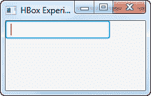

# JavaFX 文本字段

> 原文：<https://jenkov.com/tutorials/javafx/textfield.html>

JavaFX TextField 控件使 JavaFX 应用程序的用户能够输入应用程序可以读取的文本。JavaFX TextField 控件由类`javafx.scene.control.TextField`表示。

## 创建文本字段

通过创建一个`TextField`类的实例来创建一个 TextField 控件。下面是一个 JavaFX `TextField`实例化的例子:

```
TextField textField = new TextField();

```

## 将文本字段添加到场景图

要使 JavaFX `TextField`可见，必须将`TextField`对象添加到场景图形中。这意味着将其添加到一个`Scene`对象，或作为一个附加到`Scene`对象的布局的子对象。

下面是一个将 JavaFX `TextField`附加到场景图的示例:

```
package com.jenkov.javafx.controls;

import javafx.application.Application;
import javafx.scene.Scene;
import javafx.scene.control.TextField;
import javafx.scene.layout.HBox;
import javafx.stage.Stage;

public class TextFieldExperiments extends Application  {

    @Override
    public void start(Stage primaryStage) throws Exception {
        primaryStage.setTitle("HBox Experiment 1");

        TextField textField = new TextField();

        HBox hbox = new HBox(textField);

        Scene scene = new Scene(hbox, 200, 100);
        primaryStage.setScene(scene);
        primaryStage.show();

    }

    public static void main(String[] args) {
        Application.launch(args);
    }
}

```

运行上述 JavaFX `TextField`示例的结果是一个如下所示的应用程序:



## 获取文本字段的文本

您可以使用返回`String`的`getText()`方法将文本输入到`TextField`中。下面是一个完整的例子，显示了一个`TextField`和一个`Button`，当点击按钮时，它读取输入到`TextField`中的文本:

```
package com.jenkov.javafx.controls;

import javafx.application.Application;
import javafx.scene.Scene;
import javafx.scene.control.Button;
import javafx.scene.control.TextField;
import javafx.scene.layout.HBox;
import javafx.stage.Stage;

public class TextFieldExperiments extends Application  {

    @Override
    public void start(Stage primaryStage) throws Exception {
        primaryStage.setTitle("HBox Experiment 1");

        TextField textField = new TextField();

        Button button = new Button("Click to get text");

        button.setOnAction(action -> {
            System.out.println(textField.getText());
        });

        HBox hbox = new HBox(textField, button);

        Scene scene = new Scene(hbox, 200, 100);
        primaryStage.setScene(scene);
        primaryStage.show();

    }

    public static void main(String[] args) {
        Application.launch(args);
    }
}

```

## 设置文本字段的文本

您可以使用`setText()`方法设置`TextField`的文本。当您需要为作为表单一部分的文本字段设置初始值时，这通常很有用。例如，编辑现有的对象或记录。下面是一个设置 JavaFX `TextField`文本的简单例子:

```
textField.setText("Initial value");

```