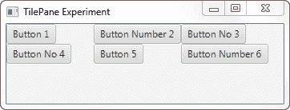
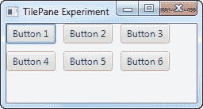

# JavaFX TilePane

> 原文：<https://jenkov.com/tutorials/javafx/tilepane.html>

JavaFX TilePane 是一个布局组件，它在大小相等的单元格网格中布置其子组件。JavaFX TilePane 布局组件由类`javafx.scene.layout.TilePane`表示

## 创建平铺窗格

您通过它的构造函数创建一个 JavaFX `TilePane`。下面是一个 JavaFX `TilePane`实例化的例子:

```
TilePane tilePane = new TilePane();

```

## 向 TilePane 添加子项

你可以通过获取它的子集合来给一个`TilePane`添加子元素，并添加你想让`TilePane`布局的组件。下面是一个给`TilePane`添加 6 个按钮的例子:

```
primaryStage.setTitle("TilePane Experiment");

Button button1 = new Button("Button 1");
Button button2 = new Button("Button Number 2");
Button button3 = new Button("Button No 3");
Button button4 = new Button("Button No 4");
Button button5 = new Button("Button 5");
Button button6 = new Button("Button Number 6");

TilePane tilePane = new TilePane();

tilePane.getChildren().add(button1);
tilePane.getChildren().add(button2);
tilePane.getChildren().add(button3);
tilePane.getChildren().add(button4);
tilePane.getChildren().add(button5);
tilePane.getChildren().add(button6);

tilePane.setTileAlignment(Pos.TOP_LEFT);

```

## 向场景图添加 TilePane

要使`TilePane`可见，必须将其添加到 JavaFX 场景图中。为此，您必须将`TilePane`实例添加到一个`Scene`对象中，或者将`TilePane`添加到一个布局组件中，该布局组件被添加到一个`Scene`对象中。

下面是一个将 JavaFX `TilePane`添加到场景图的例子:

```
package com.jenkov.javafx.layouts;

import javafx.application.Application;
import javafx.geometry.Pos;
import javafx.scene.Scene;
import javafx.scene.control.Button;
import javafx.scene.layout.TilePane;
import javafx.stage.Stage;

public class TilePaneExperiments extends Application  {

    @Override
    public void start(Stage primaryStage) throws Exception {
        primaryStage.setTitle("TilePane Experiment");

        Button button1 = new Button("Button 1");
        Button button2 = new Button("Button Number 2");
        Button button3 = new Button("Button No 3");
        Button button4 = new Button("Button No 4");
        Button button5 = new Button("Button 5");
        Button button6 = new Button("Button Number 6");

        TilePane tilePane = new TilePane();

        tilePane.getChildren().add(button1);
        tilePane.getChildren().add(button2);
        tilePane.getChildren().add(button3);
        tilePane.getChildren().add(button4);
        tilePane.getChildren().add(button5);
        tilePane.getChildren().add(button6);

        tilePane.setTileAlignment(Pos.TOP_LEFT);

        Scene scene = new Scene(tilePane, 200, 100);
        primaryStage.setScene(scene);
        primaryStage.show();
    }

    public static void main(String[] args) {
        Application.launch(args);
    }
}

```

该应用程序生成的应用程序类似于以下屏幕截图。



## 水平和垂直间距

您可以使用 JavaFX `TilePane`的`setHGap()`和`setVGap()`方法来设置 Java FX`TilePane`中显示的组件之间的水平和垂直间距。下面的例子展示了如何设置`TilePane`中组件之间的水平和垂直间隙:

```
tilePane.setHgap(10);
tilePane.setVgap(10);

```

当添加到前面的示例中时，生成的应用程序如下所示:



请注意按钮之间的水平和垂直间隙。如果`TilePane`上没有设置间隙，按钮将会彼此相邻放置。