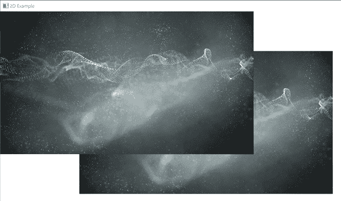
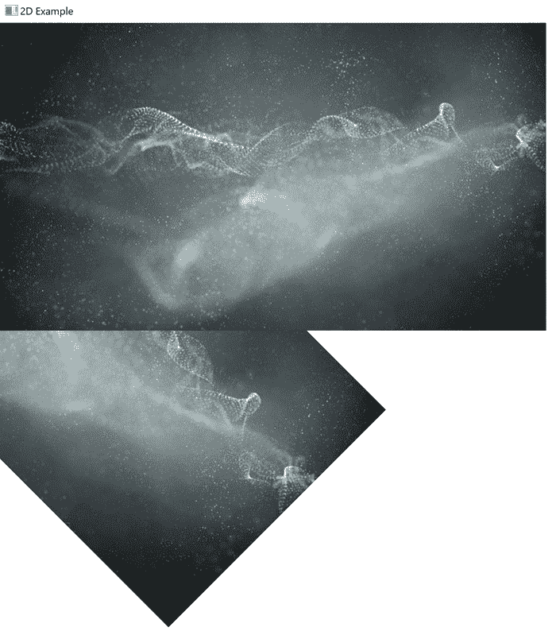
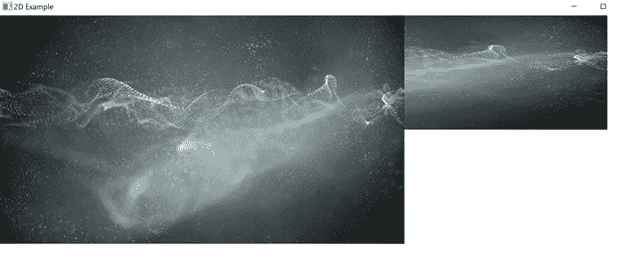

# JavaFX 转换

> 原文：<https://jenkov.com/tutorials/javafx/transformation.html>

JavaFX 变换支持使您能够变换(平移、旋转、缩放、剪切)附加到 JavaFX 场景图的 JavaFX 节点。在这篇 JavaFX 转换教程中，我将仔细研究 JavaFX 中的转换是如何工作的。

## JavaFX 转换示例

下面是一个完整的 JavaFX 转换示例，向您展示 JavaFX 转换是如何工作的:

```

import javafx.application.Application;
import javafx.scene.Scene;
import javafx.scene.layout.Pane;
import javafx.scene.paint.Color;
import javafx.scene.shape.Rectangle;
import javafx.scene.transform.Transform;
import javafx.stage.Stage;

public class TransformationsExample extends Application {

    public static void main(String[] args) {
        launch(args);
    }

    public void start(Stage primaryStage) {

        Rectangle rectangle = new Rectangle();
        rectangle.setX(200);
        rectangle.setY(200);
        rectangle.setWidth(300);
        rectangle.setHeight(400);
        rectangle.setStroke(Color.TRANSPARENT);
        rectangle.setFill(Color.valueOf("#00ffff"));

        double degrees = 30;
        double rotationPointX = 100;
        double rotationPointY = 100;
        Transform rotate = Transform.rotate(degrees, rotationPointX, rotationPointY);
        rectangle.getTransforms().add(rotate);

        Transform translate = Transform.translate(100, 0);
        rectangle.getTransforms().add(translate);

        Pane pane = new Pane();
        pane.getChildren().add(rectangle);

        Scene scene = new Scene(pane, 1024, 800, true);
        primaryStage.setScene(scene);
        primaryStage.setTitle("2D Example");

        primaryStage.show();
    }
}

```

## 转换对象

JavaFX 转换由某种类型的转换对象表示。JavaFX 转换类`javafx.scene.transform.Transform`包含一些工厂方法，您可以使用它们来创建转换类的实例 。这里有一个例子:

```

Transform translate = Transform.translate(100, 0);

```

还有一些转换类可以用来代替转换工厂方法。我将在接下来的章节中讨论其中的一些。

## 向 JavaFX 控件添加转换

通过以下操作向控件添加转换实例，可以向 JavaFX 控件添加转换:

```

control.getTransforms().add(transformationObject);

```

## 内置转换

JavaFX 附带了一组您可以使用的内置转换。这些转换是:

*   翻译
*   辐状的
*   规模
*   斜交

我将在下面的小节中解释其中的一些转换。

## 翻译转换

*JavaFX* *平移变换*将 JavaFX 节点从其变换前 位置“移动”到新位置。您可以沿 Y 轴或 X 轴平移 JavaFX 节点。沿着这些轴平移节点的量就是它移动的距离。下面是一个翻译 [JavaFX ImageView](imageview.html) : 的例子

```

import javafx.application.Application;
import javafx.scene.Scene;
import javafx.scene.image.Image;
import javafx.scene.image.ImageView;
import javafx.scene.layout.Pane;
import javafx.scene.transform.Translate;
import javafx.stage.Stage;

import java.io.FileInputStream;
import java.io.FileNotFoundException;

public class TranslateTransformationExample extends Application {

    public static void main(String[] args) {
        launch(args);
    }

    public void start(Stage primaryStage) {

        ImageView imageViewOriginal  = createImageView();
        ImageView imageViewTranslated = createImageView();

        Translate translateTransform = new Translate();
        translateTransform.setX(200);
        translateTransform.setY(100);

        imageViewTranslated.getTransforms().add(translateTransform);

        Pane pane = new Pane();
        pane.getChildren().add(imageViewTranslated);
        pane.getChildren().add(imageViewOriginal);

        Scene scene = new Scene(pane, 1024, 800, true);
        primaryStage.setScene(scene);
        primaryStage.setTitle("2D Example");

        primaryStage.show();
    }

    private ImageView createImageView() {
        FileInputStream input = null;
        try {
            input = new FileInputStream("assets/media/abstract-5719221_640.jpg");
        } catch (FileNotFoundException e) {
            e.printStackTrace();
        }
        Image image = new Image(input);
        ImageView imageView = new ImageView(image);
        return imageView;
    }

}

```

此示例显示了两个 ImageView 节点，它们的变换前位置为 0，0，这意味着它们在彼此的顶部。翻译后，您可以在未转换的 ImageView 下看到翻译后的 ImageView。生成的应用程序将类似于以下内容:



## 旋转变换

*JavaFX* *旋转变换*围绕枢轴点旋转 JavaFX 节点。下面是一个 JavaFX 旋转转换示例，展示了旋转和非旋转的 ImageView:

```

import javafx.application.Application;
import javafx.scene.Scene;
import javafx.scene.image.Image;
import javafx.scene.image.ImageView;
import javafx.scene.layout.Pane;
import javafx.scene.transform.Rotate;
import javafx.stage.Stage;

import java.io.FileInputStream;
import java.io.FileNotFoundException;

public class RotateTransformationExample extends Application {

    public static void main(String[] args) {
        launch(args);
    }

    public void start(Stage primaryStage) {

        ImageView imageViewOriginal  = createImageView();
        ImageView imageViewTranslated = createImageView();

        Rotate rotateTransform = new Rotate();
        rotateTransform.setAngle(45);
        rotateTransform.setPivotX(0);
        rotateTransform.setPivotY(0);

        imageViewTranslated.getTransforms().add(rotateTransform);

        Pane pane = new Pane();
        pane.getChildren().add(imageViewTranslated);
        pane.getChildren().add(imageViewOriginal);

        Scene scene = new Scene(pane, 1024, 800, true);
        primaryStage.setScene(scene);
        primaryStage.setTitle("2D Example");

        primaryStage.show();
    }

    private ImageView createImageView() {
        FileInputStream input = null;
        try {
            input = new FileInputStream("assets/media/abstract-5719221_640.jpg");
        } catch (FileNotFoundException e) {
            e.printStackTrace();
        }
        Image image = new Image(input);
        ImageView imageView = new ImageView(image);
        return imageView;
    }

}

```

这是生成的应用程序的外观:



## 标度变换法

*JavaFX* *缩放变换*将 JavaFX 节点相对于其自然大小放大或缩小。 1.0 的比例与自然大小相同。低于 1.0 的比例小于自然大小。 1.0 以上的刻度大于自然尺寸。例如，水平比例为 0.5 意味着比例为自然 大小的一半。比例为 2.0 表示比例为两倍大小。 下面是一个 JavaFX 缩放转换示例，展示了一个 JavaFX ImageView，它在水平方向(X 轴)上放大到原始大小的 1.5 倍，在垂直方向(Y 轴)上缩小到原始大小的 0.5 倍:

```

import javafx.application.Application;
import javafx.scene.Scene;
import javafx.scene.image.Image;
import javafx.scene.image.ImageView;
import javafx.scene.layout.Pane;
import javafx.scene.transform.Scale;
import javafx.stage.Stage;

import java.io.FileInputStream;
import java.io.FileNotFoundException;

public class ScaleTransformationExample extends Application {

    public static void main(String[] args) {
        launch(args);
    }

    public void start(Stage primaryStage) {

        ImageView imageViewOriginal = createImageView();
        ImageView imageViewScaled   = createImageView();

        Scale scaleTransformation = new Scale();
        scaleTransformation.setX(1.5);
        scaleTransformation.setY(0.5);
        scaleTransformation.setPivotX(0);
        scaleTransformation.setPivotY(0);

        imageViewScaled.getTransforms().add(scaleTransformation);

        Pane pane = new Pane();
        pane.getChildren().add(imageViewScaled);
        pane.getChildren().add(imageViewOriginal);

        Scene scene = new Scene(pane, 1024, 800, true);
        primaryStage.setScene(scene);
        primaryStage.setTitle("2D Example");

        primaryStage.show();
    }

    private ImageView createImageView() {
        FileInputStream input = null;
        try {
            input = new FileInputStream("assets/media/abstract-5719221_640.jpg");
        } catch (FileNotFoundException e) {
            e.printStackTrace();
        }
        Image image = new Image(input);
        ImageView imageView = new ImageView(image);
        return imageView;
    }

}

```

最终的 JavaFX 应用程序看起来有点像这样:

