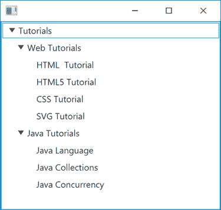
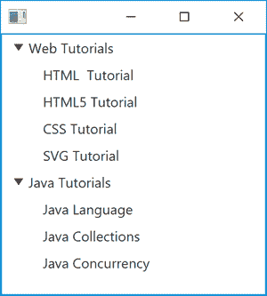

# JavaFX 树形视图

> 原文：<https://jenkov.com/tutorials/javafx/treeview.html>

JavaFX*treeview*使您能够在 Java FX 应用程序中显示树形视图。 Java FX 树视图由类`javafx.scene.control.TreeView`表示。 下面是一张*Java FX*T5】TreeView: 的截图



## 创建树形视图

只需创建一个新的`TreeView` 类实例，就可以创建一个 JavaFX `TreeView`。下面是一个创建新的 JavaFX `TreeView`实例的例子:

```

TreeView treeView = new TreeView();

```

## 将树形视图添加到场景图

要使 JavaFX `TreeView`可见，必须将其添加到 [JavaFX 场景图](scene.html#the-scene-graph)中。 下面是一个展示如何将 JavaFX `TreeView`添加到 JavaFX 场景图的例子:

```

import javafx.application.Application;
import javafx.scene.Scene;
import javafx.scene.control.TreeView;
import javafx.scene.layout.VBox;
import javafx.stage.Stage;

public class TreeViewExample extends Application {

    public static void main(String[] args) {
        launch(args);
    }

    @Override
    public void start(Stage primaryStage) {
        TreeView treeView = new TreeView();

        VBox vbox = new VBox(treeView);

        Scene scene = new Scene(vbox);

        primaryStage.setScene(scene);

        primaryStage.show();
    }

}

```

注意，在上面的例子中创建的`TreeView`没有任何项目(节点)可以显示。 我们将在下一节看到如何将树项目添加到一个`TreeView`中。

## 向 TreeView 添加树项目

JavaFX `TreeView`显示的树中的项目由`TreeItem` 类(`javafx.scene.control.TreeItem`)表示。下面是一个创建一组`TreeItem` 实例并将它们添加到 JavaFX `TreeView`实例: 的例子

```

TreeItem rootItem = new TreeItem("Tutorials");

TreeItem webItem = new TreeItem("Web Tutorials");
webItem.getChildren().add(new TreeItem("HTML  Tutorial"));
webItem.getChildren().add(new TreeItem("HTML5 Tutorial"));
webItem.getChildren().add(new TreeItem("CSS Tutorial"));
webItem.getChildren().add(new TreeItem("SVG Tutorial"));
rootItem.getChildren().add(webItem);

TreeItem javaItem = new TreeItem("Java Tutorials");
javaItem.getChildren().add(new TreeItem("Java Language"));
javaItem.getChildren().add(new TreeItem("Java Collections"));
javaItem.getChildren().add(new TreeItem("Java Concurrency"));
rootItem.getChildren().add(javaItem);

TreeView treeView = new TreeView();
treeView.setRoot(rootItem);

```

### 向 TreeItem 添加子项

如果您看一下上一节中的例子，您可以看到一个`TreeItem`可以有其他的 `TreeItem`实例作为子实例。这种父子关系可以无限递归地继续下去。 这是您在 JavaFX 应用程序中逻辑构建树节点的方式。下面的例子展示了 如何将子`TreeItem`实例添加到父`TreeItem` :

```

TreeItem javaItem = new TreeItem("Java Tutorials");
javaItem.getChildren().add(new TreeItem("Java Language"));
javaItem.getChildren().add(new TreeItem("Java Collections"));
javaItem.getChildren().add(new TreeItem("Java Concurrency"));

TreeItem rootItem = new TreeItem("Tutorials");
rootItem.getChildren().add(javaItem);

```

这个例子创建了一个只有一个根`TreeItem`的树，其上设置了一个子`TreeItem` ，这个子`TreeItem`自身添加了 3 个子`TreeItem`实例。

## 隐藏 TreeView 的根项目

您可以隐藏 JavaFX `TreeView`的根项目(根节点)。您可以通过调用 `setShowRoot()`方法，将`boolean`值`false`作为参数传递给它。 下面是一个隐藏 JavaFX `TreeView` : 的根`TreeItem`的例子

```

import javafx.application.Application;
import javafx.scene.Scene;
import javafx.scene.control.TreeItem;
import javafx.scene.control.TreeView;
import javafx.scene.layout.VBox;
import javafx.stage.Stage;

public class TreeViewExample extends Application {

    public static void main(String[] args) {
        launch(args);
    }

    @Override
    public void start(Stage primaryStage) {

        TreeItem rootItem = new TreeItem("Tutorials");

        TreeItem webItem = new TreeItem("Web Tutorials");
        webItem.getChildren().add(new TreeItem("HTML  Tutorial"));
        webItem.getChildren().add(new TreeItem("HTML5 Tutorial"));
        webItem.getChildren().add(new TreeItem("CSS Tutorial"));
        webItem.getChildren().add(new TreeItem("SVG Tutorial"));
        rootItem.getChildren().add(webItem);

        TreeItem javaItem = new TreeItem("Java Tutorials");
        javaItem.getChildren().add(new TreeItem("Java Language"));
        javaItem.getChildren().add(new TreeItem("Java Collections"));
        javaItem.getChildren().add(new TreeItem("Java Concurrency"));
        rootItem.getChildren().add(javaItem);

        TreeView treeView = new TreeView();
        treeView.setRoot(rootItem);

        treeView.setShowRoot(false);

        VBox vbox = new VBox(treeView);

        Scene scene = new Scene(vbox);

        primaryStage.setScene(scene);

        primaryStage.show();
    }

}

```

注意粗体的那一行。这一行指示 JavaFX `TreeView`隐藏根节点。 这里有一个截图，展示了所有节点展开后得到的 JavaFX `TreeView`的样子:



注意没有显示带有文本`Tutorials`的根`TreeItem`。