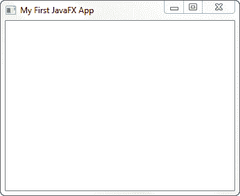
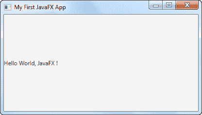

# 您的第一个 JavaFX 应用程序

> 原文：<https://jenkov.com/tutorials/javafx/your-first-javafx-application.html>

在本教程中，我将向您展示如何创建第一个 JavaFX 应用程序。因此，本教程既向您介绍了 JavaFX 的核心概念，也为您提供了一些 JavaFX 代码，您可以使用它们作为自己实验的模板。

## JavaFX 应用程序类

JavaFX 应用程序需要一个主启动类。这个类必须扩展`javafx.application.Application`类，它是 Java 8 以后 Java 中的标准类。

下面是`Application`的一个子类示例:

```
package com.jenkov.javafx.helloworld;

import javafx.application.Application;

public class MyFxApp extends Application {

}

```

## 实现 start()

JavaFX `Application`类的所有子类都必须实现`Application`类的抽象`start()`方法(或者是`Application`本身的抽象子类)。

启动 JavaFX 应用程序时会调用`start()`方法。下面是上面的例子，但是实现了`start()`方法:

```
package com.jenkov.javafx.helloworld;

import javafx.application.Application;
import javafx.stage.Stage;

public class MyFxApp extends Application {

    @Override
    public void start(Stage primaryStage) throws Exception {
        primaryStage.setTitle("My First JavaFX App");

        primaryStage.show();
    }

}

```

`start()`方法接受一个类型为`Stage`的参数。舞台是显示 JavaFX 应用程序的所有可视部分的地方。JavaFX 运行时为您创建了`Stage`对象。

上面的例子在 stage 对象上设置了一个标题，然后对其调用`show()`。这将使 JavaFX 应用程序在一个窗口中可见，其标题在窗口的顶栏中可见。

如果不在 stage 对象上调用`show()`，则什么也看不到。没有窗户开着。如果您的 JavaFX 应用程序在启动时不可见，请检查您是否记得从`start()`内部调用`Stage` `show()`方法。

## 添加 main()方法

您实际上可以在没有`main()`方法的情况下启动 JavaFX 应用程序。但是，如果您想将命令行参数传递给应用程序，您需要添加一个`main()`方法。总的来说，我更喜欢添加一个`main()`方法，因为它可以更清楚地显示哪个代码启动应用程序。

下面是上面添加了一个`main()`方法的例子:

```
package com.jenkov.javafx.helloworld;

import javafx.application.Application;
import javafx.stage.Stage;

public class MyFxApp extends Application {

    @Override
        public void start(Stage primaryStage) throws Exception {
        primaryStage.setTitle("My First JavaFX App");

        primaryStage.show();
    }
    public static void main(String[] args) {
        Application.launch(args);
    } 

}

```

如您所见，`main()`方法使用命令行参数调用静态`launch()`方法。`launch()`方法是位于`Application`类中的静态方法。该方法启动 JavaFX 运行时和 JavaFX 应用程序。

`launch()`方法将检测它是从哪个类被调用的，所以你不必明确地告诉它启动哪个类。

这就是创建 JavaFX 应用程序的全部内容。这很简单，不是吗？现在您已经准备好开始使用 JavaFX 了！

下面是运行上述 JavaFX 应用程序后打开的窗口的屏幕截图:



## 添加场景

前面的 JavaFX 示例只打开了一个窗口，但是这个窗口中不显示任何内容。要在 JavaFX 应用程序窗口中显示某些内容，您必须向`Stage`对象添加一个`Scene`。这是在`start()`方法中完成的。

要在 JavaFX 应用程序中显示的所有组件必须位于场景中。“stage”和“scene”的名称是受剧院的启发。一个舞台可以展示多个场景，就像在戏剧中一样。类似地，计算机游戏可以具有菜单场景、游戏场景、游戏结束场景、高分场景等。

下面是一个如何将一个`Scene`对象和一个简单的`Label`一起添加到`Stage`的例子:

```
package com.jenkov.javafx.helloworld;

import javafx.application.Application;
import javafx.scene.Scene;
import javafx.scene.control.Label;
import javafx.stage.Stage;

public class MyFxApp extends Application {

    @Override
    public void start(Stage primaryStage) throws Exception {
        primaryStage.setTitle("My First JavaFX App");
        Label label = new Label("Hello World, JavaFX !");
        Scene scene = new Scene(label, 400, 200);
        primaryStage.setScene(scene); 
        primaryStage.show();
    }

    public static void main(String[] args) {
        Application.launch(args);
    }
}

```

这个例子中增加了三行。首先创建一个`Label`对象。然后创建一个`Scene`对象，将`Label`作为参数传递，同时传递两个代表场景宽度和高度的参数。

`Scene`构造函数的第一个参数是*场景图*的根元素。场景图是一个类似图形的对象结构，包含所有要在 JavaFX 应用程序中显示的可视组件，例如 GUI 组件。

width 和 height 参数设置 JavaFX 窗口打开时的宽度和高度，但是用户可以调整窗口的大小。

下面是添加了`Scene`和`Label`后打开的窗口的样子:

