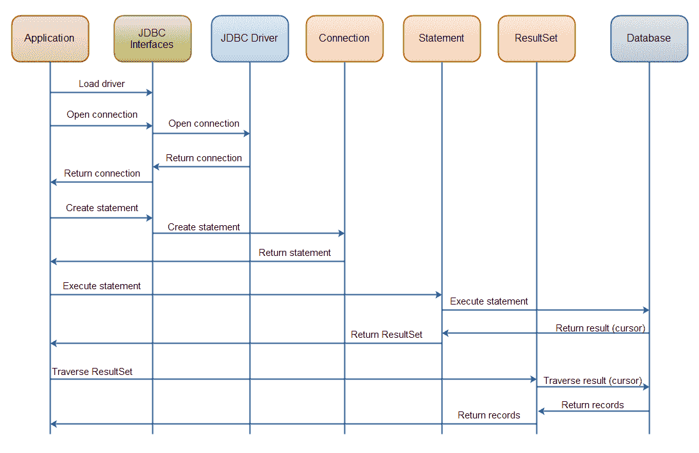

# JDBC 概述

> 原文：<https://jenkov.com/tutorials/jdbc/overview.html>

JDBC API 由以下核心部分组成:

*   JDBC 司机
*   连接
*   声明
*   结果集

大多数 JDBC 工作围绕着四个基本的 JDBC 用例展开:

*   查询数据库(从中读取数据)。
*   查询数据库元数据。
*   更新数据库。
*   执行交易。

我将在接下来的章节中解释核心组件和常见用例。

## 核心 JDBC 组件

### JDBC 司机

JDBC 驱动程序是 Java 类的集合，它使您能够连接到特定的数据库。例如，MySQL 将有自己的 JDBC 驱动程序。JDBC 驱动程序实现了许多 JDBC 接口。当你的代码使用一个给定的 JDBC 驱动时，它实际上只是使用了标准的 JDBC 接口。所使用的具体的 JDBC 驱动程序隐藏在 JDBC 接口之后。因此你可以插入一个新的 JDBC 驱动程序，而你的代码不会注意到它。

当然，JDBC 驱动程序可能会在它们支持的特性上稍有不同。

### 连接

一旦加载并初始化了 JDBC 驱动程序，就需要连接到数据库。您可以通过 JDBC API 和加载的驱动程序获得数据库的`Connection`。所有与数据库的通信都通过连接进行。一个应用程序可以同时打开多个数据库连接。这其实很常见。

### 声明

`Statement`是用来对数据库执行查询和更新的。您可以使用几种不同类型的语句。每个语句对应一个查询或更新。

### 结果集

当您对数据库执行查询时，您会得到一个`ResultSet`。然后您可以遍历这个`ResultSet`来读取查询的结果。

## 常见的 JDBC 用例

### 查询数据库

最常见的用例之一是从数据库中读取数据。从数据库中读取数据称为查询数据库。

### 查询数据库元数据

另一个常见的用例是查询数据库元数据。数据库元数据包含关于数据库本身的信息。例如，关于定义的表、每个表中的列、数据类型等的信息。

### 更新数据库

另一个非常常见的 JDBC 用例是更新数据库。更新数据库意味着向其中写入数据。换句话说，添加新记录或修改(更新)现有记录。

### 执行交易

事务是另一个常见的用例。一个事务将多个更新和可能的查询组合成一个动作。要么执行所有操作，要么都不执行。

## JDBC 组件交互图

以下是在执行数据库查询期间核心组件如何交互的示例(单击图像查看大图):

| [T2】](/images/java-jdbc/overview.png) |
| Java JDBC:在数据库查询执行期间核心 JDBC 组件的交互。 |

