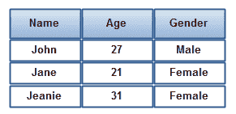

# JDBC 结果集

> 原文：<https://jenkov.com/tutorials/jdbc/resultset.html>

Java JDBC *ResultSet* 接口表示数据库查询的结果。关于[查询](query.html)的文本显示了查询结果如何作为`java.sql.ResultSet`返回。然后这个`ResultSet`被迭代以检查结果。本教程解释了如何使用`ResultSet`界面。

## 结果集包含记录

一个 JDBC `ResultSet`包含记录。每个记录包含一组列。每条记录包含相同数量的列，尽管并非所有列都有值。一列可以有一个`null`值。下面是一幅 JDBC `ResultSet`的插图:

<center>

| [T2】](/images/java-jdbc/result-set-1.png) |
| **结果集示例-包含列的记录** |

</center>

这个`ResultSet`有 3 个不同的列(姓名、年龄、性别)，每列有 3 个不同值的记录。

## 创建结果集

通过执行一个`Statement`或`PreparedStatement`来创建一个`ResultSet`，就像这样:

```
Statement statement = connection.createStatement();

ResultSet result = statement.executeQuery("select * from people");

```

或者像这样:

```
String sql = "select * from people";
PreparedStatement statement = connection.prepareStatement(sql);

ResultSet result = statement.executeQuery();

```

### 结果集类型、并发性和可持有性

创建`ResultSet`时，有三个属性可以设置。这些是:

1.  类型
2.  并发
3.  保持能力

当您创建`Statement`或`PreparedStatement`时，您已经设置了这些，如下所示:

```
Statement statement = connection.createStatement(
    ResultSet.TYPE_FORWARD_ONLY,
    ResultSet.CONCUR_READ_ONLY,
    ResultSet.CLOSE_CURSORS_OVER_COMMIT
   );

PreparedStatement statement = connection.prepareStatement(sql,
    ResultSet.TYPE_FORWARD_ONLY,
    ResultSet.CONCUR_READ_ONLY,
    ResultSet.CLOSE_CURSORS_OVER_COMMIT
   );

```

这些属性的确切含义将在本文后面解释。但是现在你知道在哪里指定它们了。

## 迭代结果集

要迭代`ResultSet`，可以使用它的`next()`方法。如果`ResultSet`有下一条记录，则`next()`方法返回 true，并移动`ResultSet`指向下一条记录。如果没有更多的记录，`next()`返回 false，并且您不能再。一旦`next()`方法返回 false，就不应该再调用它了。这样做可能会导致异常。

下面是一个使用`next()`方法迭代`ResultSet`的例子:

```
while(result.next()) {
    // ... get column values from this record
}

```

如您所见，`next()`方法实际上是在访问第一条记录之前被调用的。这意味着，`ResultSet`在第一条记录之前开始指向。一旦`next()`被调用一次，它就指向第一条记录。

同样，当调用`next()`并返回 false 时，`ResultSet`实际上是指向最后一条记录之后。

您无法获得一个`ResultSet`中的行数，除非您遍历它并计算行数。然而，如果`ResultSet`是仅向前的，你不能向后移动。即使你可以向后移动，这也是一种缓慢的在`ResultSet`中计算行数的方式。您最好对代码进行结构化，这样就不需要提前知道记录的数量。

## 访问列值

当迭代`ResultSet`时，您想要访问每条记录的列值。您可以通过调用众多`getXXX()`方法中的一个或多个来实现。你把要获取的值的列名传递给许多`getXXX()`方法。例如:

```
while(result.next()) {

    result.getString    ("name");
    result.getInt       ("age");
    result.getBigDecimal("coefficient");

    // etc.
}

```

您可以调用许多`getXXX()`方法，这些方法以某种数据类型返回列的值，例如 String、int、long、double、BigDecimal 等。它们都将获取列值的列的名称作为参数。下面是这些`getXXX()`方法的快速示例列表:

```
result.getArray("columnName");
result.getAsciiStream("columnName");
result.getBigDecimal("columnName");
result.getBinaryStream("columnName");
result.getBlob("columnName");
result.getBoolean("columnName");
result.getBlob("columnName");
result.getBoolean("columnName");
result.getByte("columnName");
result.getBytes("columnName");
result.getCharacterStream("columnName");
result.getClob("columnName");
result.getDate("columnName");
result.getDouble("columnName");
result.getFloat("columnName");
result.getInt("columnName");
result.getLong("columnName");
result.getNCharacterStream("columnName");
result.getObject("columnName");
result.getRef("columnName");
result.getRowId("columnName");
result.getShort("columnName");
result.getSQLXML("columnName");
result.getString("columnName");
result.getTime("columnName");
result.getTimestamp("columnName");
result.getUnicodeStream("columnName");
result.getURL("columnName");

```

`getXXX()`方法也有采用列索引而不是列名的版本。例如:

```
while(result.next()) {

    result.getString    (1);
    result.getInt       (2);
    result.getBigDecimal(3);

    // etc.
}

```

列的索引通常取决于 SQL 语句中列的索引。例如，SQL 语句

```
select name, age, coefficient from person

```

有三列。列名首先列出，因此在`ResultSet`中的索引为 1。列年龄的索引为 2，列系数的索引为 3。

有时你事先不知道某一列的索引。例如，如果您使用一个`select * from` 类型的 SQL 查询，您不知道列的顺序。

如果不知道某一列的索引，可以使用`ResultSet.findColumn(String columnName)`方法找到该列的索引，如下所示:

```
int nameIndex   = result.findColumn("name");
int ageIndex    = result.findColumn("age");
int coeffIndex  = result.findColumn("coefficient");

while(result.next()) {
    String     name        = result.getString     (nameIndex);
    int        age         = result.getInt        (ageIndex);
    BigDecimal coefficient = result.getBigDecimal (coeffIndex);
}

```

## 结果集类型

一个`ResultSet`可以是某种类型。类型决定了`ResultSet`的一些特性和能力。

并非所有数据库和 JDBC 驱动程序都支持所有类型。你必须检查你的数据库和 JDBC 驱动程序，看看它是否支持你想要使用的类型。根据给定类型是否受支持，`DatabaseMetaData.supportsResultSetType(int type)`方法返回 true 或 false。在后面的文本中会涉及到`DatabaseMetaData`类。

在撰写本文时，有三种`ResultSet`类型:

1.  结果集。仅转发类型
2.  结果集。TYPE _ SCROLL _ 不敏感
3.  结果集。类型 _ 滚动 _ 敏感

默认类型为`TYPE_FORWARD_ONLY`

`TYPE_FORWARD_ONLY`表示`ResultSet`只能向前导航。也就是说，您只能从第 1 行移动到第 2 行、第 3 行等等。在`ResultSet`中你不能后退。

`TYPE_SCROLL_INSENSITIVE`表示`ResultSet`可以向前和向后导航(滚动)。也可以跳到相对于当前位置的位置，或者跳到绝对位置。当`ResultSet`打开时，`ResultSet`对底层数据源的变化不敏感。也就是说，如果数据库中的`ResultSet`中的记录被另一个线程或进程更改，它将不会反映在已经打开的这种类型的`ResulsSet`中。

`TYPE_SCROLL_SENSITIVE`表示`ResultSet`可以向前和向后导航(滚动)。也可以跳到相对于当前位置的位置，或者跳到绝对位置。当`ResultSet`打开时，`ResultSet`对底层数据源的变化很敏感。也就是说，如果数据库中的`ResultSet`中的记录被另一个线程或进程更改，它将反映在已经打开的这种类型的`ResulsSet`中。

### 导航方法

`ResultSet`界面包含以下导航方法。记住，不是所有的方法都适用于所有的`ResultSet`类型。什么方法起作用取决于你的数据库、JDBC 驱动程序和`ResultSet`类型。

| 方法 | 描述 |
| `absolute()` | 移动`ResultSet`指向绝对位置。位置是作为参数传递给`absolute()`方法的行号。 |
| `afterLast()` | 将`ResultSet`移动到`ResultSet`中最后一行之后。 |
| `beforeFirst()` | 将`ResultSet`移动到`ResultSet`中第一行的前面。 |
| `first()` | 移动`ResultSet`指向`ResultSet`中的第一行。 |
| `last()` | 移动`ResultSet`指向`ResultSet`中的最后一行。 |
| `next()` | 移动`ResultSet`指向`ResultSet`中的下一行。 |
| `previous()` | 移动`ResultSet`指向`ResultSet`中的前一行。 |
| `relative()` | 移动`ResultSet`指向相对于其当前位置的位置。相对位置作为参数传递给 relative 方法，可以是正数也可以是负数。 |
|  | 移动`ResultSet` |

`ResultSet`接口还包含一组方法，可以用来查询`ResultSet`的当前位置。这些是:

| 方法 | 描述 |
| `getRow()` | 返回当前行的行号——当前由`ResultSet`指向的行。 |
| `getType()` | 返回`ResultSet`类型。 |
| `isAfterLast()` | 如果`ResultSet`指向最后一行之后，则返回 true。如果不是，则为假。 |
| `isBeforeFirst()` | 如果`ResultSet`指向第一行之前，则返回 true。如果不是，则为假。 |
| `isFirst()` | 如果`ResultSet`指向第一行，则返回 true。如果不是，则为假。 |

最后，`ResultSet`接口还包含一个用数据库变化更新行的方法，如果`ResultSet`对变化敏感的话。

| 方法 | 描述 |
| `refreshRow()` | 用数据库中的最新值刷新该行的列值。 |

## 结果集并发

`ResultSet`并发性决定了`ResultSet`是可以更新，还是只能读取。

一些数据库和 JDBC 驱动程序支持更新`ResultSet`，但不是所有的数据库和 JDBC 驱动程序都支持。根据是否支持给定的并发模式，`DatabaseMetaData.supportsResultSetConcurrency(int concurrency)`方法返回 true 或 false。在后面的文本中会涉及到`DatabaseMetaData`类。

一个`ResultSet`可以有两个并发级别:

1.  结果集。CONCUR _ 只读
2.  结果集。CONCUR _ 可更新

CONCUR_READ_ONLY 表示只能读取`ResultSet`。

CONCUR_UPDATABLE 意味着可以读取和更新`ResultSet`。

## 更新结果集

如果一个`ResultSet`是可更新的，您可以更新`ResultSet`中每一行的列。你使用许多`updateXXX()`方法来做这件事。例如:

```
    result.updateString     ("name"       , "Alex");
    result.updateInt        ("age"        , 55);
    result.updateBigDecimal ("coefficient", new BigDecimal("0.1323");
    result.updateRow();

```

还可以使用列索引而不是列名来更新列。这里有一个例子:

```
    result.updateString     (1, "Alex");
    result.updateInt        (2, 55);
    result.updateBigDecimal (3, new BigDecimal("0.1323");
    result.updateRow();

```

注意这个`updateRow()`调用。当调用`updateRow()`时，数据库用该行的值更新。如果不调用这个方法，在`ResultSet`中更新的值永远不会发送到数据库。如果在事务内部调用`updateRow()`，那么直到事务被提交，数据才真正提交到数据库。

## 将行插入结果集

如果`ResultSet`是可更新的，也可以向其中插入行。您可以通过以下方式实现:

1.  调用 ResultSet.moveToInsertRow()
2.  更新行列值
3.  调用 ResultSet.insertRow()

这里有一个例子:

```
result.moveToInsertRow();
result.updateString     (1, "Alex");
result.updateInt        (2, 55);
result.updateBigDecimal (3, new BigDecimal("0.1323");
result.insertRow();

result.beforeFirst();

```

调用`moveToInsertRow()`后指向的行是一个特殊的行，一个缓冲区，您可以用它来构建行，直到所有的列值都已经设置在该行上。

一旦行准备好插入到`ResultSet`中，调用`insertRow()`方法。

插入行后`ResultSet`仍然指向插入行。但是，一旦插入了行，您无法确定如果尝试访问它会发生什么。因此，您应该在插入新行后将`ResultSet`移动到有效位置。如果需要插入另一行，显式调用`moveToInsertRow()`向`ResultSet`发出信号。

## 结果集可持有性

`ResultSet`可保持性决定了当底层`connection`的`commit()`方法被调用时`ResultSet`是否关闭。

并非所有数据库和 JDBC 驱动程序都支持所有可保持性模式。根据是否支持给定的可持有性模式，`DatabaseMetaData.supportsResultSetHoldability(int holdability)`返回 true 或 false。在后面的文本中会涉及到`DatabaseMetaData`类。

有两种类型的可保持性:

1.  结果集。CLOSE _ CURSORS _ OVER _ 提交
2.  结果集。保持 _ 光标 _ 覆盖 _ 提交

`CLOSE_CURSORS_OVER_COMMIT`可保持性意味着当在创建了`ResultSet`的连接上调用`connection.commit()`方法时，所有的`ResultSet`实例都被关闭。

`HOLD_CURSORS_OVER_COMMIT`保持性意味着当在创建`ResultSet`的连接上调用`connection.commit()`方法时，`ResultSet`保持打开。

如果您使用`ResultSet`来更新数据库中的值，那么`HOLD_CURSORS_OVER_COMMIT`保持能力可能会很有用。因此，您可以打开一个`ResultSet`，更新其中的行，调用`connection.commit()`，并为相同行上的未来事务保持相同的`ResultSet`打开。