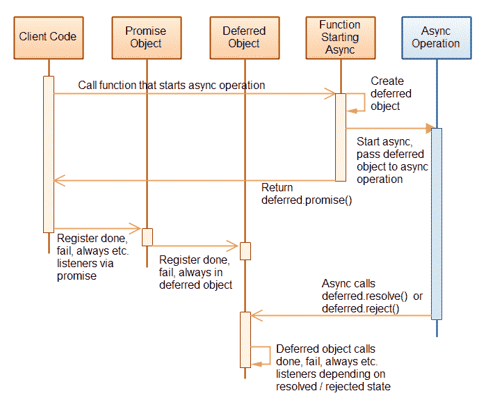

# jQuery 延迟对象

> 原文：<https://jenkov.com/tutorials/jquery/deferred-objects.html>

jQuery 中的延迟对象表示稍后将完成的工作单元，通常是异步完成的。一旦工作单元完成，延迟的对象可以被设置为已解决或失败。

延迟对象包含承诺对象。通过 promise 对象，您可以指定当工作单元完成时将会发生什么。通过在 promise 对象上设置回调函数可以做到这一点。我将在本文后面向您展示所有这些是如何工作的。

下面的图表展示了 jQuery 的延迟对象是如何工作的。如果你现在还不完全理解，不要担心。后面会解释。然后看完解释就可以回到这个图了。



## 典型的延迟对象用例

延迟对象通常用在当某个异步工作单元完成时需要传递回调函数的地方。执行异步工作时最常见的情况是:

*   AJAX 调用
*   通过网络加载资源
*   setTimeout()或 setInterval()
*   动画片
*   用户交互

当 AJAX 调用被执行时，它将被浏览器异步执行。一旦 AJAX 调用完成，浏览器就会调用一些回调函数。

例如，当使用 JavaScript 通过网络加载图像时，您可以指定一个回调函数，以便在图像完全加载时调用。加载图像本质上非常类似于 AJAX 调用。两者都是通过网络发送的 HTTP 请求。

当您使用 JavaScript `setTimeout()`和`setInterval()`函数时，您会传递一些在超时发生时要执行的回调函数。

动画通常会运行一段时间。当动画结束时，您可能希望执行一些动作，或者在动画结束后进行清理，或者执行一些与动画相关的其他动作。例如，如果您将列表中的一个项目的移除制作成动画，那么您可能希望在结束时从数据结构或 DOM 中的列表中实际移除该项目。

用户交互是另一种典型的异步情况。您的代码可以打开一个对话框，并指定当按下“确定”按钮或“取消”按钮关闭对话框时会发生什么。有时，您可以通过在“OK”和“CANCEL”按钮上设置显式侦听器函数来解决这种异步情况，而不是将回调传递给打开对话框的函数。尽管两者都是可行选择。

## 使用 jQuery 的延迟对象

在展示使用中的延迟对象之前，让我先向您展示一个没有延迟对象的标准异步函数。以下示例函数将回调函数作为参数，该函数在一定时间延迟后执行。

```
function doAsync(callback){
    setTimeout(function() { callback(); }, 1000);
}

```

用回调函数调用`doAsync()`函数看起来像这样:

```
doAsync(function() {
    console.log("Executed after a delay");
});

```

延迟后，将执行作为参数传递给`doAsync()`的功能。

`doAsync()`函数也可以使用 jQuery 延迟对象来实现。下面是`doAsync()`函数(称为`doAsync2()`)的 jQuery 延迟对象示例实现:

```
function doAsync2() {
    var deferredObject = $.Deferred();

    setTimeout(function() { deferredObject.resolve();  }, 1000);

    return deferredObject.promise();
}

```

首先，使用 jQuery `$.Deferred()`函数创建一个延迟对象。延迟对象本身不做任何事情。它只是一些异步工作的表示。

第二，将一个函数传递给`setTimeout()`函数。该功能在延迟后执行。该函数调用`deferredObject.resolve()`。这将导致延迟对象的内部状态更改为 resolved(延迟后)。

最后，返回与延迟对象相关联的承诺对象。通过 promise 对象，调用`doAsync2()`函数的代码可以决定如果延迟对象的状态变为 resolved 或 failed 时应该发生什么。

调用`doAsync2()`函数将如下所示:

```
var promise = doAsync2();

promise.done(function () {
    console.log("Executed after a delay");
});

```

注意回调函数不再作为参数传递给`doAsync2()`函数。相反，回调函数被传递给 promise 对象上的`done()`函数。一旦被延迟对象的状态变为 resolved，传递给`done()`的回调函数将被执行。

如果延迟对象的状态变为 failed，那么传递给`done()`的回调函数将不会被执行。相反，传递给 promise 对象的`fail()`函数的回调函数将被执行。下面是你如何传递一个回调函数给`fail()`函数:

```
var promise = doAsync2();

promise.done(function () {
    console.log("Executed after a delay");
});
 promise.fail(function () {
    console.log("Executed if the async work fails");
});

```

此外，由于`done()`和`fail()`函数返回 promise 对象本身，您可以将上面的代码缩短为:

```
doAsync2()
  .done(function () {
    console.log("Executed after a delay");
}).fail(function () {
    console.log("Executed if the async work fails");
});

```

当然，`doAsync2()`函数的实现永远不会将延迟对象的状态设置为 failed，所以在这个例子中这个函数永远不会被执行。让我们更改`doAsync2()`(作为`doAsync3()`)的实现，这样被延迟的对象实际上可以将状态更改为失败。

```
function doAsync3() {
    var deferredObject = $.Deferred();

    setTimeout(function() {
        var randomValue = Math.random();
        if(randomValue < 0.5) {
            deferredObject.resolve();
        } else {
            deferredObject.reject();
        }
    }, 1000);

    return deferredObject.promise();
}

```

在这个实现中，异步调用的函数生成一个介于 0 和 1 之间的随机数。如果该数字小于 0.5，则延迟对象的状态被设置为已解决。否则，延迟对象的状态被设置为失败。这是通过调用延迟对象的`reject()`函数来完成的。

## 延迟对象与承诺对象

如果您查看 jQuery 文档，您会看到一个延迟对象也有一个`done()`和`fail()`函数，就像 promise 对象一样。这意味着，您可以返回延迟对象本身，而不是从延迟对象返回承诺对象。这是它看起来的样子:

```
function doAsync4() {
    var deferredObject = $.Deferred();

    setTimeout(function() {
        var randomValue = Math.random();
        if(randomValue < 0.5) {
            deferredObject.resolve();
        } else {
            deferredObject.reject();
        }
    }, 1000);

    return deferredObject;
}

```

`doAsync4()`和`doAsync3()`唯一的区别就是最后一行。它没有返回`deferredObject.promise()`，而是返回`deferredObject`。

使用`doAsync4()`和`doAsync3()`的方式没有区别。你也可以直接在延迟对象上调用`done()`和`fail()`。效果和在 promise 对象上调用这些函数是一样的。

返回延迟对象和返回承诺对象的主要区别在于，延迟对象可用于设置延迟对象的已解决或失败状态。您不能在 promise 对象上这样做。因此，如果您不希望异步函数的用户能够修改延迟对象的状态，最好不要返回延迟对象，而只返回它的 promise 对象(`deferredObject.promise()`)。

## 许诺对象

由延迟对象返回的 promise 对象包含下列可以调用的函数:

*   完成()
*   失败()
*   总是()
*   进度()
*   然后()
*   状态()

前两个函数，`done()`和`fail()`我们已经看过了。当连接到 promise 对象的延迟对象将其状态更改为 resolved 或 failed 时，将调用它们。

`always()`函数也将回调函数作为参数。当延迟对象将状态更改为已解决或失败时，总是会调用此回调函数。延迟对象更改到哪个状态并不重要。当状态改变时，首先调用传递给`done()`或`fail()`的回调，然后调用传递给`always()`的回调。

`progress()`函数可以用来给 promise 对象附加一个进度回调函数。每当在连接到 promise 对象的 deferred 对象上调用`notify()`函数时，就会调用这个回调函数。这个系统可以用来通知侦听器一个长时间运行的异步操作的进度。在本文的后面，我将向您展示一个如何做到这一点的示例。

`then()`函数允许您链接和过滤 promise 对象。你也可以直接使用它作为快捷方式，为已解决和失败的状态改变设置回调函数，而不是使用`done()`、`fail()`和`progress()`。我将在本文后面展示如何使用`then()`功能。

`state()`函数返回连接到 promise 对象的延迟对象的状态。它将返回字符串“待定”、“已解决”或“已拒绝”中的一个。字符串“pending”表示尚未被解析或拒绝的延迟对象的状态。

### 将多个回调附加到承诺对象

您可以将每个延迟对象状态的多个回调函数附加到 promise 对象。这里有一个例子:

```
    var promise = doAsync3();

    promise.done(function() { console.log("done 1"); } );
    promise.done(function() { console.log("done 2"); } );

    promise.fail(function() { console.log("fail 1"); } );
    promise.fail(function() { console.log("fail 2"); } );

    promise.always(function() { console.log("always 1"); } );
    promise.always(function() { console.log("always 2"); } );

```

这个例子使用了`done()`、`fail()`和`always()`函数中的每一个来附加两个回调函数。当延迟对象改变其状态时，回调函数将按照它们被注册的顺序被调用。

## 解析或拒绝延迟的对象

您可以使用延迟对象的`resolve()`和`reject()`函数来解析或拒绝延迟对象。当您这样做时，通过延迟对象的 promise 对象或者通过延迟对象本身添加的任何回调函数都将被调用。实际上，您之前已经看到过这种作品的一个例子，但我将在这里重复一遍:

```
function doAsync3() {
    var deferredObject = $.Deferred();

    setTimeout(function() {
        var randomValue = Math.random();
        if(randomValue < 0.5) {
            deferredObject.resolve();
        } else {
            deferredObject.reject();
        }
    }, 1000);

    return deferredObject.promise();
}

```

如您所见，延迟对象的`resolve()`和`reject()`函数是从传递给`setTimeout()`的延迟函数内部调用的。

您实际上可以将值传递给`resolve()`和`reject()`函数。这些值将被传递给通过`done()`、`fail()`和`always()`函数注册的回调函数。

这里的`doAsync4()`被重写以显示如何通过`resolve()`和`reject()`传递参数:

```
function doAsync4() {
    var deferredObject = $.Deferred();

    setTimeout(function() {
        var randomValue = Math.random();
        if(randomValue < 0.5) {
            deferredObject.resolve( randomValue, "val2" );
        } else {
            deferredObject.reject( randomValue, "errorCode" );
        }
    }, 1000);

    return deferredObject;
}

```

注册回调函数时，应该让回调函数将传递的值作为参数。这里有一个例子:

```
doAsync4().done(function (value, value2) {
    console.log("doAsync4 succeeded: " + value + " : " + value2);

}).fail(function(value, value2) {
    console.log("doAsync4 failed: " + value + " : " + value2);

}).always(function(value, value2) {
    console.log("always4: " + value + " : " + value2);
});

```

如您所见，三个回调函数都有两个参数。

您可以通过`resolve()`和`reject()`传递任意多的参数。

## 监视延迟对象的进度

如果异步流程需要很长时间才能完成，您可以监控流程的进度。它要求异步流程将长时间运行的流程的进度通知给潜在的侦听器。这可以通过延迟对象`notify()`函数来完成。下面的例子展示了如何调用`notify()`函数:

```
function doAsync5() {
    var deferredObject = $.Deferred();

    setTimeout(function() { deferredObject.notify(1); }, 1000);
    setTimeout(function() { deferredObject.notify(2); }, 2000);
    setTimeout(function() { deferredObject.notify(3); }, 3000);
    setTimeout(function() { deferredObject.resolve(); }, 4000);

    return deferredObject.promise();
}

```

注意`doAsync5()`函数是如何设置四个延迟函数的。前 3 个延迟函数用不同的参数值调用`deferredObject.notify()`。最后一个延迟函数解析延迟的对象。

在延迟对象上调用`notify()`会导致调用通过关联 promise 对象上的`progress()`函数添加的回调。下面是如何在 promise 对象上使用`progress()`函数来通知延迟对象上的`notify()`调用:

```
doAsync5().progress(function(progressValue) {
    console.log("doAsync5 progress : " + progressValue)
}).done(function () {
    console.log("doAsync5 succeeded. ");
});

```

注意对由`doAsync5()`返回的 promise 对象的`progress()`调用。每当在连接到 promise 对象的 deferred 对象上调用`notify()`函数时，传递给`progress()`的回调就会被调用。你传递给`notify()`的任何参数都将被转发给用`progress()`注册的回调函数。

## 链接和过滤承诺对象

promise 对象有一个名为`then()`的函数，可以用来链接 promise 对象。下面是一个使用`then()`的连锁承诺示例:

```
doAsync5().then(function(val) { console.log("done 1") },
                function(val) { console.log("fail 1") },
                function(val) { console.log("prog 1") }

         ).then(function(val) { console.log("done 2") },
                function(val) { console.log("fail 2") },
                function(val) { console.log("prog 2") }
         );

```

`then()`函数有三个参数。第一个参数是在延迟对象被解析(完成)时要调用的函数。第二个函数是延迟对象被拒绝(失败)时要调用的函数。第三个函数是一个进度函数，每当异步代码对延迟对象调用`notify()`时都会调用这个函数。

上面示例中的代码类似于以下代码:

```
doAsync5()
    .done(function(val) { console.log("done 1") })
    .fail(function(val) { console.log("fail 1") })
    .progress(function(val) { console.log("prog 1") })

    .done(function(val) { console.log("done 2") })
    .fail(function(val) { console.log("fail 2") })
    .progress(function(val) { console.log("prog 2") })
;

```

两个版本都设置了两组监听函数，用于监听延迟的对象状态更改(已解决/已拒绝)和进度通知。但是有一个显著的不同。

在最后显示的使用`done()`、`fail()`和`progress()`的版本中，传递给每个监听器的值就是传递给延迟对象上的`resolve()`、`reject()`和`notify()`的确切值。

在使用`then()`的第一个版本中，每个侦听器函数都可以选择*更改(过滤)*传递给比自己晚注册的侦听器的值。它通过返回另一个值来做到这一点。侦听器返回的值将是返回给该类型的下一个侦听器的值。因此，解析的侦听器可以过滤传递给后续解析侦听器的值。进度侦听器可以过滤传递给后续进度侦听器的值。对于被拒绝(失败)的侦听器也是如此。看看这个例子:

```
doAsync5().then(function(val) { console.log("done 1: " + val); return val + 1; },
                function(val) { console.log("fail 1: " + val) },
                function(val) { console.log("prog 1: " + val); return val + 1; }

         ).then(function(val) { console.log("done 2: " + val) },
                function(val) { console.log("fail 2: " + val) },
                function(val) { console.log("prog 2: " + val) }
         )

```

在这个例子中，第一个`done`和`progress`监听器返回传递给它们的原始值，并加 1 ( `val++`)。返回的递增值将成为传递给下一个同类侦听器函数的参数值。这种过滤效果可以用来创建高级的 promise 监听器链。

## 将承诺与美元相结合。当()

如果需要等待多个延迟对象完成，可以使用`$.when()`函数组合它们的 promise 对象。这里有一个例子:

```
$.when(doAsync4(), doAsync4())
        .done(function(val1, val2) {
            console.log("val1: " + val1);
            console.log("val2: " + val2);
        })
        .fail(function(val1, val2) { 
            console.log("fail: " + val1 + " : " + val2 + " : " + val3);
        })
;

```

这个例子调用了两次`doAsync4()`函数，并使用`$.when()`函数将两次函数调用返回的 promise 对象组合起来。

`$.when()`函数返回一个新的 promise 对象，在该对象上可以使用`done()`、`fail()`、`always()`等附加回调函数。如果作为参数传递给`$.when()`调用的所有承诺都成功(=让`resolve()`调用它们的延迟对象)，那么通过`done()`设置的对`$.when()`返回的承诺的回调将被调用。如果传递给`$.when()`的单个承诺对象失败，那么通过`fail()`添加的回调将被调用。因此，`$.when()`函数的工作方式类似于逻辑`and`函数。所有输入承诺必须成功，由`$.when()`返回的承诺才能成功。

注册在由`$.when()`返回的承诺上的回调函数的参数值与普通承诺对象的参数具有稍微不同的语义。在一个普通的 promise 对象上，传递给一个`done()`回调函数的参数就是传递给延迟对象的`resolve()`函数的参数。然而，当您将两个 promise 对象组合在一起时，`done()`监听器接收传递给两个延迟对象的`resolve()`调用的参数。

组合`resolve()`参数时，有两种情况需要考虑。第一个场景是所有对`resolve()`的调用都取一个值。在这种情况下，传递给`resolve()`调用的每个值都作为单独的参数传递给回调函数，该回调函数通过`done()`函数在由`$.when()`函数返回的 promise 对象上注册。下面是在这种情况下访问`resolve()`参数的一个例子:

```
$.when(doAsync4(), doAsync4())
        .done(function(val1, val2) {
            console.log("val1: " + val1);
            console.log("val2: " + val2);
        })
        .fail(function(val1, val2) {
            console.log("fail: " + val1 + " : " + val2 + " : " + val3);
        })
;

```

`val1`参数将从传递给`$.when()`的第一个延迟对象的`resolve()`调用中接收值。`val2`参数将从传递给`$.when()`的第二个延迟对象的`resolve()`调用中接收值。

如果`resolve()`调用中的一个或两个收到不止一个参数值，那么上面例子中的`val1`和`val2`的含义会改变。它们不是参数值本身，而是来自第一次和第二次`resolve()`调用的参数值数组。在这种情况下，您可以像这样访问参数值:

```
$.when(doAsync4(), doAsync4())
        .done(function(val1, val2) {
            for(var i=0; i < val1.length; i++) {
                console.log("val1[" + i +"]: " + val1[i]);
            }
            for(var i=0; i < val2.length; i++) {
                console.log("val2[" + i +"]: " + val2[i]);
            }
        })
        .fail(function(val1, val2) {
            console.log("fail: " + val1 + " : " + val2 + " : " + val3);
        })
;

```

注意`val1`和`val2`现在都是数组。

如果其中一个延迟对象失败，那么失败的延迟对象的`reject()`调用的参数将被传递给在`$.when()`返回的承诺对象上使用`fail()`注册的回调。无论是否有一个或多个延迟对象失败，您都只能从第一个失败的延迟对象的`reject()`调用中获取参数，作为`$.when()`返回的承诺上向`fail()`注册的回调的参数。

## 延迟对象优于回调函数

与将回调函数作为参数传递给异步函数相比，延迟对象有一些优势。

与只使用一个回调函数的函数相比，能够附加多个回调函数是 deferred 对象和 promise 对象的一个优势。当然，一个异步函数可以只接受一个回调函数数组，但是要获得 promise 对象的能力，每个异步函数都必须接受一个“完成”回调数组、一个“失败”回调数组和一个“总是”回调数组。必须接受三个这样的数组并调用这些回调会导致笨拙的函数实现。将这些功能集中在一个地方要干净得多——在延迟对象和它的承诺对象中。

除了在内部清理异步函数，延迟对象还清理调用异步函数的外部代码。例如，`$.when()`函数很好地结合了两个或更多的承诺，而不是在回调中嵌套回调来等待多个异步动作完成。

第三，一旦理解了延迟对象和承诺对象，就基本理解了使用这些构造的所有函数。你知道如何处理返回值，如何处理失败，如果异步函数提供的话，监控进程等等。

## jQuery 中的延迟对象

jQuery 在它的一些 API 中使用延迟对象和内部承诺。例如，当你调用`$.ajax()`函数时，它返回一个`jqXHR`对象。在`jqXHR`对象上可用的函数中有三个承诺函数，`done()`、`fail()`和`always()`。这意味着，即使`jqXHR`对象不仅仅是一个 promise 对象，您也可以将其用作 promise 对象。

Promise 对象也可以在 jQuery 中与动画结合使用。以下示例是示例 jQuery 文档的修改版本:

```
$( "#theButton" ).on( "click", function() {

   $( "div" ).each(function( i ) {
       $( this ).fadeIn().fadeOut( 1000 * ( i + 1 ) );
   });

   $( "div" ).promise().done(function() {
       $( "p" ).append( " Finished! " );
   });
});

```

当点击 id 为`theButton`的按钮时，所有的`div`元素都会淡入。第二，从所有`div`元素的集合中获得一个承诺对象。当所有选定的`div`元素的动画完成时，这个 promise 对象将调用它的`done()`回调函数。这是一个有点棘手的语义含义，从一组元素中获得的 promise 对象被绑定到它们的动画上，我承认这一点。