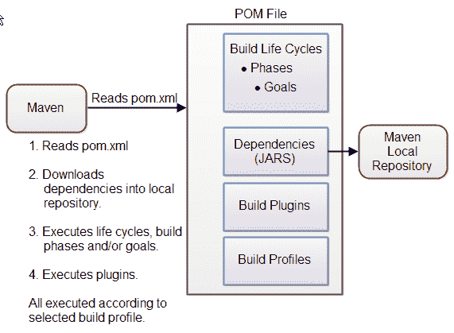
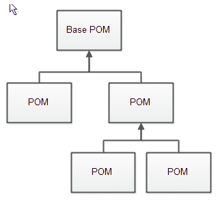
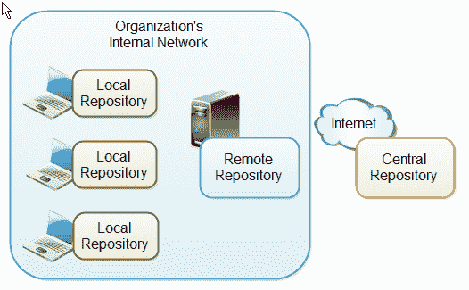

# Maven 教程

> 原文：<https://jenkov.com/tutorials/maven/maven-tutorial.html>

Maven 是一个强大的 Java 软件项目构建工具。实际上，您也可以使用其他语言构建软件项目，但是 Maven 是用 Java 开发的，因此历史上更多地用于 Java 项目。

这篇 Maven 教程的目的是让你明白 Maven 是如何工作的。因此，本教程主要关注 Maven 的核心概念。一旦理解了核心概念，在 Maven 文档中查找细节或者在互联网上搜索就容易多了。

实际上，Maven 开发者声称 Maven 不仅仅是一个构建工具。你可以在他们的文档[Maven 的哲学](http://maven.apache.org/background/philosophy-of-maven.html)中读到他们认为的东西。但是现在，就把它当成一个构建工具吧。一旦你理解了 Maven 并开始使用它，你就会发现它到底是什么。

## Maven 版本

这个 Maven 教程的第一个版本是基于 Maven 3.6.3 的。

## Maven 网站

Maven 网站位于以下位置:

[http://maven.apache.org](http://maven.apache.org)

从这个网站上，你可以下载 Maven 的最新版本，并大致了解这个项目。

## 什么是构建工具？

构建工具是一种自动化与构建软件项目相关的一切的工具。构建软件项目通常包括以下一项或多项活动:

*   生成源代码(如果项目中使用了自动生成的代码)。
*   从源代码生成文档。
*   编译源代码。
*   将编译后的代码打包成 JAR 文件或 ZIP 文件。
*   将打包的代码安装在服务器、存储库或其他地方。

任何给定的软件项目可能比构建完成的软件需要更多的活动。这样的活动通常可以插入到构建工具中，所以这些活动也可以自动化。

自动化构建过程的优势在于，您可以最小化人工构建软件时人为出错的风险。此外，自动化构建工具通常比人工执行相同的步骤要快。

## 安装 Maven

要在您自己的系统(计算机)上安装 Maven，请转到 [Maven 下载页面](http://maven.apache.org/download.cgi)并按照那里的说明进行操作。总而言之，你需要做的是:

1.  设置`JAVA_HOME`环境变量指向一个有效的 Java SDK(例如 Java 8)。
2.  下载并解压 Maven。
3.  设置`M2_HOME`环境变量指向您解压 Maven 的目录。
4.  将`M2`环境变量设置为指向`M2_HOME/bin`(在 Windows 上为`%M2_HOME%\bin`，在 unix 上为`$M2_HOME/bin`)。
5.  将`M2`添加到`PATH`环境变量中(在 Windows 上为`%M2%`，在 unix 上为`$M2`)。
6.  打开命令提示符，键入'`mvn -version`'(不带引号)，然后按 enter 键。

在键入`mvn -version`命令后，您应该能够看到 Maven 执行，并且 Maven 的版本号被写到命令提示符下。

注意:Maven 在执行时使用 Java，所以您也需要安装 Java(以及如上所述设置的`JAVA_HOME`环境变量)。Maven 3.0.5 需要 Java 版或更高版本。我用的是 Maven 3.3.3 搭配 Java 8 (u45)。

如果你不熟悉的话，我有一个关于安装 Java SDK 的教程。记住，它必须是 SDK(软件开发工具包)，而不仅仅是 JRE (Java 运行时环境)。JRE 不包含 Java 编译器。只有 SDK 有。

## Maven 概述-核心概念

Maven 以 POM 文件(项目对象模型)的概念为中心。POM 文件是项目资源的 XML 表示，如源代码、测试代码、依赖项(使用外部 jar)等。POM 包含对所有这些资源的引用。POM 文件应该位于它所属项目的根目录中。

下图说明了 Maven 如何使用 POM 文件，以及 POM 文件主要包含的内容:

|  |
| **Maven 核心概念概述。** |

这些概念将在下面简要介绍，让您有一个总体的了解，然后在本教程后面的章节中会有更详细的介绍。

当你执行一个 Maven 命令时，你给 Maven 一个 POM 文件来执行命令。然后，Maven 将在 POM 中描述的资源上执行命令。

**构建生命周期、阶段和目标**
Maven 中的构建过程分为构建生命周期、阶段和目标。构建生命周期由一系列构建阶段组成，每个构建阶段由一系列目标组成。当您运行 Maven 时，您向 Maven 传递一个命令。此命令是构建生命周期、阶段或目标的名称。如果请求执行生命周期，则执行该生命周期中的所有构建阶段。如果一个构建阶段被请求执行，那么在预定义的构建阶段序列中在它之前的所有构建阶段也被执行。

依赖关系和存储库
Maven 执行的首要目标之一是检查项目所需的依赖关系。依赖项是项目使用的外部 JAR 文件(Java 库)。如果在本地 Maven 存储库中没有找到依赖项，Maven 会从一个中央 Maven 存储库中下载它们，并将它们放在您的本地存储库中。本地存储库只是电脑硬盘上的一个目录。如果您愿意，您可以指定本地存储库应该位于哪里(我就是这样做的)。您还可以指定用于下载依赖项的远程存储库。所有这些将在本教程的后面部分详细解释。

**构建插件**
构建插件用于在构建阶段插入额外的目标。如果您需要为您的项目执行一组标准 Maven 构建阶段和目标没有涵盖的操作，您可以向 POM 文件添加一个插件。Maven 有一些你可以使用的标准插件，如果需要的话，你也可以用 Java 实现自己的插件。

**构建概要文件**
如果你需要以不同的方式构建你的项目，那么可以使用构建概要文件。例如，为了开发和测试，您可能需要为本地计算机构建项目。并且您可能需要构建它以便在您的生产环境中部署。这两个版本可能不同。要启用不同的构建，您可以向 POM 文件添加不同的构建配置文件。当执行 Maven 时，您可以判断使用哪个构建概要文件。

## Maven vs. Ant

Ant 是 Apache 的另一个流行的构建工具。如果您已经习惯了 Ant，并且正在尝试学习 Maven，您将会注意到这两个项目的方法有所不同。

Ant 使用命令式方法，这意味着您在 Ant 构建文件中指定 Ant 应该采取的操作。您可以指定低级操作，如复制文件、编译代码等。您可以指定操作，也可以指定执行操作的顺序。Ant 没有默认的目录布局。

Maven 使用了一种更加声明性的方法，这意味着您在 Maven POM 文件*中指定要构建什么*，而不是*如何构建它。POM 文件描述了您的项目资源——而不是如何构建它。相反，Ant 文件描述了如何构建项目。在 Maven 中，如何构建你的项目是在 [Maven 构建生命周期、阶段和目标](#maven-build-life-cycles-phases-and-goals)中预定义的。*

## Maven POM 文件

Maven POM 文件(项目对象模型)是描述项目资源的 XML 文件。这包括存放源代码、测试源代码等的目录。位于中，您的项目有哪些外部依赖项(JAR 文件)等等。

POM 文件描述了*要构建什么*，但大多数情况下不是*如何*构建它。如何构建取决于 Maven 构建阶段和目标。但是，如果需要的话，您可以在 Maven 构建阶段插入定制的操作(目标)。

每个项目都有一个 POM 文件。POM 文件被命名为`pom.xml`，应该位于项目的根目录下。划分为子项目的项目通常会有一个用于父项目的 POM 文件，以及一个用于每个子项目的 POM 文件。这种结构允许在一个步骤中构建整个项目，或者单独构建任何子项目。

在本节的其余部分，我将描述 POM 文件最重要的部分。关于 POM 文件的完整参考，参见 [Maven POM 参考](http://maven.apache.org/pom.html)。

下面是一个最小的 POM 文件:

```
<project 
         xmlns:xsi="http://www.w3.org/2001/XMLSchema-instance"
         xsi:schemaLocation="http://maven.apache.org/POM/4.0.0
                      http://maven.apache.org/xsd/maven-4.0.0.xsd">
    <modelVersion>4.0.0</modelVersion>

    <groupId>com.jenkov</groupId>
    <artifactId>java-web-crawler</artifactId>
    <version>1.0.0</version>
</project>

```

元素设置您正在使用的 POM 模型的版本。使用与您正在使用的 Maven 版本相匹配的版本。4.0.0 版匹配 Maven、3 版。

`groupId`元素是一个组织或项目(例如，一个开源项目)的惟一 ID。大多数情况下，您会使用一个类似于项目的根 Java 包名的组 ID。例如，对于我的 Java Web Crawler 项目，我可以选择组 ID `com.jenkov`。如果这个项目是一个有许多独立贡献者的开源项目，也许使用与项目相关的组 ID 比使用与我的公司相关的组 ID 更有意义。因此，`com.javawebcrawler`可以用。

组 ID 不一定是 Java 包名，也不需要使用。用于分隔 ID 中单词的符号(点符号)。但是，如果这样做，项目将位于 Maven 存储库中与组 ID 匹配的目录结构下。每个。替换为目录分隔符，因此每个单词代表一个目录。组 ID `com.jenkov`将位于名为`MAVEN_REPO/com/jenkov`的目录中。目录名的`MAVEN_REPO`部分将被替换为 Maven 资源库的目录路径。

`artifactId`元素包含您正在构建的项目的名称。在我的 Java Web Crawler 项目中，工件 ID 是`java-web-crawler`。工件 ID 被用作 Maven 存储库中组 ID 目录下的子目录的名称。工件 ID 也用作构建项目时生成的 JAR 文件名称的一部分。构建过程的输出，也就是构建结果，在 Maven 中被称为工件。最常见的是 JAR、WAR 或 EAR 文件，但也可能是其他东西。

元素包含了项目的版本号。如果您的项目已经发布了不同的版本，例如一个开源 API，那么对构建版本化是很有用的。这样，项目的用户就可以引用项目的特定版本。版本号被用作工件 ID 目录下子目录的名称。版本号也被用作构建的工件名称的一部分。

上面的`groupId`、`artifactId`和`version`元素将导致一个 JAR 文件被构建并放入本地 Maven 存储库中，路径如下(目录和文件名):

```
MAVEN_REPO/com/jenkov/java-web-crawler/1.0.0/java-web-crawler-1.0.0.jar

```

如果您的项目使用 [Maven 目录结构](#maven-directory-structure)，并且您的项目没有外部依赖项，那么上面的最小 POM 文件就是您构建项目所需要的全部。

如果您的项目不遵循标准的目录结构，具有外部依赖性，或者在构建期间需要特殊的操作，那么您将需要向 POM 文件添加更多的元素。Maven POM 参考资料中列出了这些元素(参见上面的链接)。

一般来说，你可以在 POM 中指定很多东西，这给了 Maven 更多关于如何构建你的项目的细节。有关可以指定什么的更多信息，请参见 Maven POM 参考。

### 超级 POM

所有 Maven POM 文件都继承自一个超级 POM。如果没有指定超级 POM，POM 文件将从基本 POM 继承。下图说明了:

|  |
| **超级 POM 和 POM 遗传。** |

您可以让一个 POM 文件显式继承另一个 POM 文件。这样，你就可以通过它们共同的超级 POM 来改变所有继承 POM 的设置。在 POM 文件的顶部指定超级 POM，如下所示:

```
<project 
         xmlns:xsi="http://www.w3.org/2001/XMLSchema-instance"
         xsi:schemaLocation="http://maven.apache.org/POM/4.0.0
                      http://maven.apache.org/xsd/maven-4.0.0.xsd">
    <modelVersion>4.0.0</modelVersion>
    <parent>
        <groupId>org.codehaus.mojo</groupId>
        <artifactId>my-parent</artifactId>
        <version>2.0</version>
        <relativePath>../my-parent</relativePath>
        </parent> 

    <artifactId>my-project</artifactId>
    ...
</project>

```

继承 POM 文件可能会覆盖超级 POM 的设置。只需在继承 POM 文件中指定新的设置。

POM 继承在 Maven POM 参考中也有更详细的介绍。

### 有效 POM

有了这些 POM 继承，可能很难知道 Maven 执行时整个 POM 文件是什么样子。总的 POM 文件(所有继承的结果)称为*有效 POM* 。您可以使用以下命令让 Maven 向您展示有效的 POM:

```
mvn help:effective-pom

```

这个命令将使 Maven 在命令行提示符下写出有效的 POM。

## Maven 设置文件

Maven 有两个设置文件。在设置文件中，您可以在所有 Maven POM 文件中配置 Maven 的设置。例如，您可以配置:

*   本地存储库的位置
*   活动构建配置文件
*   等等。

设置文件称为`settings.xml`。这两个设置文件位于:

*   Maven 安装目录:`$M2_HOME/conf/settings.xml`
*   用户的主目录:`${user.home}/.m2/settings.xml`

这两个文件都是可选的。如果两个文件都存在，用户主设置文件中的值将覆盖 Maven 安装设置文件中的值。

你可以在 [Maven 设置参考](http://maven.apache.org/settings.html)中阅读更多关于 Maven 设置文件的信息。

## 运行 Maven

当[安装了 Maven](#installing-maven) 并创建了一个 [POM 文件](#maven-pom-files)并将 POM 文件放在项目的根目录下时，您就可以在项目上运行 Maven 了。

运行 Maven 是通过在命令提示符下执行`mvn`命令来完成的。当执行`mvn`命令时，将一个[构建生命周期、阶段或目标](#maven-build-life-cycles-phases-and-goals)的名称传递给它，然后 Maven 执行它。这里有一个例子:

```
mvn install

```

该命令执行名为`install`(构建生命周期`default`的一部分)的构建阶段，构建项目并将打包的 JAR 文件复制到本地 Maven 存储库中。实际上，该命令在执行`install`构建阶段之前，执行构建阶段序列中`install`之前的所有构建阶段。

通过向`mvn`命令传递多个参数，可以执行多个构建生命周期或阶段。这里有一个例子:

```
 mvn clean install

```

这个命令首先执行`clean`构建生命周期，从 Maven 输出目录中删除编译后的类，然后执行`install`构建阶段。

您还可以执行 Maven 目标(构建阶段的一个子部分),方法是将构建阶段和目标名称作为参数传递给 Maven 命令。这里有一个例子:

```
mvn dependency:copy-dependencies

```

这个命令执行`dependency`构建阶段的`copy-dependencies`目标。

## Maven 目录结构

Maven 有一个标准的目录结构。如果您遵循项目目录结构，您不需要指定源代码、测试代码等的目录。在你的 POM 文件里。

我已经在这里更详细地介绍了 Maven 目录结构: [Maven 目录结构](directory-structure.html)。

以下是最重要的目录:

```
- src
  - main
    - java
    - resources
    - webapp
  - test
    - java
    - resources

- target

```

`src`目录是您的源代码和测试代码的根目录。`main`目录是与应用程序本身相关的源代码(不是测试代码)的根目录。`test`目录包含了测试源代码。在`main`和`test`下的`java`目录包含应用程序本身的 Java 代码(在`main`下)和测试的 Java 代码(在测试中)。

`resources`目录包含项目所需的其他资源。这可能是用于应用程序国际化的属性文件，或者其他东西。

如果您的项目是一个 web 应用程序，那么`webapp`目录包含您的 Java web 应用程序。然后,`webapp`目录将成为 web 应用程序的根目录。因此`webapp`目录包含`WEB-INF`目录等。

`target`目录是 Maven 创建的。它包含所有编译好的类，JAR 文件等等。由 Maven 出品。当执行`clean`构建阶段时，清理的是`target`目录。

## 项目相关性

除非您的项目很小，否则您的项目可能需要外部 Java APIs 或框架，它们打包在自己的 JAR 文件中。编译项目代码时，类路径中需要这些 JAR 文件。

用这些外部 JAR 文件的正确版本来保持您的项目是一项全面的任务。每个外部 JAR 也可能需要其他外部 JAR 文件等。递归地下载所有这些外部依赖项(JAR 文件)并确保下载正确的版本是很麻烦的。尤其是当你的项目越来越大，你得到越来越多的外部依赖时。

幸运的是，Maven 内置了依赖管理。您在 POM 文件中指定您的项目依赖于什么外部库，以及哪个版本，然后 Maven 为您下载它们并把它们放在您的本地 Maven 存储库中。如果这些外部库需要其他库，那么这些其他库也会下载到您的本地 Maven 存储库中。

您可以在 POM 文件的`dependencies`元素中指定项目依赖关系。这里有一个例子:

```
<project 
         xmlns:xsi="http://www.w3.org/2001/XMLSchema-instance"
         xsi:schemaLocation="http://maven.apache.org/POM/4.0.0
   http://maven.apache.org/xsd/maven-4.0.0.xsd">
    <modelVersion>4.0.0</modelVersion>

    <groupId>com.jenkov.crawler</groupId>
    <artifactId>java-web-crawler</artifactId>
    <version>1.0.0</version>
    <dependencies>

        <dependency>
          <groupId>org.jsoup</groupId>
          <artifactId>jsoup</artifactId>
          <version>1.7.1</version>
        </dependency>

        <dependency>
          <groupId>junit</groupId>
          <artifactId>junit</artifactId>
          <version>4.8.1</version>
          <scope>test</scope>
        </dependency>

      </dependencies> 

    <build>
    </build>

</project>

```

注意粗体的`dependencies`元素。在它里面有两个`dependency`元素。每个`dependency`元素描述了一个外部依赖。

每个依赖项由它的`groupId`、`artifactId`和`version`来描述。您可能还记得，这也是您在 POM 文件的开头标识自己的项目的方式。上面的例子需要版本`1.7.1`中`org.jsoup`组的`jsoup`工件，以及版本`4.8.1`中`junit`组的`junit`工件。

当 Maven 执行这个 POM 文件时，这两个依赖项将从一个中央 Maven 存储库中下载，并放入您的本地 Maven 存储库中。如果已经在本地存储库中找到了依赖项，Maven 将不会下载它们。只有当依赖项丢失时，它们才会被下载到您的本地存储库中。

有时给定的依赖项在中央 Maven 存储库中不可用。然后，您可以自己下载依赖项，并将其放入本地 Maven 存储库中。记得把它放到与`groupId`、`artifactId`和`version`匹配的子目录结构中。替换所有点(。)并用/分开`groupId`、`artifactId`和`version`。然后你有你的子目录结构。

以上示例下载的两个依赖项将被放入以下子目录中:

```
MAVEN_REPOSITORY_ROOT/junit/junit/4.8.1

```

```
MAVEN_REPOSITORY_ROOT/org/jsoup/jsoup/1.7.1

```

### 外部依赖性

Maven 中的外部依赖项是一个依赖项(JAR 文件),它不位于 Maven 存储库中(既不是本地存储库，也不是中央存储库或远程存储库)。它可能位于您本地硬盘的某个位置，例如在 webapp 的`lib`目录中，或者其他地方。“外部”这个词意味着 Maven 存储库系统的外部——不仅仅是项目的外部。大多数依赖项都在项目之外，但是很少在存储库系统之外(不在存储库中)。

您可以像这样配置外部依赖关系:

```
<dependency>
  <groupId>mydependency</groupId>
  <artifactId>mydependency</artifactId>
  <scope>system</scope>
  <version>1.0</version>
  <systemPath>${basedir}\war\WEB-INF\lib\mydependency.jar</systemPath>
</dependency>

```

`groupId`和`artifactId`都被设置为依赖项的名称。使用的 API 的名称，即。`scope`元素值被设置为`system`。`systemPath`元素被设置为指向包含依赖项的 JAR 文件的位置。`${basedir}`指向 POM 所在的目录。路径的其余部分相对于该目录。

### 快照依赖关系

快照依赖关系是正在开发中的依赖关系(JAR 文件)。您可以依赖项目的快照版本，而不是不断更新版本号来获得最新版本。对于每个构建，快照版本总是被下载到您的本地存储库中，即使匹配的快照版本已经位于您的本地存储库中。总是下载快照依赖关系可以确保您的本地存储库中对于每个构建都有最新的版本。

您可以告诉 Maven，您的项目是一个快照版本，只需在 POM 的开头将`-SNAPSHOT`附加到版本号上(在这里您还设置了`groupId`和`artifactId`)。下面是一个`version`元素的例子:

```
<version>1.0-SNAPSHOT</version>

```

注意版本号后面的`-SNAPSHOT`。

依赖快照版本也可以通过在配置依赖关系时在版本号后追加`-SNAPSHOT`来实现。这里有一个例子:

```
<dependency>
    <groupId>com.jenkov</groupId>
    <artifactId>java-web-crawler</artifactId>
    <version>1.0-SNAPSHOT</version>
</dependency>

```

附加在`version`数字后面的`-SNAPSHOT`告诉 Maven 这是一个快照版本。

您可以在 [Maven 设置文件](#maven-settings-files)中配置 Maven 下载快照依赖项的频率。

### 传递依赖性

如果你的项目依赖于一个依赖项，比如说依赖项 ABC，而依赖项 ABC 本身依赖于另一个依赖项，比如说依赖项 XYZ，那么你的项目对依赖项 XYZ 有一个*传递依赖项*。

### 排除依赖性

有时，项目的直接依赖项可能会与直接依赖项的传递依赖项冲突。例如，您可能正在使用一个 JAX-RS 实现，它在内部使用了一个旧版本的 [Jackson JSON 工具包](/java-json/jackson-objectmapper.html)。然而，您的应用程序可能正在使用 Jackson JSON 工具包的新版本。你怎么知道两个版本中的哪一个会被使用？

一个解决方案是为 JAX-RS 依赖性指定它对旧版本的杰克森 JSON 工具包的依赖性应该被排除。这也被称为*依赖性排除*。

在依赖项的声明中指定要排除的传递性依赖项。下面是一个声明 Maven 依赖排除的示例:

```
<dependency>
  <groupId>example.jaxrs</groupId>
  <artifactId>JAX-RS-TOOLKIT</artifactId>
  <version>1.0</version>
  <scope>compile</scope>
  <exclusions>
    <exclusion>
      <groupId>com.fasterxml.jackson.core</groupId>
      <artifactId>jackson-core</artifactId>
    </exclusion>
  </exclusions>
</dependency>

```

有了这个依赖项排除声明，包含该排除的依赖项所使用的被排除的依赖项的任何版本都将在 Maven 编译项目期间被忽略。

## Maven 仓库

Maven 存储库是带有额外元数据的打包 JAR 文件的目录。元数据是 POM 文件，描述每个打包的 JAR 文件所属的项目，包括每个打包的 JAR 有哪些外部依赖项。正是这些元数据使得 Maven 能够递归地下载您的依赖项的依赖项，直到整个依赖项树被下载并放入您的本地存储库。

Maven 资源库在 [Maven 资源库简介](http://maven.apache.org/guides/introduction/introduction-to-repositories.html)中有更详细的介绍，但这里有一个快速概述。

Maven 有三种类型的存储库:

*   本地知识库
*   中央存储库
*   远程存储库

Maven 按照上面的顺序在这些存储库中搜索依赖项。首先在本地存储库中，然后在中央存储库中，第三个在远程存储库中，如果在 POM 中指定的话。

下图说明了三种存储库类型及其位置:

|  |
| **Maven 储存库的类型和位置。** |

**本地存储库**
本地存储库是开发者计算机上的一个目录。这个库将包含 Maven 下载的所有依赖项。同一个 Maven 存储库通常用于几个不同的项目。因此 Maven 只需要下载依赖项一次，即使多个项目依赖于它们(例如 Junit)。

您自己的项目也可以使用`mvn install`命令构建并安装在您的本地存储库中。这样，您的其他项目就可以使用您自己项目的打包 JAR 文件作为外部依赖项，方法是在它们的 Maven POM 文件中将它们指定为外部依赖项。

默认情况下，Maven 将您的本地存储库放在本地计算机上的用户主目录中。但是，您可以通过设置 Maven 设置文件中的目录来更改本地存储库的位置。您的 Maven 设置文件也位于您的`user-home/.m2`目录中，名为`settings.xml`。下面是如何为本地存储库指定另一个位置:

```
<settings>
    <localRepository>
        d:\data\java\products\maven\repository
    </localRepository>
</settings>

```

**中央储存库**

中央 Maven 资源库是由 Maven 社区提供的资源库。默认情况下，Maven 会在这个中央存储库中查找本地存储库中没有找到但需要的依赖项。然后 Maven 将这些依赖项下载到您的本地存储库中。访问中央存储库不需要特殊的配置。

远程存储库
远程存储库是 web 服务器上的一个存储库，Maven 可以从这里下载依赖项，就像中央存储库一样。远程存储库可以位于互联网上的任何地方，也可以位于本地网络内。

远程存储库通常用于托管组织内部的项目，这些项目由多个项目共享。例如，一个公共的安全项目可能会跨多个内部项目使用。这个安全项目不应该对外界开放，因此也不应该托管在公共的中央 Maven 存储库中。相反，它可以托管在内部远程存储库中。

Maven 还会下载远程存储库中的依赖项，并将其放入本地存储库中。

您可以在 POM 文件中配置远程存储库。将以下 XML 元素放在`<dependencies>`元素之后:

```
<repositories>
   <repository>
       <id>jenkov.code</id>
       <url>http://maven.jenkov.com/maven2/lib</url>
   </repository>
</repositories>

```

## Maven 构建生命周期、阶段和目标

当 Maven 构建一个软件项目时，它遵循一个构建生命周期。构建生命周期分为构建阶段，构建阶段分为构建目标。Maven 构建生命周期、构建阶段和目标在 [Maven 构建阶段简介](http://maven.apache.org/guides/introduction/introduction-to-the-lifecycle.html)中有更详细的描述，但这里我会给你一个快速概述。

构建生命周期
Maven 有 3 个内置的构建生命周期。这些是:

1.  系统默认值
2.  干净的
3.  位置

这些构建生命周期中的每一个都关注构建软件项目的不同方面。因此，这些构建生命周期中的每一个都是彼此独立执行的。您可以让 Maven 执行多个构建生命周期，但是它们将按顺序执行，相互独立，就像您执行了两个独立的 Maven 命令一样。

生命周期处理与编译和打包项目相关的所有事情。`clean`生命周期处理与从输出目录中删除临时文件相关的一切，包括生成的源文件、编译的类、以前的 JAR 文件等。`site`生命周期处理与为项目生成文档相关的所有事情。事实上，`site`可以为您的项目生成一个包含文档的完整网站。

构建阶段
每个构建生命周期被划分为一系列构建阶段，构建阶段又被细分为目标。因此，整个构建过程是一系列构建生命周期、构建阶段和目标。

你可以执行像`clean`或`site`一样的整个构建生命周期，像`default`构建生命周期的一部分的`install`一样的构建阶段，或者像`dependency:copy-dependencies`一样的构建目标。注意:您不能直接执行`default`生命周期。您必须在`default`生命周期中指定一个构建阶段或目标。

当您执行一个构建阶段时，标准阶段序列中该构建阶段之前的所有构建阶段都会被执行。因此，执行`install`构建阶段实际上意味着执行`install`阶段之前的所有构建阶段，然后执行之后的`install`阶段。

生命周期最令人感兴趣，因为这是构建代码的部分。因为您不能直接执行`default`生命周期，所以您需要从`default`生命周期中执行一个构建阶段或目标。`default`生命周期有一系列广泛的构建阶段和目标，所以我不会在这里一一描述。最常用的构建阶段有:

| 构建阶段 | 描述 |
| `validate` | 验证项目是否正确以及所有必要的信息是否可用。这也确保下载了依赖项。 |
| `compile` | 编译项目的源代码。 |
| `test` | 使用合适的单元测试框架对编译后的源代码运行测试。这些测试不需要打包或部署代码。 |
| `package` | 将编译后的代码打包成可分发的格式，比如 JAR。 |
| `install` | 将包安装到本地存储库中，作为本地其他项目的依赖项。 |
| `deploy` | 将最终的包复制到远程存储库中，以便与其他开发人员和项目共享。 |

您可以通过将名称传递给`mvn`命令来执行其中一个构建阶段。这里有一个例子:

```
mvn package

```

这个例子执行`package`构建阶段，因此也执行 Maven 预定义的构建阶段序列中在它之前的所有构建阶段。

如果标准的 Maven 构建阶段和目标不足以构建您的项目，您可以创建 [Maven 插件](#maven-plugins)来添加您需要的额外构建功能。

**构建目标**
构建目标是 Maven 构建过程中最精细的步骤。一个目标可以绑定到一个或多个构建阶段，或者根本不绑定。如果一个目标没有绑定到任何构建阶段，那么您只能通过将目标名称传递给`mvn`命令来执行它。如果一个目标被绑定到多个构建阶段，那么该目标将在它所绑定到的每个构建阶段被执行。

## Maven 构建概要文件

Maven 构建概要文件使您能够使用不同的配置来构建您的项目。您不需要创建两个单独的 POM 文件，只需指定一个具有不同构建配置的概要文件，并在需要时使用这个构建概要文件构建您的项目。

您可以在 Maven POM 参考中的 [Profiles](http://maven.apache.org/pom.html#Profiles) 下阅读关于构建概要文件的完整故事。在这里，我会给你一个快速的概述。

Maven 构建概要文件是在 POM 文件中的`profiles`元素中指定的。每个构建概要文件都嵌套在一个`profile`元素中。这里有一个例子:

```
<project 
         xmlns:xsi="http://www.w3.org/2001/XMLSchema-instance"
         xsi:schemaLocation="http://maven.apache.org/POM/4.0.0
   http://maven.apache.org/xsd/maven-4.0.0.xsd">
  <modelVersion>4.0.0</modelVersion>

  <groupId>com.jenkov.crawler</groupId>
  <artifactId>java-web-crawler</artifactId>
  <version>1.0.0</version>

  <profiles>
      <profile>
          <id>test</id>
          <activation>...</activation>
          <build>...</build>
          <modules>...</modules>
          <repositories>...</repositories>
          <pluginRepositories>...</pluginRepositories>
          <dependencies>...</dependencies>
          <reporting>...</reporting>
          <dependencyManagement>...</dependencyManagement>
          <distributionManagement>...</distributionManagement>
      </profile>
  </profiles>

</project>

```

构建配置文件描述了在该构建配置文件下执行时应该对 POM 文件进行哪些更改。这可能是更改要使用的应用程序配置文件等。`profile`元素中的元素将覆盖 POM 中具有相同名称的元素的值。

在`profile`元素中，您可以看到一个`activation`元素。这个元素描述了触发这个构建概要文件被使用的条件。选择正在执行的概要文件的一种方法是在`settings.xml`文件中。您可以在那里设置活动配置文件。另一种方法是在 Maven 命令行中添加`-P profile-name`。有关更多信息，请参见配置文件文档。

## 腹部插塞

Maven 插件使您能够将自己的操作添加到构建过程中。您可以通过创建一个简单的 Java 类来扩展一个特殊的 Maven 类，然后为项目创建一个 POM。插件应该位于它自己的项目中。

为了使本教程简短，我将参考 [Maven 插件开发者中心](http://maven.apache.org/plugin-developers/index.html)来获得更多关于开发插件的信息。