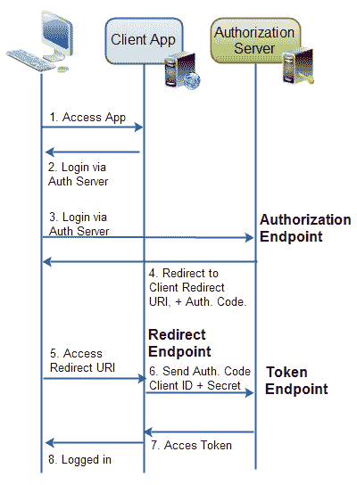

# OAuth 2.0 端点

> 原文：<https://jenkov.com/tutorials/oauth2/endpoints.html>

OAuth 2.0 定义了一组端点。端点通常是 web 服务器上的 URI。例如，Java servlet、JSP 页面、PHP 页面、ASP.NET 页面等的地址。

定义的端点是:

*   授权端点
*   令牌端点
*   重定向端点

授权端点和令牌端点都位于授权服务器上。重定向端点位于客户端应用程序中。下面介绍了这些端点。

端点如下图所示:

|  |
| **OAuth 2.0 端点。** |

OAuth 2.0 规范没有描述如何找到或记录这些端点的 URI。这由每个实现者决定。大多数网站都有一个子网站，供开发人员记录这些端点。

## 授权端点

授权端点是授权服务器上的端点，资源所有者在此登录，并向客户端应用程序授予授权。

## 令牌端点

令牌端点是授权服务器上的端点，客户端应用程序在这里为访问令牌交换授权代码、客户端 ID 和客户端机密。

## 重定向端点

重定向端点是客户端应用程序中的端点，在授权端点授予授权后，资源所有者被重定向到该端点。