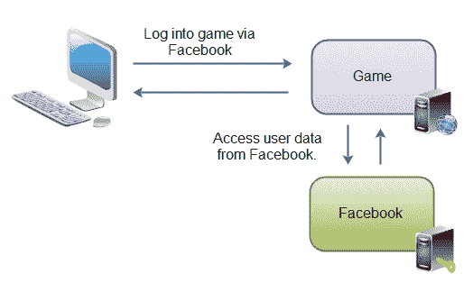

# OAuth 2.0 教程

> 原文：<https://jenkov.com/tutorials/oauth2/index.html>

OAuth 2.0 是一个开放的授权协议，允许应用程序访问彼此的数据。例如，游戏应用程序可以访问脸书应用程序中的用户数据，或者基于位置的应用程序可以访问 Foursquare 应用程序等的用户数据。

下图说明了这一概念:

|  |
| 【OAuth 2.0 如何用于通过应用程序共享数据的示例。 |

用户访问游戏网络应用。游戏 web 应用程序要求用户通过脸书登录游戏。用户登录到脸书，并被送回游戏。游戏现在可以访问脸书的用户数据，并代表用户调用脸书的功能(例如发布状态更新)。

## OAuth 2.0 用例

OAuth 2.0 既可以用来创建一个可以从另一个应用程序(例如上图中的游戏)读取用户数据的应用程序，也可以用来创建一个允许其他应用程序访问其用户数据的应用程序(例如上例中的脸书)。

OAuth 2.0 是更复杂的 OAuth 1.0 的替代品。OAuth 1.0 涉及证书等。OAuth 2.0 更简单。它不需要任何证书，只需要 SSL / TLS。

## OAuth 2.0 规范

本教程的目的是提供一个易于理解的 OAuth 2.0 协议的概述。然而，描述规范的每一个细节并不是目的。

如果您计划实现 OAuth 2.0，那么您很可能需要访问该规范来全面研究它的细节。您可以在此处找到规格:

[http://tools.ietf.org/html/draft-ietf-oauth-v2-23](http://tools.ietf.org/html/draft-ietf-oauth-v2-23)

## 请随时联系我

如果您不同意我在这里写的关于 OAuth 2.0 教程的任何内容，或者只是有意见、问题等，请随时给我发电子邮件。你不是第一个这样做的人。你可以在[关于](http://jenkov.com/about/index.html)页面找到我的邮箱地址。