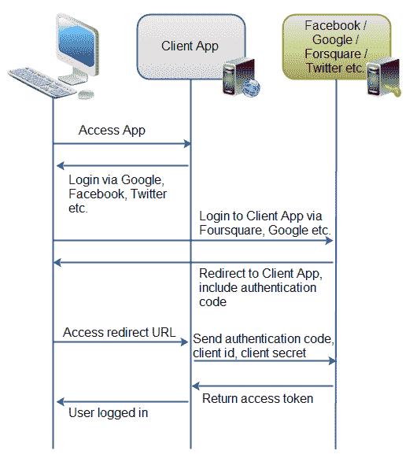

# OAuth 2.0 概述

> 原文：<https://jenkov.com/tutorials/oauth2/overview.html>

正如引言中提到的，OAuth 2.0 是一个开放的授权协议，它允许应用程序访问彼此的数据。在这里，我将尝试提供一个关于 procotol 如何工作的概述，以及规范中提到的各种概念。

OAuth 2.0 涵盖了客户端应用程序获得授权以访问存储在资源服务器上的资源的不同方式。在这里，我将向您展示最常见、最安全的用例:一个客户端 web 应用程序请求访问另一个 web 应用程序中的资源。

下图显示了身份验证过程:

|  |
| 【OAuth 2.0 如何用于通过应用程序共享数据的示例。 |

首先，用户访问客户端 web 应用程序。在这个 web 应用程序中，按钮显示“通过脸书登录”(或其他系统，如谷歌或 Twitter)。

第二，当用户点击登录按钮时，用户被重定向到认证应用程序(例如脸书)。然后，用户登录到认证应用程序中，并被询问她是否希望授权客户端应用程序访问认证应用程序中的数据。用户接受。

第三，认证应用将用户重定向到重定向 URI，这是客户端应用已经提供给认证应用的。提供这种重定向 URI 通常是通过向身份验证应用程序注册客户端应用程序来完成的。在此注册期间，客户端应用程序的所有者注册重定向 URI。也是在该注册期间，认证应用程序向客户端应用程序提供客户端 id 和客户端密码。URI 附有一个认证码。该代码代表认证。

第四，用户访问客户端应用程序中位于重定向 URI 的页面。在后台，客户端应用联系认证应用，并发送在重定向请求参数中接收的客户端 id、客户端密码和认证代码。认证应用发回访问令牌。

一旦客户端应用获得了访问令牌，该访问令牌可以被发送到脸书、谷歌、Twitter 等。访问这些系统中与登录用户相关的资源。