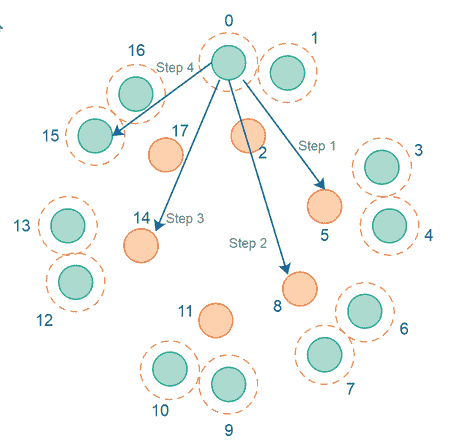
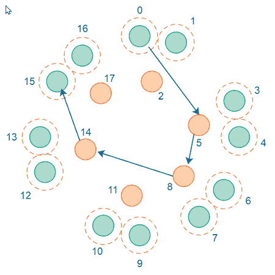

# 对等点可发现性和消息可路由性

> 原文：<https://jenkov.com/tutorials/p2p/peer-findability-and-message-routability.html>

当对等(P2P)网络很小时，意味着网络中的对等点少于一定数量，所有对等点可以毫无问题地相互了解。换句话说，P2P 网络中的所有对等体可以在它们的路由表中拥有彼此。

然而，一旦对等网络发展到超过一定的规模(网络中一定数量的对等体)，每个对等体就不再可能知道网络中的所有其他对等体。每个对等体的路由表会变得非常大，所有对等体之间保持路由表最新所需的通信量也会变得非常大。

## 对等可发现性

在一个大的 P2P 网络中，由于太大，所有的对等体都无法相互了解，所以仍然需要每个对等体能够找到连接到该网络的其他对等体。我所说的“发现”是指能够找到它们的 IP 地址，或者对等体所连接的公共对等体的 IP 地址，如果对等体是私有的(在 NAT 或防火墙之后)。因此，P2P 网络算法需要解决*对等点可发现性*。

典型地，P2P 网络算法通过设计每个对等点的路由表来解决这个问题。路由表将根据其对等体 GUID 来组织它所知道的对等体，其方式是为每个 GUID 分配一个虚拟位置，从而为其对应的对等体分配一个虚拟位置。然后，对等体将联系越来越接近它正在寻找的对等体的对等体，每次都请求与它正在寻找的对等体最近的对等体。例如:

如果对等体 1 想要找到对等体 15，对等体 1 将查看自己的路由表，并在其中找到最近的对等体。想象那是对等体 5。对等体 1 然后连接到对等体 5，并询问它知道哪个对等体离对等体 15 最近。对等体 5 知道的离对等体 15 最近的对等体可能是对等体 8。对等体 1 然后连接到对等体 8，并请求与对等体 15 最近的对等体。对等体 8 可能认识对等体 12。然后，对等体 1 联系对等体 12，并请求与对等体 15 最近的对等体。对等体 12 可能知道对等体 15，因此将它在对等体 15 上的信息(IP +端口)返回给对等体 1。这个过程如下图所示:

## 消息可路由性

一些 P2P 网络可能选择不要求通信对等体之间的直接连接，而是经由 P2P 网络本身在对等体之间路由消息。如果对等体 1 想要向对等体 15 发送消息，则该消息可能首先被路由到对等体 5，然后被路由到对等体 8，然后被路由到对等体 12，然后被路由到对等体 15。这是它看起来的样子:

## 实现是特定于 P2P 网络算法的

P2P 网络使用的确切的对等点发现和消息路由方案取决于具体的 P2P 网络算法。然而，他们中的大多数人会使用一些类似于我上面概述的东西。