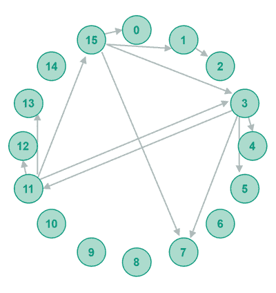
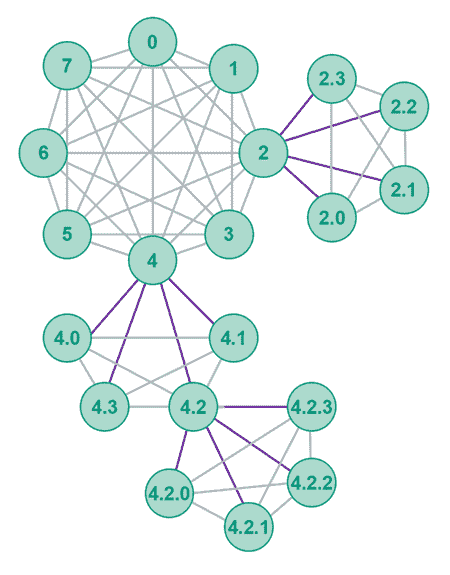
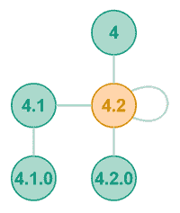
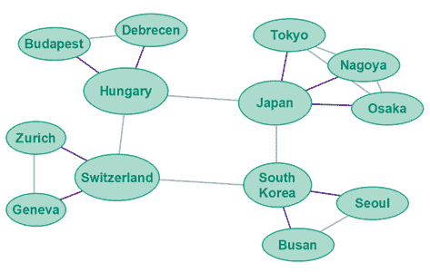
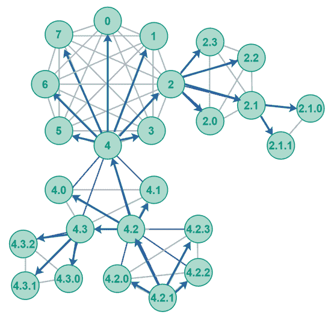
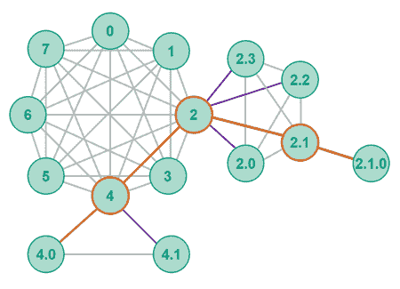
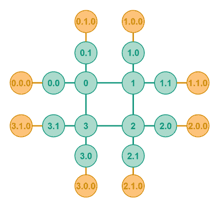
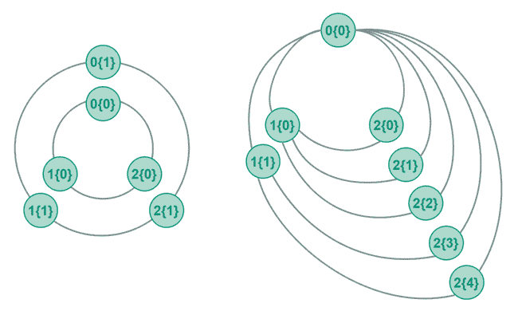
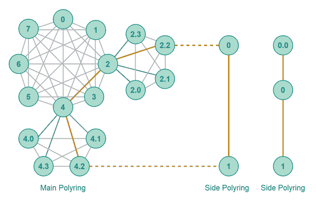
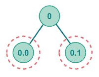

# 多态 P2P 网络算法

> 原文：<https://jenkov.com/tutorials/p2p/polymorph.html>

*多态* *P2P* 网络算法是我的[多态](https://plmph.com) 项目的一部分，该项目将能够实现许多不同种类的网络拓扑(多态拓扑-拓扑多态) -以及其他 P2P 网络拓扑。在这篇多态 P2P 教程中，我将主要关注可以用于 P2P 网络的多态 拓扑。

## 变形教程

你可以在我的关于多态的系列教程中读到更多关于多态项目的内容:

[变形术教程](/tutorials/polymorph/index.html)

## 多态历史

我在 Q1 2021 开始开发多形体项目。多态 P2P 算法于 2021 年 7 月 30 日首次发布。因此，多态是一种新型的 P2P 网络拓扑，因此看起来不同于经典的 P2P 算法。

## 多形体与和弦、卡德姆利亚、挂毯和糕点

polymer 与 [Chord](chord.html) 、Kademlia、Tapestry 和 Pastry 的主要区别在于 polymer 使用 *polyring* 拓扑，而其他系统使用 *uniring* 拓扑。 这两种拓扑都将在以下章节中进行解释。

### 联合拓扑

Chord、Kademlia、Tapestry 和 Pastry 都使用一个 *uniring* 拓扑——一个单一的、统一的环形拓扑。Chord、Kademlia、Tapestry 或 Pastry network 中的所有同行 都是同一个环的一部分。下图显示了一个 Chord uniring——但是 Kademlia、Tapestry 或 Pastry uniring 只是在 对等体之间的连接上有所不同——而不是在统一的 uniring 拓扑本身上。下面是单环拓扑的样子:



### 多环拓扑

Polymorph P2P 拓扑使用一个 *polyring* 拓扑——多个环连接成一个环图—— 一个环图。下面是多态聚合环拓扑的一个例子:



多态聚合环中的对等体被组织成环。环中的所有对等体都知道该环中的所有其他对等体。因此，每个环也可以被称为网格。

围绕每个对等体，可以形成新的子环。一个子环里的所有同行都互相认识。子环中的所有对等体也知道其父对等体，并且父对等体知道其子环中的所有对等体。因此，每个对等体都知道:

*   它的父对等
*   它的兄弟姐妹
*   其子代

孩子同龄人的知识只有 1 级深。因此，一个对等体不知道孙级及其以下的任何对等体。一个对等体只知道 1 级以上，与自己相同的级别(环)，以及 1 级以下的聚合环。

## 多态多环 GUID 方案

polymer poly ring 使用动态大小的 GUID，这意味着 polymer poly ring 中的对等体并不都具有相同大小的 GUID。

一个 Polymorph polyring GUID 由一个或多个坐标组成。以下是几个 GUID 示例:

```

[1]
[1.0]
[4.10.34.9875.2344]

```

对等体的 GUID 坐标取决于对等体在聚合环中的位置。

聚合环中中心环中的对等体被赋予一个单坐标 GUID。这个坐标从 0 到无穷大。例如[0]、[99]、[1234]等。

子环中的对等方被给予比父环的 GUID 多一个坐标的 GUID。子对等 GUID 以完整的父对等 GUID 开始，以使子 GUID 唯一的额外坐标结束。以下是一个带有相应子对等 GUID 的父对等 GUID 示例:

```

[3]     : Parent  peer GUID
[3.0]   : Child 0 peer GUID
[3.1]   : Child 1 peer GUID
[3.2]   : Child 2 peer GUID

```

这种 GUID 方案意味着只有最后一个坐标在同一子环内的对等体的 GUID 之间不同。

任何 GUID 的最后一个坐标也可以从 0 到无穷大。因此，对等方[1]的子环中的对等方将获得从[1.0]到[1.infinity]的 GUIDs。对等体[4.99.658]的子环中的对等体将获得从[4.99.658.0]到[4.99.658.infinity]的 GUIDs。

## 多态聚合环消息路由

Polymorph polyring 拓扑是专为消息路由而设计的。这意味着对等体不会查找它们想要与之通信的对等体的 IP 地址+ TCP / UDP 端口号。相反，发送方将消息转发到聚合环，聚合环将消息路由到目的方。

### TCP 上的消息路由

为了使 TCP 上的消息路由有效，Polymorph polyring 中的所有对等体保持与它知道的所有对等体的开放 TCP 连接。这意味着，一个开放的 TCP 连接:

*   它的父对等
*   它的兄弟姐妹
*   其子代

完成 TCP 握手以打开新的 TCP 连接需要时间。因此，保持与所有相关对等体的开放连接会更快，通过这些连接可以路由消息。

此外，TCP 连接可能需要一些时间才能达到其最大速度。TCP 连接开始以默认速度发送数据，然后尝试提高速度，直到它不再能够提高速度(当 IP 数据包开始被丢弃时)。

由于 TCP 握手和逐渐的传输加速，在已经打开的 TCP 连接上路由消息时，您将获得更好的性能。

## 多态多环路由算法

多态多环路由算法实际上非常简单。任何给定的对等体只能将消息转发给其父节点、兄弟节点或子节点。换句话说，它只能将消息转发给它已经打开连接的对等体(如果通过 TCP 路由)。下图说明了这一点，其中 GUID [4.2](黄色)的对等体可以将消息路由到其父对等体、同级对等体或子对等体。



在解释路由算法之前，我需要做一些定义:

```

R = Routing peer
D = Destination peer

LR = Length of Routing     peer's GUID in coordinates (coordinate count)
LD = Length of Destination peer's GUID in coordinates (coordinate count)

```

首先，路由对等方从左到右计算它自己的 GUID 与目的地 GUID 有多少个匹配的坐标，直到第一个不匹配的坐标。在下面的章节中，我将把这个数字称为 M。

```

M = Number of Matching coordinates between
    routing     peer's GUID and
    destination peer's GUID,
    from left to right,
    until first non-matching coordinate.

```

注意，M 不能大于 LR，因为 M 是通过计算 LR 与 LD 的匹配坐标来计算的。因此，可以有最大 LR 匹配坐标。

以下是坐标匹配计数的示例:

```

Routing     peer GUID: [4.7.8.87]
Destination peer GUID: [4.7.3.87]
M = 2

```

路由对等体的 GUID 是[4.7.8.87]，目的对等体的 GUID 是[4.7.3.87]。这些 GUIDs 的前两个坐标匹配。第三坐标不匹配。第四个坐标也匹配，但这无关紧要，因为第三个坐标不匹配。因此，M 是 2。

一旦知道了 M，剩下的路由算法就相当简单了。路由算法总结如下:

```

M <= LR - 2                  => Not same parent. Route to parent.

M == LR - 1 && LD == LR - 1  => Destination is parent. Route to parent.
M == LR - 1 && LD >= LR      => Destination is sibling or sibling descendant.
                                Route to sibling.

M == LR     && LD == LR      => Destination is self. Process message.
M == LR     && LD >  LR      => Destination is descendant. Route to child.

```

第一次检查确定目的对等体是否与路由对等体在聚合环的同一分支内。如果目的对等体甚至没有与路由对等体相同的父对等体，则目的对等体位于聚合环的另一个分支中。然后，消息必须被路由到路由对等体的父节点，父节点将进一步转发消息，直到消息到达目的地。以下是不共享同一父节点的路由对等体和目的对等体的一些示例。

```

[2.3.4.50]  : Routing     peer GUID
[2.3.8.10]  : Destination peer GUID (M = 2, LR = 4)
[1.3.4.50]  : Destination peer GUID (M = 0, LR = 4)

```

第二个检查确定目的对等体本身是否是路由对等体的父对等体。如果是，就将消息路由到它的父对等体。下面是这种情况的一个例子:

```

[2.3.4.50]  : Routing     peer GUID
[2.3.4]     : Destination peer GUID (M = 3, LR -1 = 3, LD = 3)

```

第三次检查确定目的对等体是路由对等体的兄弟还是兄弟后代。如果目的地 GUID 具有相同的父对等项，但坐标不同于路由对等项的最后一个坐标，就会出现这种情况。然后，消息必须被路由到相应的兄弟节点。以下是这种情况的一些例子:

```

[2.3.4.50]      : Routing     peer GUID
[2.3.4.51]      : Destination peer GUID (sibling) (M = 3, LR - 1 = 3, LD = 4)
[2.3.4.51.9]    : Destination peer GUID (sibling descendant)    (..., LD = 5)
[2.3.4.51.9.2]  : Destination peer GUID (sibling descendant)    (..., LD = 6)

```

第四次检查确定消息是否是发送给路由对等方本身的。如果是，那么路由对等体应该自己消费(处理)它。不需要进一步的路由。以下是这种情况的一个例子:

```

[2.3.4.50]      : Routing     peer GUID
[2.3.4.50]      : Destination peer GUID (M = 4, LR = 4, LD = 4)

```

第五项检查确定消息是发送给路由对等方的子节点还是后代节点。如果是，消息应该被路由到相应的子节点。以下是这种情况的一些例子:

```

[2.3.4.50]      : Routing     peer GUID
[2.3.4.50.1]    : Destination peer GUID (child)      (M = 4, LR = 4, LD = 5)
[2.3.4.50.1.4]  : Destination peer GUID (descendant) (M = 4, LR = 4, LD = 6)

```

### 备选路由算法总结

另一种总结 Polymorph polyring 路由算法的方法是:

```

M <= LR - 2        => Not same parent. Route to parent.

M == LR - 1
     LD == LR - 1  => Destination is parent. Route to parent.
     LD >= LR      => Destination is sibling or sibling descendant.
                      Route to sibling.
M == LR
     LR == LD      => Destination is self. Process message
     LR <  LD      => Destination is descendant. Route to child.

```

总结路由算法的另一种方式是:

```

Route to parent if
    M  <= LR - 2       => Not same parent. Route to parent.

    M  == LR - 1  &&
    LD == LR - 1       => Destination is parent. Route to parent.

Route to sibling if
    M  == LR - 1  &&
    LD >= LR           => Destination is sibling or sibling descendant.
                          Route to sibling.

Route to child if
    M  == LR  &&
    LR <  LD            => Destination is descendant. Process message.

Route to self if
    M  == LR  &&
    LR == LD            => Destination is self. Route to self.

```

## 多态多环路由表

多态聚合环中的对等体的路由表包含以下内容:

*   父对等体
*   同级对等列表
*   子对等列表

如果兄弟对等体和子对等体的列表被实现为基于数组的列表(Java 中的 ArrayList ),则可以在恒定时间内对这些列表进行查找。

兄弟对等体应该存储在列表中对应于不同于拥有路由表的对等体(路由对等体)的第一个坐标的索引处，该坐标是坐标 M + 1。例如:

```

[1.56.89]  =  Routing peer GUID
[1.56.45]  =  Sibling peer GUID.
              M = 2\. Index coordinate = 3.
              Index in sibling list = 45

[1.56.11]  =  Sibling peer GUID.
              M = 2\. Index coord is 3rd coord.
              Index in sibling list = 11

```

类似地，子对等体应该存储在列表中对应于不同于拥有路由表的对等体(路由对等体)的第一个坐标的索引处，该坐标也是坐标 M + 1。例如:

```

[1.56.89]    =  Routing peer GUID
[1.56.89.0]  =  Child peer GUID.
                M = 3\. Index cord is 4th coord.
                Index in child list = 0

[1.56.89.23]  = Child peer GUID.
                M = 3\. Index coord is 4th coord.
                Index in child list = 23

```

## 常数时间内的路由逻辑

前面几节中介绍的路由算法和路由表设计使路由对等体能够在恒定的时间内做出路由决定——不管它引用了多少兄弟和子对等体。

最多可以通过 4 次比较(if 语句)和 1 次数组列表查找来做出路由决定。

相比之下，Chord、Kademlia、Pastry 和 Tapestry 路由表和算法至少需要 log(N)比较，或者 log(N)比较的某种变体，才能做出路由决定(据我所知)——其中 N 是路由表中条目的数量。

## 灵活的可扩展性

Polymorph polyring 拓扑提供了一些有趣的可伸缩性选项，我将在下面的部分中讨论这些选项。

### 二维缩放

首先要注意的是，polyring 可以沿两个维度扩展:

1.  每个环中的对等体数量可以增加。
2.  环的深度水平可以增加。

第一维是环中对等体的数量。这个选项意味着您可以在一个环内添加任意多的对等点。一枚戒指永远不会“满”。请记住，随着环中对等体数量的增加，每个对等体需要在其路由表中引用的对等体数量也会增加。如果使用 TCP 通信，每个对等体所需的开放 TCP 连接数也会随着其路由表中对等体数量的增加而增加。

第二维是子环的数量和级别。这个选项意味着你可以递归地添加子环到聚合环中。子环的数量或级别没有上限。聚合环永远不会“满”。请记住，随着子环级别的增加，在外层环中路由消息所需的集线器数量也会增加。

这种二维可扩展性选项意味着您有更多的选择，以适合您的具体需求的方式来扩展 polyring。

### 固定集线器数量可扩展性

通过向现有环添加新的对等点来进行横向扩展的能力意味着您可以在保持路由集线器数量固定的情况下横向扩展 polyring。记住，将一条消息从一个对等体路由到另一个对等体所需的集线器数量取决于聚合环中的环级数量。

## 拓扑整形

Polymorph polyring 灵活的可扩展性和可伸缩性使其能够根据您的需求来调整 polyring 的拓扑结构。这并不意味着 polyring 拓扑适合所有的分布式系统，但是与传统的 P2P uniring 相比，它可以更好地适应更多的需求。

多环可以采用不对称拓扑。这开启了一些有趣的拓扑整形选项，我将在下面的小节中介绍。

### 地理上一致的拓扑

有可能在网络中对等体的地理位置之后形成拓扑。例如，中心环中的对等体可以用于对不同国家/地区的子对等体进行分组。因此，位于日本的所有对等体将加入日本中心环对等体的子环。巴西的所有同行将加入巴西中心环同行等的子环。

显然，随着给定国家内对等体数量的增长，您可能需要将它们分成国家根对等体下的多层环。下面是一个地理上一致的拓扑示例，其中国家对等点位于中心环中，城市对等点位于第一级子环中。



当地理上彼此靠近的对等体被期望彼此进行更多的通信时，对等体的地理分组是有意义的。因此，聚合环中的更多通信将保持在聚合环的外层。

如果位于同一国家的对等体之间交换的数据不允许通过外国路由，地理分组也是有意义的。

### 流量对齐拓扑

还可以根据期望与哪些其他对等体进行通信来对对等体进行分组。在聚合环中，一个对等体离与其通信的其他对等体越近，在它们之间路由消息所需的集线器就越少，通信就越快，并且通信给聚合环带来的负担就越小。

## 可预测路由

Polymorph polyring 的一个有趣的特性是 polyring 中的对等体之间的路由遵循 polyring 中的一条可预测的路径。

可预测路由实现了诸如广播、多播和沿路由路径的内容缓存等功能。在本教程的后面，我将更详细地介绍这些特性。

## 广播和多播

由于聚合环的可预测的路由特性，有可能在聚合环内实现有效的广播和组播。

### 广播

在聚合环中广播消息意味着将该消息发送给聚合环中的所有对等方。因为聚合环的可预测路由，所以可以有效地广播消息。发送方不需要知道聚合环中的所有对等方，也不需要将消息单独发送给所有这些对等方。polyring 可以在传播过程中智能地复制消息。

一个对等体希望将一个聚合环中的消息广播给整个聚合环中的所有其他对等体。将简单地将消息转发给它在路由表中知道的所有对等体。这意味着遵循以下步骤:

1.  向父对等方发送消息。
2.  向所有同级发送消息。
3.  向所有子对等方发送消息。

对等体如何路由从另一个对等体接收的广播消息，取决于该消息是从子对等体、兄弟对等体还是父对等体接收的。换句话说，消息当前是向上传播还是向下传播到聚合环的路由对等体分支。以下是步骤:

1.  如果消息来自子对等方:
    1.  将消息路由到父对等方。
    2.  将消息路由到所有同级对等点。
2.  如果消息来自同级:
    1.  将消息路由到所有子对等方。
3.  如果消息来自父对等方:
    1.  向所有子对等方发送消息。

如果一个对等体接收到来自子对等体的广播消息，那么该消息当前正被路由到聚合环的这个分支。子对等体在聚合环中只知道它的父对等体，所以父对等体负责将消息路由到它的兄弟节点和它自己的父节点。然而，接收对等体的其他子节点将是从其接收消息的子节点的兄弟节点——因此这些对等体将已经直接从子对等体接收了消息。

如果一个对等体收到来自同级对等体的广播消息，则该消息当前正在分支中被横向路由。接收方的所有其他兄弟也是发送方的兄弟，并且已经直接从发送方接收了消息。此外，接收方的父对等体也是发送方的父对等体，因此父对等体已经直接从发送方接收了消息。因此，当从同级接收广播消息时，它仅被路由到接收对等体的子对等体。

如果一个对等体从父对等体接收到广播消息，那么该消息当前正被路由到聚合环的这个分支。该子对等体的同级将已经接收到来自父对等体的消息。因此，消息只被向下路由到它的子对等体。

下图说明了在多态聚合环 P2P 网络中传播的广播。广播从对等体 4.2.1 开始。蓝色箭头表示广播的传播方向。该图显示了向内路由到父节点、向旁边路由到兄弟节点和向外路由到子节点的示例。



### 广播优化

为了使广播消息能够在整个聚合环中更快地传播，我猜想最好是先向内路由消息(到父节点)，然后再向外路由(到兄弟节点)。换句话说，当从分支向内路由消息时，通过首先将消息路由到其父节点，然后路由到其兄弟节点，传播将更好地并行化。

在横向路由之前向内路由将使消息尽可能快地到达聚合环中的尽可能多的分支。我怀疑这将导致整个聚合环更快的传播。

在向内之前横向路由将导致发送者自己的分支在消息最终到达中心环并传播到聚合环中的其余分支之前饱和。我怀疑这将导致整个聚合环的传播速度比你先沿着树枝向上再向侧面传播要慢。

### 多点传送

多播意味着向聚合环中的多个对等体发送相同的消息，但不是向所有对等体发送。组播消息时，发送方不需要知道所有要接收消息的对等方。

多播遵循与广播相同的算法，除了路由对等体需要确定消息是否需要被路由到它的兄弟、子或父——这取决于任何接收者是否是兄弟、兄弟后代、子、后代、父或位于聚合环中的其它地方。没有理由将消息不必要地转发到没有消息接收者的聚合环的一部分。

此外，路由对等体可能应该只在被路由的消息中包括位于消息被路由到的聚合环部分内的接收者。

这意味着，当将消息向上路由到父代时，消息中不需要包括子代、后代、兄弟或兄弟后代接收者。将消息横向路由到同级时，消息中只应包含同级本身或消息所路由到的同级的后代的接收方 GUIDs。并且当将消息消息向下路由到孩子时，只有孩子 GUID 或后代接收者 GUID 应该包括在消息中。

通过将包括在消息中的接收者 GUIDs 仅指向与消息被转发到的对等体相关的那些 GUIDs，消息被保持得更短，并且每个中间对等体对聚合环中的哪些其他对等体已经接收到该消息知道得更少。

同样的传播优化也适用于多播和广播:在侧边之前向上路由消息可能会导致在整个聚合环中更快的传播。

顺便说一句，实现多播的一种更有效的方式是让对多播感兴趣的对等体子集加入到一个[侧多环](#side-polyrings)中，然后向该侧多环中的所有对等体广播 。广播不需要包含 接收者的 GUID，因此对于有许多接收者的多播——这将在 广播消息中保存大量 GUID 数据。

## 内容缓存

可预测的路由功能使 Polymorph polyring 能够缓存视频、图像、音频、文本、脚本等内容。在整个聚合环中。当文件已经从源对等体被路由到目的对等体时，该内容可以沿着路由路径被缓存。如果高速缓存对等体位于到目的对等体的路由路径上，则稍后对同一文件的请求可能由高速缓存对等体提供服务。

哪个缓存方案是最佳的取决于 polyring 中对等体的确切流量模式——这又取决于 polyring 中的对等体正在做什么(用例)。

一个简单的缓存方案是在从源对等体到中心环的途中缓存内容。由于从中心环到源对等体的路由对于聚合环的其他分支中的所有对等体是相同的，所以来自这些对等体的对缓存内容的所有请求都可以从这些缓存对等体得到服务。

下图显示了从源对等点[2.1.0]到消费对等点[4.0]的路由路径(橙色线)。内容可以被有效地缓存在橙色路径上的任何地方——特别是在源对等点的分支内(从对等点[2]和向外)。



## 路由表管理

Polymorph polyring 中的路由表管理实际上非常简单。

当对等体加入聚合环时，它要么加入中心环，要么加入某个父环的子环。

如果一个对等体加入中心环，它将需要连接中心环中的至少一个其他对等体。从第一个对等体，加入对等体可以获得中心环中所有兄弟对等体的列表。然后，加入对等体拥有完整的路由表，并可以打开到中心环中其他对等体的连接。

如果对等体加入某个父对等体的子环，则加入对等体连接到父对等体以加入其子环。从父对等端，加入对等端可以获得已经在环中的所有子对等端的完整列表。环中现有的子对等体将是加入对等体的兄弟。加入对等体现在具有完整的路由表，并且可以打开到子环中其他对等体(其兄弟)的连接。

类似地，当一个对等体想要离开 polyring 时——它已经包含了所有需要知道的对等体的完整列表。离开的对等体可以通知它的父节点、兄弟节点和子节点它正在离开。被通知的父对等体和兄弟对等体然后可以从它们的路由表中移除离开的对等体。

离开的对等体的孩子必须在其他地方重新加入聚合环，并将获得一个新的 GUID。离开对等体的孙辈和其他后代也必须在其他地方重新加入网络，并获得新的 GUID。

具有大量后代的离开对等体将导致许多对等体不得不在新的位置重新加入网络。随着更多的研究，可能会发现一种更智能的离开协议，它不需要后代对等体必须重新加入。也许只有离开对等体的子节点需要重新加入，后代可以简单地被分配与他们的新位置相匹配的新 GUIDs。我将不得不调查那件事。

## 托管对等体与自治对等体

正如在关于[对等连接](peer-connectivity.html)的文章中提到的，对于 P2P 网络软件的开发者来说，拥有一组可以帮助从头开始启动网络的对等点是很有用的 。 加入的自治对等体可以连接到这些托管的引导对等体，并通过它们找到网络中的其他自治 对等体。

polyring 拓扑使决定 polyring 的哪一部分作为主机变得更加容易。典型地，根据网络提供商的需要，中心环中的对等体将是托管对等体，也可能是聚合环的第 2 层中的对等体。

下图显示了一个混合聚合环的示例，其中两个内层是托管对等体(绿色对等体)，外层是自治对等体(黄色对等体)。



## 单点故障

多态聚合环中的任何对等体本质上都是其所有后代对等体的单点故障。如果父对等体失败或离开聚合环，所有后代对等体也将脱离聚合环。

给定对等体离中心环越近，如果该对等体出现故障，后代对等体被分离的风险就越大。

使用[对等集群](#peer-clusters)可以解决单点故障问题。

## 拥堵点

如果流量合理地均匀分布在聚合环上，包括聚合环中的分支，中心环可能会成为连接到该中心对等体的整个分支的流量的拥塞点。

中心对等体是否会真正成为拥塞点取决于聚合环中对等体的流量模式。例如，在按照地理位置组织对等体的聊天系统中，可以假设大多数对等体将与在地理位置上靠近自己的对等体进行通信。因此，大多数流量将发生在每个多环分支的内部，而不是跨分支。

拥塞点问题可以用[对等集群](#peer-clusters)和 [边聚合](#side-polyrings)来解决。

## 对等集群

第一种解决方案是*对等集群*。不是让 polyring 的一个分支只连接到 一个单独的中心对等体，而是将这个分支连接到一群对等体。

对等群集是共享相同 GUID 的两个或多个对等体。所有单节点对等体(父节点、兄弟节点和子节点)必须连接到对等集群中的所有对等体。因此，对等集群中的所有对等体与单节点对等体具有相同的连接。

如果两个对等集群相互连接，例如中心环中的两个对等集群，则该集群中的对等体在它们之间将连接分配给另一个集群中的对等体。因此，对等集群中的对等体并不都与另一个对等集群中的对等体具有相同的连接。这种对等集群到对等集群的连接分布是为了减少每个对等集群的连接数。

下图显示了两个具有对等集群的聚合环。左多环具有对称聚类。如您所见，在对称聚类中，两个中心环是断开的。一旦任何中心对等体的子节点将消息路由到中心对等体之一，该消息将停留在它进入中心环的集群环内。在使用非对称集群的 polyring 中，您可以看到集群对等体并没有全部相互连接。对等集群 2 中的节点尽可能平均地分配到对等集群 1 中节点的连接。



将流量路由到对等群集时，路由对等方选择仅将消息路由到群集中的一个对等方。这确保了流量在对等集群中的对等体之间达到平衡。这种负载平衡减少了对等集群周围的拥塞。

如果对等集群中的一个对等体离开或失败，对等集群中的其余对等体可以保持分支活动并连接到聚合环。没有子对等体需要改变它们的 GUIDs 或重新加入聚合环。

理论上，无限扩展对等集群是可能的。在实践中，您可能需要试验在一个对等集群中有多少对等体是有意义的。这取决于集群中对等体的流量模式和离开/失败模式。

## 侧聚环

边聚合环(也称为边结构、边环或边网络)是交通拥堵点问题的解决方案。

假设一个用户(对等体)在一个 Polymorph polyring 中找到了一个它想大量使用的服务(另一个对等体)。例如，用户想要观看存储在服务对等端的一些视频。为了观看这些视频，用户必须从服务对等端下载这些视频。为了下载视频，它们必须通过聚合环从服务对等体路由到用户对等体。这给 polyring 带来了沉重的负担。如果许多用户具有相似的流量模式，这可能会使聚合环严重拥塞——特别是当流量需要通过中心对等体加载时。

服务对等体可以提供一个*侧多环*，通过它 可以路由大流量，而不是通过主多环路由大流量。边多环只是与主多环分离的另一个多环。 此侧聚合环是为服务对等体的用户保留的。用户和服务对等体可以使用主聚合环 来发现对等体和内容，而副聚合环用于繁重的通信。

保留端 polyring 很可能在环级上更小，因此在其上路由消息时提供的集线器更少。因此，副多环很可能比通过主多环路由大流量更快。

此外，由于副多环仅路由由单个(或几个)服务提供的内容，如果所有业务都通过主多环路由，则通过它路由的业务将比通过主多环路由的业务少。这种较低的交通流量也有助于降低拥堵并提高侧边聚合环的性能。

下图显示了具有两种可能的边环拓扑的主多环。假设对等点[2.2]正在提供对等点[4.2]想要使用的服务。peer [2.2]不直接通过主 polyring 使用它，而是专门提供一个边环，使其服务具有更好的性能。该图显示了两种可能的边环拓扑:对等体之间的直接连接，以及中间有一个对等体的拓扑。



## DOS 保护

如果客户端对等体通过聚合环(无论是主聚合环还是副聚合环)与服务对等体通信，那么客户端不知道服务对等体的确切 IP 地址。只有聚合环知道。这使得对给定服务发起 DOS(拒绝服务)攻击变得更加困难。如果 polyring 负载很重，它可以向外扩展以匹配负载(至少理论上是这样)。拥堵点也可以进行聚类和扩展。高流量客户端对等体可以被速率限制或拒绝访问聚合环。众所周知的客户端对等体可以被给予到聚合环等的优选接入点。等等。

## 秘密保护

由于在聚合环边缘的对等体并不直接相互连接，仅仅通过查看网络连接本身并不能立即看出哪些对等体正在相互通信。您需要检查包含发送方和接收方 GUIDs 的交换消息本身。不过，这些信息可以用加密来保护，或许应该是为了降低黑客嗅探这些信息的风险。

## 负载平衡

父对等体可以在子对等体之间负载平衡消息(如果您对它进行了编程)。这是可能的，因为多晶型多环化合物的路线是可预测的。

## 公共和私人同行

如果一个多形态聚合环中的一些边缘对等体是私有的，这意味着它们在防火墙或 NAT 之后，那么它的同级不能直接连接到它。它的兄弟节点必须通过它们共享的父节点与它通信。具体应该如何实现还没有完全探索出来——但是应该可以实现。对于兄弟姐妹来说，挑战在于知道什么时候尝试直接与同伴交流，或者尝试通过他们共享的父同伴交流。

一种解决方案是让 GUID 本身包含关于给定对等体是公共的还是私有的信息。

另一个解决方案是让父对等体告诉它的所有子对等体关于私有对等体的信息，这样兄弟对等体就可以在它们的路由表中标记出对私有对等体的引用。

下图显示了两个必须通过父对等体进行通信的私有对等体，因为它们不能直接相互连接。



## 多态 P2P 网络算法综述

正如你所看到的，多态 P2P 网络算法有很多不同的用例——甚至可能有一些上面没有提到的。许多不同类型的服务可以在一个多态聚合环之上分层。

我目前正在研究的一个用例是如何在 polyring 之上构建分布式哈希表(DHT)——以及这是否有意义——或者 DHT 是否会从稍微定制的拓扑中受益更多。

另一个用例是发布-订阅类型功能-这可能只是多播的一种变体。