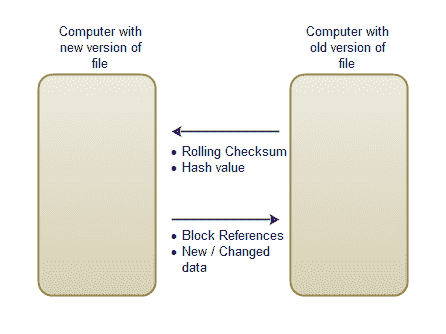

# RSync -网络协议

> 原文：<https://jenkov.com/tutorials/rsync/network-protocol.html>

最初的 RSync 文档没有讨论 RSync 实现所使用的网络协议。但是，由于这个协议对 RSync 的效率相当重要，所以我将在这里讨论它。

如您所知，RSync 首先计算旧版本文件中每个数据块的校验和(滚动+哈希值)。这些校验和需要传输到保存文件新版本的计算机，以便它可以检测文件的更改。

一旦检测到文件的新版本和旧版本之间的差异，保存文件的旧版本的计算机接收关于如何创建与新版本相同的文件副本的指令。这些指令包括对旧文件中在新文件中没有改变的块的引用，以及改变的或新的数据的序列。

下图显示了来回发送的数据:

<center>

|  |
| **RSync 网络协议** |

</center>

## 校验和协议

在最初的 RSync 实现中，滚动校验和占用 4 个字节。在我的实现中，它占用了 8 个字节。哈希值是 16 个字节。这意味着，对于旧版本文件的每个块，有 24 个字节在网络上以这个方向发送。不需要任何特定的块参考号。持有该文件新版本的计算机将假定前 24 个字节用于块 0，接下来的 24 个字节用于块 1，依此类推。这是这条河流的样子:

```
 8 bytes rolling checksum - block 0
16 bytes hash value

 8 bytes rolling checksum - block 1
16 bytes hash value

...

 8 bytes rolling checksum - block N
16 bytes hash value

```

## 合并指令协议

当发送有关如何创建文件新版本的指令时，块参照列表将与要插入的新数据序列一起发送。块参照编码为 4 字节整数。这使得可以引用多达 2，147，483，648 个数据块。

数据序列被插入到块引用流中，并用负数标记为块引用。例如，块引用-1 意味着数据序列正在开始，并且一直持续到遇到结束代码。

下面是指令流的样子:

```
4 byte block reference
4 byte block reference
4 byte block reference
4 byte block reference
4 byte block reference

4 byte sequence begin (-1)
N byte data
2 byte sequence end (-1)

4 byte block reference
4 byte block reference

4 byte sequence begin (-1)
4 byte sequence length
N byte data

4 byte block reference

...    

```

## 协议效率

当您添加滚动校验和、哈希值和块引用时，您会看到每个未更改的数据块总共交换了 28 个字节。24 字节校验和以及 4 字节块参考。如果块大小为 1024 字节，则每个块节省 996 字节，相比之下，通过网络发送整个文件=节省 97.27 %的数据。

以 CPU 时间为代价优化网络协议是可能的。至少有五件事你可以优化:

1.  滚动校验和的大小。
2.  块引用的大小。
3.  顺序块引用的折叠。
4.  数据序列压缩。
5.  本地存储校验和

### 滚动校验和优化

在最初的 RSync 实现中，滚动校验和由两个 16 位值组成，而不是两个 32 位值。将滚动校验和削减回 16 位将增加校验和匹配的数量，因此在块上搜索校验和匹配时需要更多的 16 字节哈希值计算。

使用 32 (4 字节)滚动校验和而不是 64 位(8 字节)将把每个未更改块交换的数据减少 4 个字节。

### 块引用的大小

在大多数情况下，4 字节的块引用是不必要的。如果块大小为 1024 字节，那么这里列出了不同块引用字节大小可以引用多大的文件:

```
1 byte  =           127 * 1024 =           130,048 bytes =    127 KB
2 bytes =        32,768 * 1024 =        33,554,432 bytes =     32 MB
3 bytes =     8,388,608 * 1024 =     8,589,934,592 bytes =      8 GB
4 bytes = 2,147,483,648 * 1024 = 2,199,023,255,552 bytes =  2,048 GB

```

请记住，块参考的最高位保留用于表示数据序列的开始。

如您所见，大多数较小的文件都可以使用 1 或 2 字节的引用。有了 3 字节的参考，你甚至可以参考更大的视频文件。除非文件非常大，否则不需要 4 字节的块引用。平均来说，每个块引用可以减少 2 个字节。但是，这完全取决于您正在同步的文件类型。

可以在指令流的开始发送块引用大小，以便在从指令流中读取块引用之前，接收方知道块引用有多大。

### 顺序块引用的折叠

如果您同步的文件变化不大，则块引用流将有许多连续的块引用(例如，1、2、3、4、5、6、7、8 等。).您可以收拢块参照，而不是分别发送每个块参照，而是发送间隔参照。例如:

```
1
2
3
...
128

```

可以转移为:

```
1
128

```

换句话说，对于后续的块参照，您只需传递块参照间隔的边界。当然，您需要某种方式来表明这两个块引用确实是区间边界，并且接收端应该在这两个边界值之间进行插值。

### 压缩数据序列

作为指令流的一部分发送的已更改数据可以压缩，以减少占用的字节数。当然，如果你同步的是已经压缩的文件，比如视频、MP3、图片等。那么这种压缩可能不会产生太多效果，但是对于未压缩的数据，实际上可能会有所收获。

### 本地存储校验和

如果你知道数据同步总是发生在一个方向，例如从你的客户机到服务器，你可以做另一个小把戏。

成功同步文件后，您可以计算其滚动校验和及哈希值，并将它们本地存储在通常创建文件新版本的计算机上。这必须在您知道文件的两个版本相等时完成。

检测更改时，您可以将更改后的文件与更改前的文件校验和值进行比较。这样做可以节省 8 字节滚动校验和以及 16 字节哈希值的传输，代价是本地存储了一个额外的校验和文件。对于原始文件的每 1024 个字节，该校验和文件将占用 24 个字节。