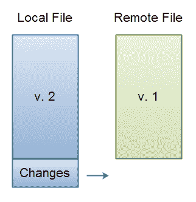
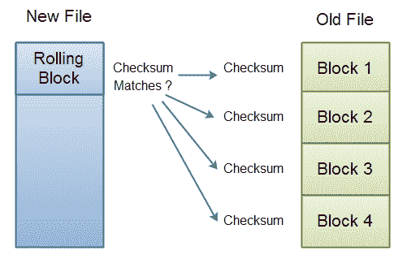
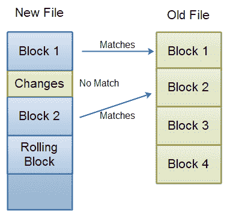
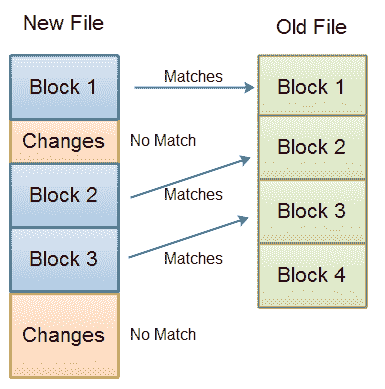

# RSync -概述

> 原文：<https://jenkov.com/tutorials/rsync/overview.html>

这篇文章将向您概述 RSync 是如何工作的。本文的目的不是给出每个细节，而只是提供 RSync 的概述。每个步骤/部分在后面的文本中有更详细的解释。

假设您在本地硬盘上有一个文件，在远程服务器上有该文件的副本。现在，您对本地硬盘上的文件进行更改。然后，您希望远程服务器上的副本与本地硬盘上的副本相同。由于您只对文件做了很小的更改，所以您不想通过网络发送完整的文件。您只想发送更改。这就是 RSync 所做的。

下图显示了 RSync 的用途:

|  |
| **本地和远程文件版本** |

## 检测变化

那么 RSync 如何在同一台机器上没有文件的两个版本的情况下检测变化呢？

以下是方法:

1.  持有最新版本文件的计算机在这里被称为新的，而持有最旧文件的计算机被称为旧的。

2.  OLD 将文件的最早版本分成块，比如 1024 或 2048 字节。文件在磁盘上没有分割。这只是旧的东西在逻辑上做的，在内存中。

3.  OLD 为每个块计算一个校验和。

4.  块校验和列表被发送到 NEW。

5.  NEW 在文件的最新版本中搜索与文件的旧版本中的校验和相同的数据块。首先计算第一个数据块(1024 或 2048 字节)的校验和。如果该校验和与旧文件中的任何校验和都不匹配，NEW 将在新文件中下移 1 个字节，并计算该 1024 校验和的校验和。因此，NEW 为新文件中每个可能的 1024(或 2048)字节块计算校验和，以搜索与旧文件中块的匹配。

6.  如果 NEW 找到一个 1024 字节的块，其校验和与从 OLD 收到的校验和之一相同，则它认为该块存在于旧版本中。如果块的顺序和老版本不一样也没关系。NEW 现在跳到该块的末尾，并从那里继续搜索校验和匹配。

7.  因此，NEW 将在旧文件中找到 X 个与校验和匹配的数据块。这是在文件的旧版本和新版本之间没有改变的数据。在这些数据块之间是不属于 1024 数据块的数据，该数据块与旧文件中的校验和相匹配。该数据是变化的，或者是新的或者是修改的数据。

8.  NEW 向 OLD 发回如何创建文件最新版本副本的指令。NEW 通过发送旧文件中未更改的最新文件部分的块引用列表来完成此操作。对于已更改的部分，NEW 将完整发送回已更改的数据。

9.  OLD 接收块引用和文字数据(更改)的列表，并从旧文件和文字数据中构造文件的新版本。

以下三张图说明了该过程的不同进展:

|  |
| 接收到旧文件的块校验和，新文件中的滚动校验和匹配现在开始。 |

|  |
| RSync:检测文件新旧版本差异的过程进行到一半。 |

|  |
| RSync:差异检测完成。新文件中的三个块与旧文件中的块相匹配。剩下的就是修改过的或者新的数据。 |

