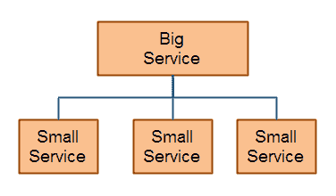

# 服务组合

> 原文：<https://jenkov.com/tutorials/soa/service-composition.html>

服务组合意味着通过组合许多较小的服务来组成一个较大的服务。这与由许多较小的组件组成一个较大的软件组件时使用的原理相同。下面是说明服务组合的图表:

|  |
| 服务组合——通过组合几个较小的服务来组合一个服务。 |

## 服务组合性能

虽然服务组合在纸面上看起来很吸引人，就像组件组合一样，但是请记住，服务通常通过网络相互通信。这意味着服务间通信比典型的组件间通信慢得多，后者通常发生在同一地址空间(应用程序/进程)内。将较大的服务分解成太多较小的服务可能会降低性能。尤其是当服务通过企业服务总线(ESB)进行内部通信时。