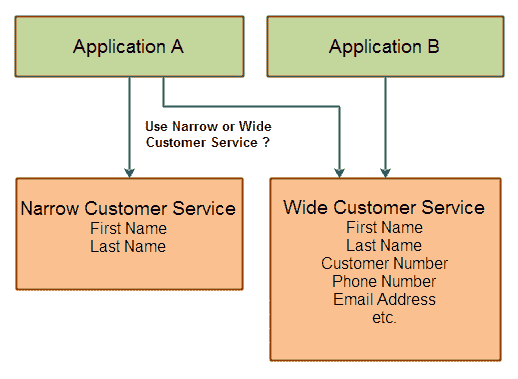

# 服务可重用性

> 原文：<https://jenkov.com/tutorials/soa/service-reusability.html>

服务的可重用性在很大程度上取决于它的设计和目的。“可重用性”指的是应用程序或较大的服务如何重用给定的较小的服务。我将用一个小例子来解释这一点:

假设您有两个应用程序，A 和 B，它们都需要客户信息。应用程序 A 只需要客户的名字和姓氏，但是应用程序 B 需要客户的名字、姓氏、客户号、电话号码、电子邮件地址等。这些要求总结如下:

```
Application A
--------------
 - First Name
 - Last Name

Application B
--------------
 - First Name
 - Last Name
 - Customer Number
 - Phone Number
 - Email Address
 - etc.

```

为了服务应用程序 A 和 B，您有两种选择:

1.  创建一个返回所有客户信息的大客户服务
2.  创建两个客户服务。一个返回所有客户信息，另一个只返回名字和姓氏。

从服务可重用性的角度来看，只开发和维护一个客户服务当然很好。这个服务可以在应用程序 A 和 b 中重用。

但是从性能的角度来看，当应用程序 A(只需要名字和姓氏)使用时，一个大客户服务会增加通信开销，因为大客户服务发回的数据比应用程序 A 需要的多。

这里显示了在一种广泛服务或多种定制服务之间的设计选择:

<center>

|  |
| 服务重用——重用一个广泛的服务并承受开销，还是创建适合每个应用需求的服务？ |

</center>