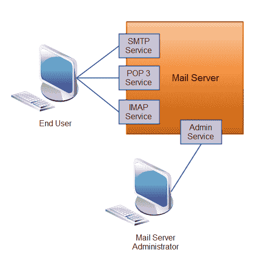

# 服务与应用

> 原文：<https://jenkov.com/tutorials/soa/services-applications.html>

当你开始学习面向服务的架构时，你可能想知道服务和应用之间的区别。

服务或应用程序没有精确的定义。服务和应用程序都是软件程序，但是它们有一些不同的特点。我在下表中总结了最常见的特质:

| **服务** | **应用程序** |
| 执行一个或几个专门的操作。 | 执行广泛的操作，甚至可能将其中一些操作公开为服务。 |
| 最常被其他程序访问。 | 经常(但不总是)被人类访问。 |
| 通常(但不总是)针对更大问题领域的一部分。 | 通常(但不总是)针对整个问题领域。 |

服务通常针对比应用程序更小、更孤立的问题。应用程序经常公开和调用服务，有时是其他应用程序中的服务。很难有比这更具体的了。以下是一个原因示例:

邮件服务器(作为软件)可以被认为是服务和应用程序。它运行在网络上某个地方的某个服务器(硬件)上。它公开了 2-3 个主要服务:一个用于发送电子邮件的 SMTP 服务，一个用于阅读电子邮件的 POP3 和 IMAP 服务。邮件服务器可能没有用户可以与之交互的用户 GUI。他们可能只是使用一些标准的电子邮件客户端。

尽管邮件服务器可能有管理员 GUI。但是不能保证。邮件服务器也可以只通过配置文件来配置。

我仍然将邮件服务器称为应用程序的原因是，它公开 2-3 个服务，旨在供最终用户使用(尽管通过一些客户端应用程序)，并且它针对整个问题域。但真的，你不妨称之为“邮件服务”。服务和应用程序之间的界限并不清楚。

以下是邮件服务器示例的图示:

|  |
| 公开 4 种不同服务的邮件服务器(应用程序)。 |

