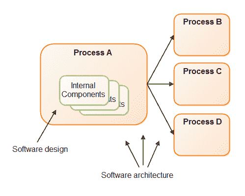
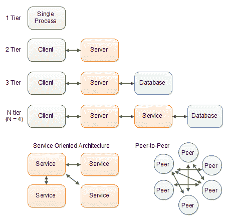
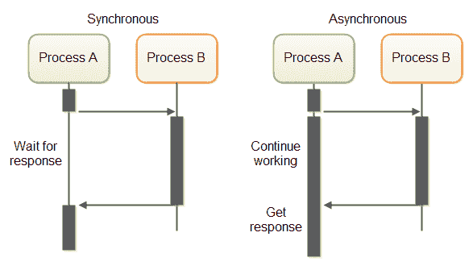

# 软件体系结构

> 原文：<https://jenkov.com/tutorials/software-architecture/index.html>

注意:本教程仍在进行中。它会一点一点的更新，直到达到一个更全面更连贯的状态。然而，你现在可能已经从中获得了一些东西。

软件架构和软件设计是同一个主题的两个方面。两者都是关于软件如何被构造以执行它的任务。术语“软件架构”通常指软件系统的较大结构，而“软件设计”通常指较小的结构。

体系结构和设计之间的确切界限很难说，因为系统的体系结构也会影响其设计。较大结构的设计影响较小结构的设计。为了将它设置在某个有意义的地方(决定在本教程中应该包括和排除什么)，我将边界设置在流程级别。因此，软件设计关注的是单个软件过程的内部设计，而软件体系结构关注的是多个软件过程如何合作执行它们的任务的设计。

我对软件架构的定义如何与术语“分布式系统”相适应？在我看来，软件架构提供了各种分布式算法可以运行的基本结构。是的，这两个术语之间有一定的重叠，但是各种不同的分布式算法可以运行在相同的底层架构之上。

软件架构也受整个系统的硬件架构(软件+硬件)的影响。根据您使用的硬件，您可能需要不同的架构(以及设计)。或者，您可以根据您的架构选择不同的硬件。

## 通用软件架构

有许多不同类型的架构，但是有些架构模式比其他模式更常见。以下是常见软件架构模式的列表:

*   单一流程。
*   客户机/服务器(两个进程协作)。
*   3 层系统(3 个流程在链中协作)。
*   N 层系统(链中协作的 N 个过程)。
*   面向服务的架构(许多流程相互交互)。
*   对等架构(许多进程在没有中央服务器的情况下交互)。
*   混合架构——上述架构的组合。

下面是这些架构的简单说明。

## 过程通信渠道

进程通常有三种媒介，通过它们可以相互通信。这些是:

*   网络
*   唱片
*   管道

进程可以通过计算机网络相互通信。通过这种介质，一个进程可以与运行在同一台计算机上的进程进行通信，也可以与运行在不同计算机上的进程进行通信，前提是运行这些进程的两台计算机与计算机网络相连。

在同一台计算机上运行的进程也可以通过计算机的硬盘(或其他磁盘，如 USB 磁盘等)相互通信。).进程 A 可以将文件写入磁盘，这些文件由进程 B 处理。进程 B 也可以在写入磁盘的文件中发回回复，然后进程 A 读取该文件。

进程也可以通过网络存储进行通信，网络存储实际上是一个连接到计算机网络的硬盘。这样，通过网络和磁盘通信的结合，进程也可以与运行在不同计算机上的进程进行通信。

根据进程运行的操作系统，在同一台机器上运行的进程也可以通过管道相互通信。管道是操作系统为进程提供的通信通道。通信类似于网络通信，但交换的消息保存在计算机内部的 RAM 中。管道可以比网络通信更快，因为当通信进程在同一台计算机上运行时，可以消除大量的网络协议开销。

进程也可以通过 RAM 磁盘进行通信，RAM 磁盘是分配在计算机 RAM 中的虚拟硬盘。对于进程来说，RAM 磁盘看起来像一个磁盘，但比磁盘快得多，因为数据只存储在 RAM 中。

## 过程通信模式

进程可以通过以下两种方式相互通信:

*   同步模式。
*   异步模式。

当进程 A 与进程 B 同步通信时，意味着进程 A 向进程 B 发送消息，等待 B 回复。流程 A 在得到流程 b 的回复之前什么都不做。

当两个进程异步通信时，这两个进程互相发送消息，而不等待对方回复。进程 A 可能会向进程 B 发送一条消息，然后继续其他一些工作。在某个时刻，进程 B 向进程 A 发回一条消息，当进程 A 有时间时，进程 A 处理这条消息。

同步和异步通信有不同的优势和用例。可以使用异步通信实现同步通信，也可以使用同步通信实现异步通信。

同步和异步通信模式如下所示:

