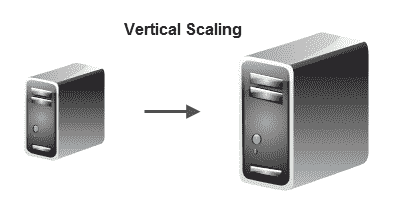
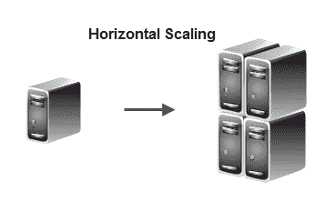
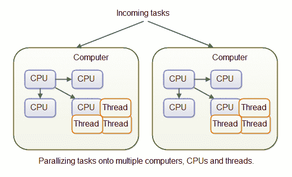
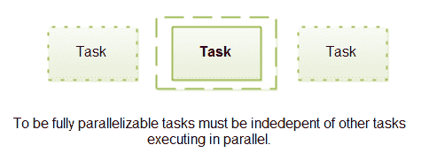

# 可扩展架构

> 原文：<https://jenkov.com/tutorials/software-architecture/scalable-architectures.html>

可伸缩体系结构是一种可以向上扩展以满足增加的工作负载的体系结构。换句话说，如果工作负载突然超过您现有的软件+硬件组合的能力，您可以扩展系统(软件+硬件)来满足增加的工作负载。

## 可扩展性因素

当您纵向扩展系统的硬件容量时，您希望它能够处理的工作负载也能纵向扩展到相同的程度。如果您将系统的硬件容量加倍，您会希望您的系统也能够处理加倍的工作负载。这种情况被称为“线性可伸缩性”。

但是线性可伸缩性通常不是这样。通常情况下，向上扩展会带来开销，这意味着当您将硬件容量翻倍时，您的系统可以处理的工作负载不到两倍。

当您增加硬件容量时，系统可以处理的额外工作负载就是系统的可伸缩性因素。可伸缩性因素可能会有所不同，这取决于您向上扩展系统的哪一部分。

## 纵向和横向可扩展性

纵向扩展系统有两种主要方式:垂直扩展和水平扩展。

垂直扩展是指通过将软件部署在比当前部署的计算机容量更大的计算机上来扩展系统。新的计算机可能有更快的 CPU、更大的内存、更快更大的硬盘、更快的内存总线等。比现在的电脑。

水平扩展意味着通过添加更多部署了软件的计算机来扩展系统。添加的计算机通常与当前运行系统的计算机具有相同的容量，或者与您购买时花同样的钱所能获得的容量相当(随着时间的推移，花同样的钱，计算机往往会变得更强大)。

## 架构可扩展性要求

从开发人员的角度来看，扩展软件最简单的方法是垂直可伸缩性。您只需部署在更大的机器上，软件就会执行得更好。然而，一旦你获得了过去的标准硬件要求，购买更快的 CPU，更大更快的 RAM 模块，更大更快的硬盘，更快更大的主板等等。与您获得的额外性能相比，变得非常非常昂贵。此外，如果您向计算机添加更多的 CPU，并且您的软件没有明确实现来利用它们，您将不会从额外的 CPU 中获得任何提高的性能。

从软件开发人员的角度来看，水平扩展并不容易。为了让您的软件利用多台计算机(甚至同一台计算机中的多个 CPU)，您的软件需要能够并行化其任务。事实上，你的软件在并行化任务方面做得越好，你的软件在水平方向上的伸缩性就越好。

### 任务并行化

任务的并行化可以在几个级别完成:

*   将不同的任务分配到不同的计算机上。
*   将不同的任务分配到同一台计算机上不同的 CPU 上。
*   将不同的任务分配到同一 CPU 上的不同线程上。

您还可以利用计算机可能拥有的特殊硬件，如具有大量 CPU 内核的图形卡或 InfiniBand 网络接口卡等。

将不同的任务分配给不同的计算机通常被称为“负载平衡”。负载平衡将在单独的文本中详细介绍。

在同一台计算机上执行多个不同的应用程序，可能使用相同的 CPU 或使用不同的 CPU，这被称为“多任务处理”。多任务通常由操作系统完成，所以这不是软件开发人员需要考虑太多的事情。您需要考虑的是如何将您的应用程序分成更小的、独立但协作的进程，如果需要，这些进程也可以分布到不同的 CPU 甚至计算机上。

将同一应用程序中的任务分配给不同的线程被称为“多线程”。我有一个关于 [Java 多线程](/java-concurrency/index.html)的单独教程，所以我不会在这里深入讨论多线程。

要实现完全并行化，任务必须独立于与其并行执行的其他任务。

要完全分布到任何计算机上，任务必须包含或能够访问执行任务所需的任何数据，而不管哪台计算机执行该任务。确切的意思取决于您正在开发的应用程序的类型，所以我不能在这里进行更深入的讨论。