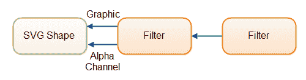

# SVG Filters

> 原文：<https://jenkov.com/tutorials/svg/filters.html>

SVG 过滤器用于给你的 SVG 图像添加漂亮的效果。例如，投射阴影、模糊或高光。

## 过滤器示例

下面是一个简单的 SVG 过滤器示例，展示了两个椭圆。左侧椭圆显示时没有过滤器。右椭圆是应用高斯模糊滤镜渲染的:

```
  <defs>
      <filter id="blurFilter" y="-5" height="40"
          <feGaussianBlur in="SourceGraphic" stdDeviation="3" y="-"/>
      </filter>
  </defs>

  <ellipse cx="55" cy="60" rx="25" ry="15"
           style="stroke: none; fill: #0000ff; " />

  <ellipse cx="155" cy="60" rx="25" ry="15"
           style="stroke: none; fill: #0000ff; filter: url(#blurFilter);" />    

```

以下是生成的图像:

请注意右椭圆的边缘是如何模糊的。

## 过滤输入和输出

SVG 滤镜接受一些输入(源),并对其应用滤镜效果。滤镜的输入可以是形状的图形(即 RGB 颜色)、形状的 alpha 通道或另一个滤镜的输出。

SVG 过滤器从输入产生图形输出(结果)。此输出是通常显示的内容，而不是过滤器应用到的形状。一个滤波器的输出可以用作另一个滤波器的输入。因此，过滤器可以被链接。

下面是 SVG 过滤器输入和输出的图示:

|  |
| **SVG 滤镜可以将形状图形、alpha 通道或另一个滤镜的输出作为输入。** |

SVG 过滤器的输入通常在过滤器元素的`in`属性中指定。这里有一个例子:

```
<feGaussianBlur stdDeviation="3" in="SourceGraphic" />

```

如果一个 SVG 过滤器的输出被用作另一个过滤器的输入，您需要向过滤器元素添加一个`result`属性。这里有一个例子:

```
<feGaussianBlur stdDeviation="3"
    in="SourceGraphic" result="blur"/>

```

另一个 SVG 过滤器现在可以通过将值`blur`放入它的`in`属性来使用这个过滤器的输出。在上例中，值`blur`是在过滤器的`result`属性中指定的。

## 过滤器尺寸

使用过滤器的`x`、`y`、`width`和`height`属性设置过滤器的尺寸。

相对于用作输入的形状的`x`和`y`来解释`x`和`y`属性。由于一些滤镜的输出通常比输入大(比如在形状周围添加的模糊)，您通常需要对`x`和`y`使用负数，以避免切断滤镜添加的图形。

`width`和`height`属性同样简单明了。同样，有时您可能需要指定大于输入形状的宽度和高度，以避免切断滤镜添加的效果。

## 组合过滤器

您可以使用`<feMerge>`元素组合过滤器。这里有一个例子:

```
<defs>
    <filter id="blurFilter2" y="-10" height="40" x="-10" width="150">
        <feOffset in="SourceAlpha" dx="3" dy="3" result="offset2" />
        <feGaussianBlur in="offset2" stdDeviation="3"  result="blur2"/>

        <feMerge>
            <feMergeNode in="blur2" />
            <feMergeNode in="SourceGraphic" />
        </feMerge>
    </filter>
</defs>

<ellipse cx="55" cy="60" rx="25" ry="15"
         style="stroke: none; fill: #0000ff; filter: url(#blurFilter2);" />    

```

这个例子创建了一个包含两个过滤器元素的 SVG 过滤器:`<feOffset>`和`<feGaussianBlur>`。“偏移”滤镜效果作用于它所应用到的形状的 alpha 通道。高斯模糊作用于偏移滤镜效果的输出。

`<feMerge>`元素将模糊滤镜的输出与原始图形相结合。输入按照它们在`<feMerge>`元素中出现的顺序进行组合。因此，较晚的输入显示在较早的输入之上。结果是图像中的形状看起来像有投影。以下是生成的图像:

## 高斯模糊过滤器

高斯模糊 SVG 滤镜可以模糊 SVG 形状。高斯模糊滤镜由`<feGaussianBlur>`元素表示。这里有一个例子:

```
<defs>
    <filter id="blurFilter4" x="-20" y="-20" width="200" height="200">
        <feGaussianBlur in="SourceGraphic" stdDeviation="10" />
    </filter>
</defs>
<rect x="20" y="20" width="90" height="90"
      style="stroke: none; fill: #00ff00; filter: url(#blurFilter4);" />

```

这个例子定义了一个内部有一个`<feGaussianblur>`的`<filter>`。然后，该示例定义了一个绿色矩形，该矩形引用 CSS `filter`属性中的过滤器。以下是生成的图像:

### 模糊尺寸

`<feGaussianBlur>`元素的`stdDeviation`属性决定了应用滤镜的形状的模糊程度。数字越大，形状越模糊。下面是三个不同的`stdDeviation`属性值的例子:

```
<defs>
    <filter id="blurFilter5" x="-20" y="-20" width="200" height="200">
        <feGaussianBlur in="SourceGraphic" stdDeviation="2" />
    </filter>
    <filter id="blurFilter6" x="-20" y="-20" width="200" height="200">
        <feGaussianBlur in="SourceGraphic" stdDeviation="6" />
    </filter>
    <filter id="blurFilter7" x="-20" y="-20" width="200" height="200">
        <feGaussianBlur in="SourceGraphic" stdDeviation="12" />
    </filter>
</defs>

<rect x="20" y="24" width="90" height="90"
      style="stroke: none; fill: #00ff00; filter: url(#blurFilter5);" />
<rect x="150" y="24" width="90" height="90"
      style="stroke: none; fill: #00ff00; filter: url(#blurFilter6);" />
<rect x="300" y="24" width="90" height="90"
      style="stroke: none; fill: #00ff00; filter: url(#blurFilter7);" />    

```

以下是生成的图像:

请注意，应用于矩形的滤镜的`stdDeviation`属性中的值越高，矩形就变得越来越模糊。

### 模糊阿尔法通道

上面的例子使用`SourceGraphic`作为输入，意味着形状的 RGB 颜色被用作过滤器的输入。您可以使用形状的 alpha 通道作为输入，方法是在`<feGaussianBlur>`元素的`in`属性上设置值`SourceAlpha`。这里有一个例子:

```
<defs>
    <filter id="blurFilter8" x="-20" y="-20" width="200" height="200">
        <feGaussianBlur in="SourceAlpha" stdDeviation="10" />
    </filter>
</defs>
<rect x="20" y="20" width="90" height="90"
      style="stroke: none; fill: #00ff00; filter: url(#blurFilter8);" />    

```

以下是生成的图像:

请注意，即使矩形是用绿色填充定义的，过滤器的输出也是黑白的。当高斯模糊滤镜应用于 alpha 通道而不是图形(RGB)通道时，会发生这种情况。

## 偏移滤波器

失调滤波器接受一个输入，并在其输出中移动该输入。也就是说，它可以上下左右移动形状。因此，它的工作方式类似于翻译转换，只是它是在过滤器中完成的。这里有一个例子:

```
<defs>
    <filter id="offsetFilter1" x="-20" y="-20" width="200" height="200">
        <feOffset in="SourceGraphic" dx="80" dy="20" />
    </filter>
</defs>
<rect x="20" y="20" width="90" height="90"
      style="stroke: #000000; fill: none; filter: url(#offsetFilter1);" />
<rect x="20" y="20" width="90" height="90"
      style="stroke: #000000; fill: none; " />

```

这个例子在完全相同的位置定义了两个矩形。其中一个矩形应用了偏移滤镜，这将使其向右下方移动。

这是生成的图像。

似乎偏移滤镜对形状也有一些其他的影响(一种模糊)，但我不确定为什么会这样。我还没有找到任何解释为什么会发生这种情况。

## 彩色矩阵滤波器

颜色矩阵滤镜可用于将矩阵转换应用于形状的颜色。这里有一个例子:

```
<defs>
    <filter id="colorMatrixFilter1" x="-20" y="-20" width="200" height="200">
        <feColorMatrix in="SourceGraphic" type="matrix"
                values="0 0 0 1 0
                        0 0 0 1 0
                        0 0 0 1 0
                        0 0 0 1 0
                "/>
    </filter>
</defs>
<rect x="20" y="20" width="90" height="90"
      style="stroke: none; fill: #0000ff; filter: url(#colorMatrixFilter1);" />

```

矩阵的值在`<feColorMatrix>`元素的`values`属性中提供。总共必须有 4 x 5 = 20 个值。这些值应用于原始形状的颜色，如下所示:

```
 0 0 0 red   0
 0 0 0 green 0
 0 0 0 blue  0
 0 0 0 1     0

```

以下是生成的图像:

注意:我在 Chrome 和 Firefox 中使用颜色矩阵滤镜得到了一些奇怪的结果。上面的矩形指定了填充颜色，但是一旦颜色矩阵过滤器完成了它的工作，就只剩下轮廓了。

## 混合过滤器

混合过滤器可以将来自多个过滤器的输入混合成一个。这里有一个例子:

```
<svg width="500" height="100">
  <defs>
    <filter id="blurFilter3" y="-10" height="40" x="-10" width="150">
      <feOffset in="SourceAlpha" dx="3" dy="3" result="offset3" />
      <feGaussianBlur in="offset3" stdDeviation="3"  result="blur3"/>

      <feBlend  in="SourceGraphic" in2="blur3" x="-10" width="160"/>

    </filter>
  </defs>

  <ellipse cx="55" cy="60" rx="25" ry="15"
         style="stroke: none; fill: #0000ff;
                filter: url(#blurFilter3);" />

</svg>    

```

此示例声明了一个使用 3 种滤镜效果的滤镜。前两个是已经链接的偏移和高斯模糊效果。第三个是`<feBlend>`效果，它接受两个输入(`in`和`in2`)并将它们混合成一个。

最终的效果非常类似于本文前面所述的通过组合滤镜得到的效果。